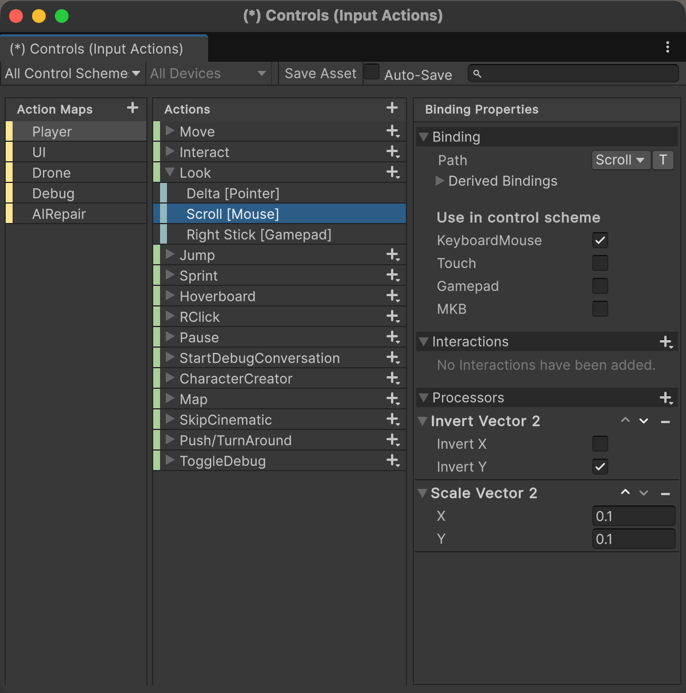
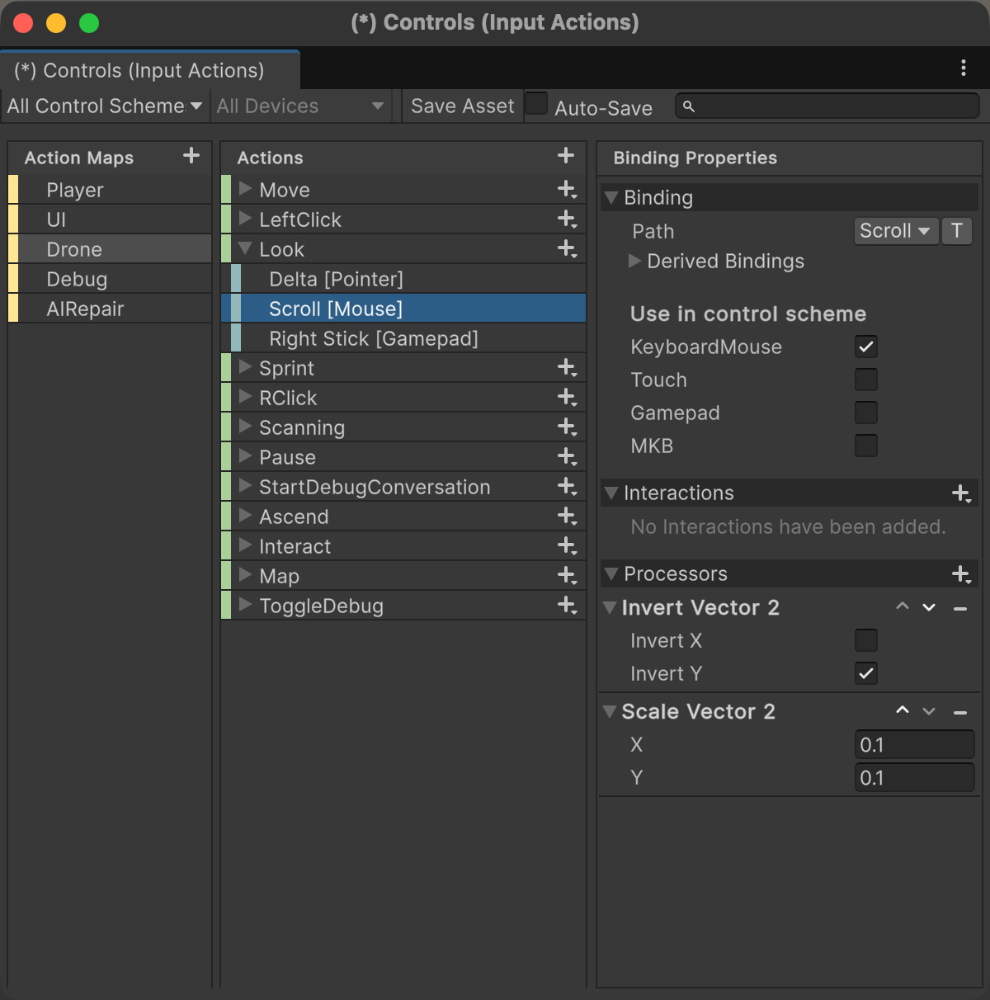

# iPad Scroll-Wheel Look Support

## Overview

This documents the change that lets the Magic Keyboard trackpad on iPad control the camera (look direction) in the Mission HydroSci WebGL game. With the change in place, a **two-finger drag** on the trackpad rotates the camera — parity with the desktop mouse-look experience.

The change is a single **input-asset edit**: two new bindings added to `Assets/Settings/Input/Controls.inputactions`. No new scripts, no JavaScript bridges, no modifications to player controllers, camera controllers, tutorials, or any other game code.

## The problem this solves

On desktop, the game sets `Cursor.lockState = CursorLockMode.Locked`. Pointer Lock hides the system cursor and tells the browser to deliver raw, uncapped mouse-movement deltas — the cursor has no on-screen position, so movement has no screen-edge limit.

**iPadOS Safari does not implement the Pointer Lock API.** The request fails silently, the OS cursor stays visible, and the cursor is pinned against the edges of the display. Once the cursor hits an edge, the browser stops reporting meaningful pointer deltas, so the camera — which reads `<Pointer>/delta` through Unity's Input System — freezes. The player keeps dragging on the trackpad and nothing happens.

**Two-finger drag on the trackpad** is fundamentally different. It does not move the cursor; it fires `wheel` events with `deltaX` and `deltaY` values derived directly from finger motion. Those values are independent of cursor position and are not bounded by screen edges. Unity's WebGL input plugin forwards these events to `Mouse.current.scroll`, making them available to any Input System binding. The fix is to point the existing `Look` action at that input.

## The fix

In `Assets/Settings/Input/Controls.inputactions`, add a `<Mouse>/scroll` binding to the `Look` action in both the `Player` and `Drone` action maps. The binding uses the same `InvertVector2` and `ScaleVector2` processors as the existing `<Pointer>/delta` binding.

### In the Unity Input Actions editor (recommended)

1. In the Project window, double-click `Assets/Settings/Input/Controls.inputactions`. The Input Actions editor window opens.
2. In the **Action Maps** pane (left), select **Player**. In the **Actions** pane (middle), expand the **Look** action — you should see its existing `Delta [Pointer]` and `Right Stick [Gamepad]` bindings.
3. Click the **+** button on the `Look` row and choose **Add Binding**.
4. Select the new binding, then fill in the **Binding Properties** panel on the right:
   - **Path:** `<Mouse>/scroll` (displays in the Actions list as `Scroll [Mouse]`).
   - **Use in control scheme:** check only `KeyboardMouse` — matches the existing `Delta [Pointer]` binding. Leave `Touch`, `Gamepad`, and `MKB` unchecked.
   - **Interactions:** none.
   - **Processors:** click **+** twice to add the two processors below, in this order:
     - `Invert Vector 2` — **Invert X** unchecked, **Invert Y** checked.
     - `Scale Vector 2` — **X** = `0.1`, **Y** = `0.1`.
5. Repeat steps 2–4 for the **Drone** action map's **Look** action.
6. Click **Save Asset** at the top of the window. (If the project has auto-save enabled, this happens automatically.) If a generated `Controls.cs` wrapper exists, Unity will regenerate it on save — no schema change, just an added binding on an existing action.

**Reference screenshots of the final state** — use these to verify your configuration matches the intended state when you're done.

`Player.Look` with the new `Scroll [Mouse]` binding selected:



`Drone.Look` with the same binding selected:



### As raw JSON (reference)

The new binding entry, for either action map:

```json
{
    "name": "",
    "id": "<generate a fresh GUID>",
    "path": "<Mouse>/scroll",
    "interactions": "",
    "processors": "InvertVector2(invertX=false),ScaleVector2(x=0.1,y=0.1)",
    "groups": "KeyboardMouse",
    "action": "Look",
    "isComposite": false,
    "isPartOfComposite": false
}
```

Insert it into `maps[<Player or Drone>].bindings` immediately after the existing `<Pointer>/delta` binding for the same action. After the edit, each `Look` action has three bindings: `<Pointer>/delta`, `<Mouse>/scroll`, `<Gamepad>/rightStick`.

## Why this works (and why it's a clean fix)

The Look action is a `Value` / `Vector2` Input System action. Every look consumer in the project — `PlayerController`, `CharacterControllerAdapter_Player`, `CameraManager`, `RotateCameraTarget`, the `LookAroundTutorial` prefab's `OnActionPerformed` subscriber, and any future script the dev team adds — reads this action. Adding an additional binding on the same action means those consumers get their input from whichever source has data that frame:

- `<Pointer>/delta` is non-zero when the system cursor is moving (desktop mouse, iPad one-finger trackpad while cursor is not pinned).
- `<Mouse>/scroll` is non-zero when the system is reporting scroll (desktop scroll wheel, Mac trackpad two-finger drag, iPad Magic Keyboard trackpad two-finger drag).
- `<Gamepad>/rightStick` is non-zero when a gamepad right stick is pushed.

No script knows or cares which one fired. Tutorials trigger. Cameras rotate. Everything works.

This is why the fix requires no code changes — not to `MHS.Ken.CharacterControllerAdapter_Player` (the live player script, attached to the shared `Player_VSM` prefab that every gameplay unit instantiates), nor to the drone/camera controllers, nor to any tutorial. The Input System abstraction absorbs the platform difference.

### Note on the two player-controller classes

MHS has two player-controller script files in the codebase, which can be confusing at first glance:

- `MHS.Ken.CharacterControllerAdapter_Player` — the **live** player controller. Attached to `Assets/Prefabs/_Core/Player/Player_VSM.prefab`, which is referenced by every gameplay unit's scene. This is the one that actually runs.
- `MHS.PhysicSystem.Player.PlayerController` — **dead code**. Exists in the source tree at `Assets/Scripts/Player/PlayerController.cs` but is referenced by zero prefabs and zero scenes. Not instantiated by anything; never runs.

The dead script is presumably an earlier implementation that was superseded by the Ken adapter and never deleted. Since Plan B touches no code regardless, this is not a blocker — just worth knowing so nobody wastes time editing the dead class (as I did during an earlier experiment).

## Platform coverage

Because the change is entirely at the Input-System-asset level, it works on every Unity target. If Mission HydroSci is ever built as a native iPad app (or any native desktop build) in the future, the same binding provides the same feature — there is no WebGL-specific code path to re-port.

| Platform | How scroll reaches `Mouse.current.scroll` |
|---|---|
| WebGL — desktop (Safari/Chrome/Firefox) | Browser `wheel` event → Unity WebGL input plugin |
| WebGL — iPad Safari | Browser `wheel` event from two-finger trackpad drag → Unity WebGL input plugin |
| Native macOS | `NSEvent.scrollWheel` → Unity native input |
| Native Windows | `WM_MOUSEWHEEL` → Unity native input |
| Native iPad (if ever shipped) | Magic Keyboard trackpad gesture → iOS pointer/scroll input → Unity native input |

## Sensitivity

Sensitivity for the scroll-based look path is controlled at two levels. Both are already in the project today; the dev team can expose whichever one the settings UI should drive.

### Level 1 — binding-level scale (in `Controls.inputactions`)

The `ScaleVector2(x=0.1, y=0.1)` processor on the new `<Mouse>/scroll` binding sets how much raw scroll delta translates into camera rotation. Higher values = faster look; lower = slower.

**Default: 0.1.** This was the value used during iPad testing. A few things to know:

- The existing `<Pointer>/delta` binding (used by mouse and one-finger trackpad) uses `ScaleVector2(0.05)`. The scroll binding's default is **twice that** because raw wheel deltas on trackpads are roughly half the magnitude of pointer deltas for an equivalent physical gesture.
- Trackpad hardware varies: during testing, a scale of `0.1` felt a bit slow on the MacBook built-in trackpad (scroll delta magnitudes are smaller there) and a bit fast on the iPad Magic Keyboard trackpad (scroll delta magnitudes are larger there). A single static scale can't be perfect on both. `0.1` is the compromise. Individual users can fine-tune via the `MouseSensitivity` variable below.
- If the dev team wants to change this default globally, edit the `ScaleVector2` values on this specific binding — **do not change the values on `<Pointer>/delta`**, which would affect desktop mouse-look.

### Level 2 — user-facing `MouseSensitivity` scriptable variable

Several look-handling scripts multiply the Look-action output by a `ScriptableVariable<float>` before applying it to the camera:

- `MHS.Ken.CharacterControllerAdapter_Player.CameraRotation` (the live player controller) uses `_mouseSensitivity`.
- `MHS.RotateCameraTarget.OnLook` uses `_mouseSensitivity`.
- `MHS.CameraSystems.CameraManager` does *not* currently read this variable (it applies the Look-action value directly to the drone camera target).

The variable is defined in:

```
Assets/Data/Scriptables/Input/FloatVariable_Input_MouseSensitivity.asset
```

Its default value is `1.0`. There is a companion event asset — `EventFloat_Input_MouseSensitivityChanged.asset` — intended for a settings UI to broadcast changes. **This is the variable a dev-menu sensitivity slider should write to.** Exactly how that slider is surfaced (menu location, persistence, range) is left to the dev team.

### How the two levels compose

Effective sensitivity is the product of the two:

```
effective_look_delta  =  raw_input_delta  ×  binding_scale  ×  MouseSensitivity
```

For one-finger pointer-delta: `raw × 0.05 × 1.0 = raw × 0.05` (default).
For two-finger scroll: `raw × 0.1 × 1.0 = raw × 0.1` (default).

Because `MouseSensitivity` multiplies both the pointer and scroll paths, adjusting the user-facing slider scales **both** look methods uniformly — the *ratio* between one-finger and two-finger look stays fixed at whatever the binding-level scales imply. So the recommended tuning flow is:

1. Set the `<Mouse>/scroll` binding-level scale so that two-finger look feels roughly comparable to one-finger look on the primary target device. (Done: `0.1`.)
2. Expose `MouseSensitivity` as a slider in the dev menu so individual users can dial overall sensitivity to their preference.

## Verification

On iPad Safari with the Magic Keyboard:

1. Two-finger drag on the trackpad rotates the camera.
2. Hold **W** while two-finger-dragging — the player walks forward and looks simultaneously.
3. In Unit 1, at the "look around" tutorial step, two-finger dragging advances the tutorial. (Nothing special here — the `LookAroundTutorial` prefab subscribes to the `Look` action's `performed` event and fires when the camera's yaw has moved ±45° from the initial orientation. Because scroll input now fires the Look action, the tutorial advances naturally.)

On desktop (regression check):

1. Mouse one-finger / mouse pointer movement rotates the camera exactly as before — `<Pointer>/delta` binding is unchanged.
2. If a scroll wheel is present, rolling it now pitches the camera up and down. This is intentional — see the next section.

## Intentional side effect: scroll wheels on desktop

The binding is not gated to iPad. A traditional scroll-wheel mouse on desktop will pitch the camera when the wheel is rolled (scroll.y populated, scroll.x stays zero on single-wheel mice). Multi-axis scroll wheels (e.g., Logitech MX-series) populate both axes and produce full 360° look.

This is accepted behavior, not a regression:

- It is the natural consequence of binding the Look action to `Mouse.scroll` uniformly across platforms.
- Gating the binding to WebGL-only (or iPad-only) would defeat the main reason to take this approach: portability. A native Mission HydroSci build would lose the trackpad scroll-to-look support on any platform.
- Players generally do not roll a scroll wheel during gameplay. If the movement is unwanted, the `MouseSensitivity` slider scales it proportionally.

## Removal, if/when Apple ships Pointer Lock in iPadOS Safari

If a future iPadOS Safari version implements the Pointer Lock API, desktop-style mouse-look will work natively on iPad and the scroll-wheel fallback is no longer necessary. At that point the change can be reverted by:

1. Deleting the two `<Mouse>/scroll` bindings from `Controls.inputactions` (one in `Player.Look`, one in `Drone.Look`).
2. Desktop scroll-wheel users will lose scroll-to-pitch. If that had become a valued feature, the binding can be kept.

No other cleanup required.

## Reference index.html for Unity WebGL builds

`index.html` in this folder is a clean reference launcher for the game's WebGL build — the `dev-handoff041526/index.html` template with the experimental iPad shim removed. Once the scroll-wheel binding in `Controls.inputactions` ships in an official build, this is the file devs should ship with that build; the in-game input-action change replaces the need for the shim entirely.

## Related: temporary host-page shim

While this input-asset change is being rolled out by the game dev team, a temporary host-page JavaScript shim provides equivalent functionality to existing WebGL builds without requiring a Unity rebuild. It lives in:

- `stratahub/docs/iPad-support/index.html` — reference standalone launcher (older, with the shim still in place).
- `stratahub/docs/dev-handoff041526/index.html` — currently also has the shim embedded for ongoing test builds.
- `stratahub/internal/app/features/missionhydrosci/templates/missionhydrosci_play.gohtml` — deployed via stratahub's Mission HydroSci play route.

The shim listens for `wheel` events and dispatches synthetic `pointermove`/`mousemove` events on the canvas, which Unity's input plugin consumes as though the cursor were really moving. It is a stopgap only — once this scroll-wheel binding is in an official build, all three shim locations should be deleted (or, for `dev-handoff041526/index.html`, replaced with the clean `index.html` in this folder). Each shim block is surrounded by an `EXPERIMENTAL` comment explaining how to remove it.

## Change history

| Date | Approach | Status |
|---|---|---|
| 2026-04-20 | Host-page synthetic-event shim | Deployed for classroom test; works well but is JS-only and doesn't port to native builds. |
| 2026-04-20 → 04-21 | Unity-side jslib + per-frame pump + four controller patches | Implemented and partially tested; rejected because the jslib path is WebGL-only and required patching each player/camera script individually. |
| 2026-04-21 | `<Mouse>/scroll` binding on the `Look` action | **Current design.** One asset edit. Works on WebGL and native; no code changes; no per-controller patching. |
