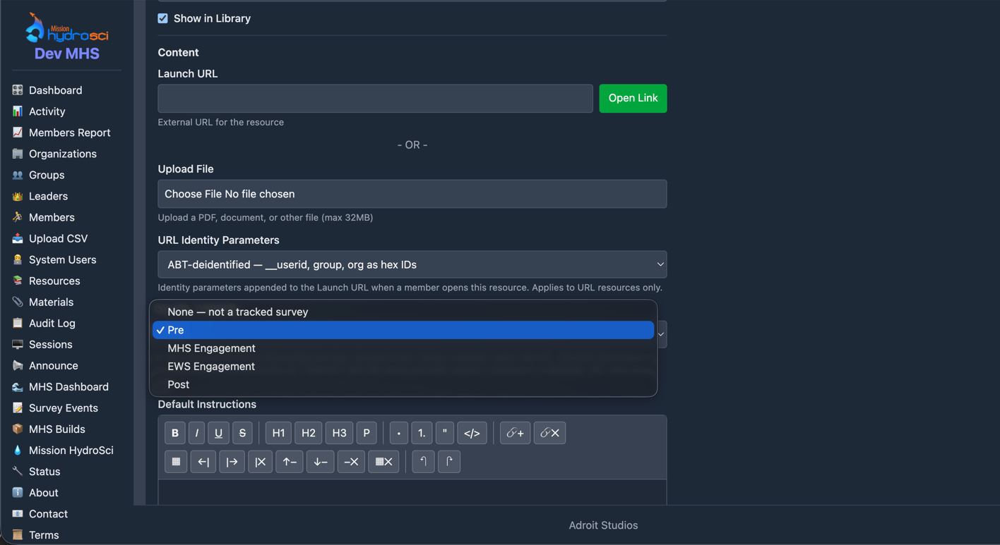

# Survey Status in StrataHub — Overview and Guide Index

_Start here. This page explains in a few minutes how StrataHub, the survey
links, and the survey provider (Abt) work together, then lists the detailed
guides and who each one is for._

---

## 1. How the parts work together

```
Abt survey link, set up as a StrataHub resource
  URL Identity Parameters = ABT-deidentified · Survey Tracking = the survey
        │
        ▼  student opens it from their resources
StrataHub records OPENED and sends the student on to Abt
  with __userid / group / org as hex ids — no names, no emails
        │
        ▼  student takes the survey on Abt's system (answers stay there)
Abt's system calls StrataHub:  POST /api/member-status
  { key, user_id, entity: "Pre" …, state: started | completed }
        │
        ▼
StrataHub records it (one status per student per survey, forward-only)
and logs the call (event_id)
        │
        ├──▶  Survey Events — every call, accepted or rejected   (developers, admins)
        └──▶  MHS Dashboard › Surveys tab — a pill per student   (teachers)
```

**1. The survey links are resources.** Abt supplies one link per survey
(Pre, MHS Engagement, EWS Engagement, Post). Each is a Resource in
StrataHub with two settings that make the rest possible:

- **URL Identity Parameters → ABT-deidentified.** When a student opens the
  link, StrataHub appends `__userid`, `group`, and `org` to it as hex ids.
  Abt therefore knows *which* student is answering without ever receiving a
  name or an email; StrataHub alone can translate the ids back (the Members
  Report).
- **Survey Tracking → the survey this link is.** This tells StrataHub which
  column the resource belongs to, so opening it can be recorded as
  **Opened**, the first step on the status ladder.



_The Launch URL field holds Abt's survey link; it is blanked here._

**2. The shared key.** An admin generates a key on Settings → **Member
Status API** and hands it to Abt privately, together with the workspace
host. The key is per workspace; nothing else is needed on either side.

**3. The student opens the survey.** StrataHub records *Opened* for that
student and survey, then sends the browser to Abt with the hex ids on the
URL.

**4. Abt reports progress.** When the student starts and when they finish,
Abt's system makes one HTTPS call each to StrataHub's Member Status API,
carrying the key, the same `__userid` value, the survey's name, and
`started` or `completed`. StrataHub answers with an `event_id`.

**5. StrataHub records and logs.** Each student has one status per survey
that only moves forward — not started → opened → started → completed — with
the time each step was first reached. Retries and out-of-order deliveries
are harmless. Separately, every call is logged, accepted or rejected, with
exactly what arrived.

**6. Two places show the result.**

- **Survey Events** (menu entry for admins, coordinators, leaders, and
  analysts) lists every call with its outcome and `event_id`. This is how a
  developer — Abt's or ours — confirms the API calls worked, and how an
  admin diagnoses a rejected one.
- **MHS Dashboard → Surveys tab** shows teachers one pill per student and
  survey: ○ Not started, ◔ Opened, ◐ Started, ✓ Completed, with the date.
  Clicking a pill shows the full timeline.

**What lives where.** Survey answers stay with Abt. Names and emails stay in
StrataHub. The only thing that crosses is a hex id in each direction, and
the only key to it is StrataHub's Members Report.

---

## 2. Who does what

| Role | Does |
|------|------|
| StrataHub admin | Sets the shared key; sets the two options on each survey resource; watches Survey Events for rejected calls |
| Abt's developer | Points their system at the workspace host with the key; sends `started` / `completed` per event; quotes `event_id` when asking about a call |
| Teacher (leader) | Reads the Surveys tab; clicks a pill for dates |
| StrataHub developer | Maintains the API, the survey list, the dashboard tab, and the viewer; runs the check script after a deploy |

---

## 3. The guides

| Document | What it is | Who it is for |
|----------|-----------|---------------|
| [Provider Guide](provider-guide.md) | The complete integration contract: endpoint, key, payload, survey names, semantics, error codes, curl and Python examples, and how to see that a call worked | Abt's developers |
| [Admin Guide](admin-guide.md) | Setting and rotating the key, linking each survey resource, reading the Surveys tab, changing the survey list, troubleshooting by symptom | Workspace admins and coordinators |
| [Surveys Tab](surveys-tab.md) | Reading the tab, the state ladder, the modal, and the step-by-step path from an API request to a cell | Teachers who want the detail, and developers |
| [Check Script](check-script.md) | Running `scripts/member-status-api-check.sh`: inputs, the fifteen checks, reading the output against Survey Events, what a failure means | Whoever verifies a workspace: the admin at rollout, a developer after a deploy |
| [Rollout To-Do](rollout-todo.md) | The go-live checklist: backup, deploy, key, resource links, hand-off to Abt, end-to-end verification, first-week watch | The operator taking it to production |
| [Plan](plan.md) | Design, decisions, and the task-by-task implementation record, including the Survey Events log design | Developers |

**Related, outside this folder**

| Document | What it is | Who it is for |
|----------|-----------|---------------|
| [ABT Survey URL Identity Options](../resource-identification/abt-survey-url-options.md) | The two identity modes for Abt's links, identifiable and de-identified, with the exact parameters each sends | Abt, when choosing or confirming the mode |
| [URL Identity Parameters — Admins & Coordinators](../resource-identification/admin-coordinator-guide.md) | Choosing the identity mode on a resource and what each mode reveals | Workspace admins and coordinators |
| [URL Identity Parameters — Data Recipients](../resource-identification/data-consumer-guide.md) | What arrives on a launch URL and how to treat it | Any system receiving the parameters |
| [Members Report](../resource-identification/members-report.md) | Resolving hex ids back to students — the crosswalk, which stays inside StrataHub | Admins and analysts |
| [Parameter Vocabulary](../resource-identification/vocabulary.md) | The permanent names and meanings of the identity parameters | Developers |
| [Adding a Data Viewer](../viewers/adding-a-viewer.md) | How Survey Events is built and how to add another viewer like it | Developers |
