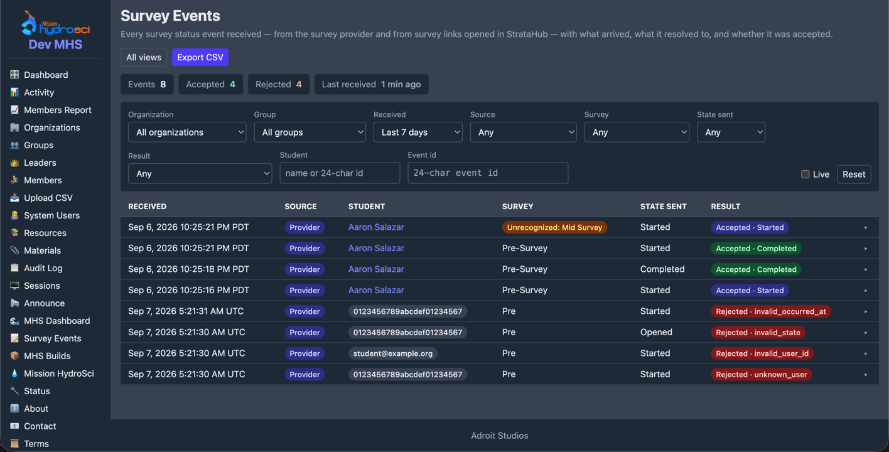

# Member Status API — Guide for the Survey Provider

_Audience: the external team (Abt) whose system reports when a student starts
or completes a survey. This document is the complete integration contract._

StrataHub exposes a small HTTPS endpoint you call whenever a student starts
or completes one of the tracked surveys. StrataHub records the event and shows
the student's survey status to their teacher. Nothing else is required of you:
no session, no cookies, no login — just a shared key included in each request.

---

## Summary

| Item | Value |
|------|-------|
| Endpoint | `POST https://<workspace-host>/api/member-status` |
| Connectivity check | `POST https://<workspace-host>/api/member-status/ping` |
| Format | JSON request and response (`Content-Type: application/json`) |
| Authentication | The workspace's shared key, sent as the `"key"` field of the JSON body |
| Transport | HTTPS only |
| Student identifier | `user_id` — the 24-character hex id you already receive as `__userid` on the survey link |
| States you report | `started`, `completed` |
| Retries | Safe: the endpoint is idempotent (see "Semantics") |

The **workspace host** is the StrataHub host students use for the study. It
is written as `<workspace-host>` throughout this guide; StrataHub gives you
the actual host and the shared key when the integration is set up. If either
changes you will be told; the request format will not change.

---

## Reporting an event

```
POST https://<workspace-host>/api/member-status
Content-Type: application/json
```

```json
{
  "key":         "ms_…the shared key…",
  "user_id":     "68f138c495cdf54a392b20aa",
  "entity":      "MHS Engagement",
  "state":       "completed",
  "occurred_at": "2026-08-25T14:03:11Z"
}
```

| Field | Required | Description |
|-------|----------|-------------|
| `key` | yes | The shared key for this workspace. Compared exactly; keep it secret. |
| `user_id` | yes | The student's StrataHub id: 24 lowercase hex characters. This is the value StrataHub places in `__userid` on the survey link (de-identified configuration). |
| `entity` | yes | The survey's name — one of the strings listed below. Matching is case-insensitive and ignores surrounding whitespace, but please send the exact string. Maximum 100 characters. |
| `state` | yes | `started` or `completed` (case-insensitive). |
| `occurred_at` | no | When the event happened on your side, as an RFC 3339 timestamp (e.g. `2026-08-25T14:03:11Z`). Stored for reference; StrataHub also records its own receipt time. |

### Survey names

Send exactly these strings in `entity`:

| Survey | `entity` value |
|--------|----------------|
| Pre-survey | `Pre` |
| MHS engagement survey | `MHS Engagement` |
| EWS engagement survey | `EWS Engagement` |
| Post-survey | `Post` |

If a name ever needs to change on your side, tell StrataHub first: the list is
configurable, and an unrecognized name is still stored (and flagged in the
response as `"known_entity": false`) so nothing is lost while the
configuration catches up.

### Successful response

`200 OK`

```json
{
  "ok": true,
  "event_id": "6a8fd0c2e1a4b3f9c2d5e7a1",
  "user_id": "68f138c495cdf54a392b20aa",
  "entity": "MHS Engagement",
  "entity_key": "mhs",
  "known_entity": true,
  "state": "completed",
  "started_at": "2026-08-25T13:41:02Z",
  "completed_at": "2026-08-25T14:03:14Z"
}
```

`state` is the student's resulting status for that survey after your event
was applied (which may be higher than the state you sent — see below).
`started_at` / `completed_at` are StrataHub's receipt times for the first
report of each state; a field is omitted when that state has not been
reported.

`entity` echoes StrataHub's name for the survey — the same string you sent —
and `entity_key` is StrataHub's internal id for it, which you can ignore.

`event_id` identifies StrataHub's record of this request. Every request that
passes authentication is logged — accepted or rejected — with exactly what
was sent and how it was handled, and StrataHub staff can look an `event_id`
up in their Survey Events view (see [Seeing that a call worked](#seeing-that-a-call-worked)).
If something looks wrong on your side, quote the `event_id` and they can see
the same record. Rejected requests carry an `event_id` too (except
authentication failures, which are not logged).

---

## Semantics

The endpoint is **idempotent and monotonic**, so retries and out-of-order
delivery are safe:

- A survey's status only moves forward: *started → completed*. A `started`
  event that arrives after `completed` is recorded in history but does not
  change the status.
- The first report of each state sets its timestamp; repeats of the same
  state are accepted (`200`) and leave the timestamp unchanged.
- You may send `completed` without ever having sent `started`. StrataHub will
  show the survey as completed and leave `started_at` unset (it never
  fabricates one).
- Sending the same event twice, or resending after a network error, has no
  effect beyond a history entry.

Send events as they happen, one request per event. There is no batch endpoint.

---

## Checking connectivity and the key

```
POST https://<workspace-host>/api/member-status/ping
Content-Type: application/json

{"key": "ms_…the shared key…"}
```

`200 OK`

```json
{
  "ok": true,
  "workspace": "mhs",
  "entities": ["Pre", "MHS Engagement", "EWS Engagement", "Post"]
}
```

`entities` lists the exact survey names currently configured, in order — a
convenient way to confirm your strings match before sending real events.

---

## Seeing that a call worked

The response is the first confirmation: `200` with `"ok": true`, plus the
`state` and timestamps StrataHub now holds for that student and survey. Keep
the `event_id`.

StrataHub also logs every request that passed authentication, accepted or
rejected, in a view its staff call **Survey Events**. Each row is one
request: when it arrived, that it came from the provider, the student it
resolved to, the survey (an unrecognized name is flagged), the state you
sent, and the result — the student's resulting status when accepted, or the
error code when rejected. Opening a row shows the request exactly as it
arrived and the `event_id` that was returned to you.



Two ways to use it:

- **During integration testing**, ask StrataHub for an analyst login on
  their test workspace. You can then watch your own test sends land (tick
  *Live* for a 10-second refresh) and filter by *Event id* to find a
  specific one.
- **In production**, StrataHub staff use the same view. If a send looks
  wrong on your side, quote the `event_id` from the response and they can
  open the same record.

---

## Errors

Every error is JSON with this shape and a non-2xx status:

```json
{"ok": false, "error": "unknown_user", "message": "No active member with that user_id in this workspace."}
```

| HTTP | `error` | Meaning | What to do |
|------|---------|---------|------------|
| 400 | `bad_json` | Body is not a JSON object | Fix the request |
| 400 | `workspace_required` | Request reached a host that is not a workspace | Use the workspace host you were given |
| 400 | `invalid_user_id` | `user_id` is not a 24-character hex id | Fix the request |
| 400 | `invalid_entity` | `entity` missing or over 100 characters | Fix the request |
| 400 | `invalid_state` | `state` is not `started` or `completed` | Fix the request |
| 400 | `invalid_occurred_at` | `occurred_at` is not RFC 3339 | Fix or omit the field |
| 401 | `unauthorized` | Missing or wrong `key` | Check the key; repeated failures are throttled |
| 401 | `not_configured` | The workspace has no key set — the API is disabled there | Contact StrataHub |
| 404 | `unknown_user` | No active student with that id in this workspace | Do not retry; the id may belong to another workspace or a removed student. Log it for reconciliation. |
| 429 | `rate_limited` | Too many failed authentications from your address (20 per 5 minutes) | Wait; the counter resets on the next successful request |
| 500 | `server_error` | Transient failure on the StrataHub side | Retry with backoff; the request is safe to repeat |

`4xx` responses other than `429` indicate a problem with the request itself
and should not be retried unchanged.

---

## Examples

### curl

```bash
curl -sS -X POST https://<workspace-host>/api/member-status \
  -H 'Content-Type: application/json' \
  -d '{"key":"ms_…","user_id":"68f138c495cdf54a392b20aa","entity":"Pre","state":"started"}'
```

### Python

```python
import requests

STRATAHUB = "https://<workspace-host>"  # the host StrataHub gave you
KEY = "ms_…"

def report(user_id: str, entity: str, state: str, occurred_at: str | None = None) -> dict:
    body = {"key": KEY, "user_id": user_id, "entity": entity, "state": state}
    if occurred_at:
        body["occurred_at"] = occurred_at
    r = requests.post(f"{STRATAHUB}/api/member-status", json=body, timeout=10)
    data = r.json()
    if not data.get("ok"):
        raise RuntimeError(f"{r.status_code} {data.get('error')}: {data.get('message')}")
    return data

report("68f138c495cdf54a392b20aa", "MHS Engagement", "completed", "2026-08-25T14:03:11Z")
```

---

## Security notes

- Always use HTTPS. The key travels in the request body, never in the URL, so
  it does not appear in access logs.
- Treat the key like a password: store it in your service's secret
  configuration, not in client-side code. It is per workspace and can be
  rotated by a StrataHub administrator at any time; you will receive the new
  key out of band.
- The endpoint returns no personal data. Responses echo only the ids and
  timestamps you supplied or that StrataHub recorded.
