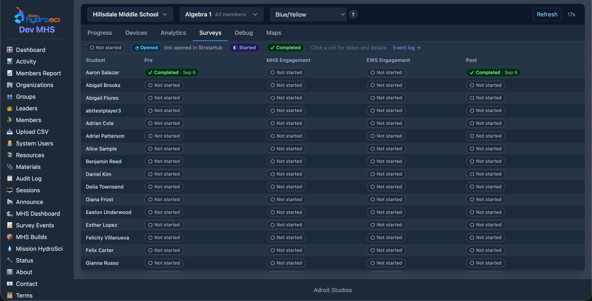

# MHS Dashboard — Surveys Tab

_Audience: leaders and admins reading survey status on the MHS Dashboard, and
developers tracing how an event received by the Member Status API becomes a
cell on that tab._

The Surveys tab answers one question per student and survey: how far along
are they? The answer is one of four states, and every state comes from
exactly one of two sources — the student opening the survey link inside
StrataHub, or the survey provider reporting through the
[Member Status API](provider-guide.md). StrataHub never sees the survey
answers; it sees only that the survey was opened, started, or completed, and
when.



_A test workspace after the [check script](check-script.md) ran twice for
one student, once on Pre and once on Post._

---

## 1. Reading the tab

**Who sees it.** The MHS Dashboard is open to leaders, admins, and
coordinators. Leaders see the groups they lead; admins and coordinators can
pick any organization and group in the workspace. Analysts do not have the
MHS Dashboard; for them the same events are visible in
**Survey Events**.

**What is on it.** The organization and group selectors at the top choose
the class; the build-collection selector next to them does not affect this
tab. Below the tab strip:

- a **legend** for the four states, with a link to the **Event log** (Survey
  Events);
- a table with **one row per student** in the group and **one column per
  configured survey**, in the configured order;
- in each cell a **pill**: a glyph, the state's name, and — once the student
  has done anything — the date the current state was reached.

| Pill | Meaning | Where it comes from |
|------|---------|---------------------|
| ○ Not started | StrataHub has no record for this student and survey | — |
| ◔ Opened | The student launched the survey link from their StrataHub resources | StrataHub itself, when the resource is linked to the survey (Admin Guide §2) |
| ◐ Started | The provider reported that the student began the survey | Member Status API, `state: started` |
| ✓ Completed | The provider reported that the student finished the survey | Member Status API, `state: completed` |

The glyph carries the state, so the tab reads correctly in dark mode, in
grayscale, and for colorblind readers; color is secondary.

**Hover** a pill for every state the student has reached, with full
timestamps. **Click** a pill for the details modal: the student, the survey
and its description, the current state, a timeline of Opened / Started /
Completed with the exact time of each and a note of which source reported
it, a line saying where the latest update came from, and a link to that
student's rows in Survey Events.

Times are shown in the **organization's time zone**, the same zone as the
dashboard's "Last updated".

---

## 2. The state ladder

A student's status on a survey only ever moves **up**:

```
not started  →  opened  →  started  →  completed
```

Three rules follow from that, and they are what make the tab trustworthy
when the provider retries or delivers events out of order:

1. **A lower state never overwrites a higher one.** A `started` that arrives
   after `completed` is kept in the record's history but the cell stays
   Completed.
2. **The first report of a state sets its time.** Repeats of the same state
   leave the timestamp alone, so the date in the cell is when the student
   *first* reached that state, as recorded by StrataHub.
3. **Nothing is fabricated.** A `completed` with no prior `started` shows
   Completed, and the modal shows no Started line. Opened only ever appears
   if the student actually launched the link through StrataHub.

The date in the pill is the time of the current (highest) state. The tooltip
and the modal show all of them.

---

## 3. From an API request to a cell

```
survey provider                          StrataHub
──────────────                           ─────────
POST /api/member-status      ──▶  1. authenticate (shared key), validate fields
{key, user_id, entity,            2. user_id must be an active member of this workspace
 state, occurred_at}              3. resolve entity name → survey key (case-insensitive)
                                  4. record in member_status  (one doc per student × survey)
                                  5. log in member_status_log (Survey Events, event_id)
                             ◀──  200 {event_id, state, started_at, completed_at, …}

student opens a linked       ──▶  4' record "opened", source "launch"
survey resource in StrataHub      5' log it (source Launch)

MHS Dashboard, Surveys tab   ──▶  6. list the group's members
(page load, Refresh, or the       7. fetch their member_status docs in one query
30-second auto-refresh)           8. build one cell per configured survey
```

**Step 1–2: authenticate and identify the student.** The request carries the
workspace's shared key in the body; the workspace is the host the request
was sent to. `user_id` is the 24-character hex id StrataHub puts in the
survey link as `__userid` under the **ABT-deidentified** identity mode, so the
provider can report on a student without ever holding their name. The id
must belong to an **active member of that workspace**; anything else is
rejected as `unknown_user` and nothing is recorded.

**Step 3: resolve the survey.** The `entity` string is matched,
case-insensitively and ignoring surrounding whitespace, against the names in
the survey configuration (`internal/app/resources/mhs_member_status.json`:
each survey's title plus any `api_names` aliases). A match yields the
survey's internal key — the same key the dashboard uses for that column. A
name the configuration does not know is **still recorded**, under a key made
from the name itself, and flagged as unrecognized in the response and in
Survey Events; it simply has no column until the name is added to the
configuration, at which point the earlier records match and appear.

**Step 4: record.** The `member_status` collection holds **one document per
(workspace, student, survey)**. Recording an event is a single upsert that:

- raises the stored state rank with `$max`, so it can only climb the ladder;
- sets the timestamp for the reported state with `$min`, so only the first
  report of each state sets it (`started_at`, `completed_at`, `opened_at`);
- notes the source of the latest event (`api` or `launch`) and the time
  received;
- appends the event to a history capped at the last 25 entries, keeping the
  provider's own `occurred_at` if it sent one.

Because every one of those operations is idempotent, sending the same event
twice, resending after a network error, or delivering `started` after
`completed` all leave the document exactly as a single correct delivery
would.

**Step 5: log.** Separately from the status document, every authenticated
request — accepted or rejected — is appended to `member_status_log` with the
request as it arrived, what it resolved to, and the outcome. That log is the
Survey Events view, and the `event_id` in the API response is the id of that
entry. The dashboard does not read the log; it reads `member_status`.

**Step 4′–5′: Opened.** When a member launches a resource whose **Survey
Tracking** names a survey (Admin Guide §2), the launch handler records
`opened` for that student and survey through the same store call, with
source `launch`, and logs a Launch row. If the provider has already reported
`started` or `completed`, the ladder rule means the launch adds an
`opened_at` time but leaves the state alone.

**Steps 6–8: display.** The dashboard grid is rendered on page load and
again on every refresh: automatically on a 30-second countdown (paused while
a modal is open, and not on the Debug or Maps tabs), or immediately with the
**Refresh** button. Each render lists the group's members, fetches all of
their `member_status` documents in one query, and for each member and each
configured survey builds a cell:

| In the cell | Comes from |
|-------------|-----------|
| glyph, label, color class | the document's `state`; no document → Not started |
| the short date | the first-wins timestamp of the current state, in the organization's zone |
| the tooltip | every reached state with its full timestamp, in ladder order |
| the modal's timeline | `opened_at`, `started_at`, `completed_at`, each with its source note |
| "Latest update came from…" | the document's `source` |
| the Survey Events link | the student's id, as a filter on the view |

A failure to load the status documents degrades to Not started cells and a
server-log error rather than a failed dashboard, the same way grades do.

So a provider event sent now shows on the tab at the next grid refresh —
within 30 seconds on an open dashboard, or on the next page load. There is
no push to the browser.

---

## 4. Things worth knowing

- **The tab is absent** when the survey configuration is empty or fails to
  load (logged at startup), and inside an empty group.
- **Removing a student from the group** hides their row; their records stay
  and reappear if they return. There is no UI for clearing a student's survey
  status.
- **Unrecognized survey names** never make a column. Look for them in Survey
  Events under Survey → *Unrecognized*, then add the name to the
  configuration (Admin Guide §4) and redeploy.
- **Opened needs the link.** Until a survey resource has Survey Tracking set,
  students who open it still show Not started until the provider reports
  something.
- **Column titles are the configured names**, so they read exactly as the
  provider sends them. Changing a title or the order is a configuration
  edit and a redeploy; it does not touch stored records.
- **Leaders see only their groups' students**, and the modal's Survey Events
  link opens a view scoped the same way.

---

## 5. Where things are

| Piece | Location |
|-------|----------|
| Survey list (titles, provider names, descriptions, order) | `internal/app/resources/mhs_member_status.json`, loaded by `internal/app/system/memberstatuscfg` |
| API write path | `internal/app/features/memberstatusapi/handler.go` (`HandleStatus`) |
| Opened write path | `internal/app/features/resources/memberview.go` (`recordSurveyOpened`) |
| Status store and ladder rules | `internal/app/store/memberstatus/store.go` (`Record`), `internal/domain/models/memberstatus.go` |
| Event log | `internal/app/store/memberstatuslog`, viewer `internal/app/features/viewers/views/surveyevents.go` |
| Dashboard data → cells | `internal/app/features/mhsdashboard/surveys.go` (`loadSurveyCells`, `buildSurveyCell`) |
| Tab, legend, modal, styles | `internal/app/features/mhsdashboard/templates/mhsdashboard_view.gohtml` |
| Table panel | `internal/app/features/mhsdashboard/templates/mhsdashboard_grid.gohtml` |
| Related guides | [Admin Guide](admin-guide.md) · [Provider Guide](provider-guide.md) · [Check Script](check-script.md) · [Plan](plan.md) |
