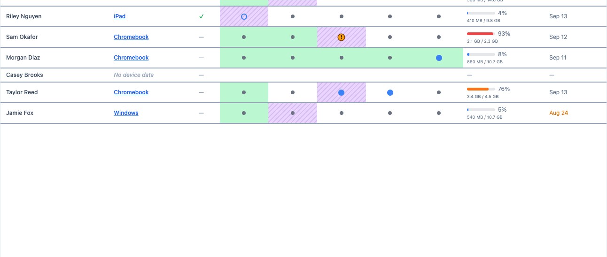
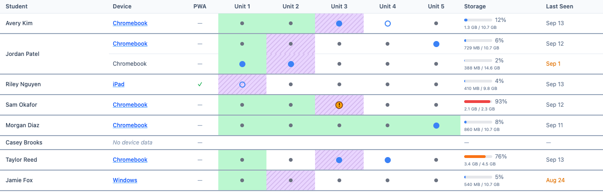

# The Devices View

*Content for the Mission HydroSci Teacher Guide, Appendix: How To Use the Teacher Dashboard. Replaces the current "The Devices View" section. Figures are in `images/` and were made from the dashboard itself with fictional students. See `devices-tab-notes.md` for the plan, rationale, and editor notes.*

---

The Devices view answers a practical question: **is each student's device ready to play Mission HydroSci today?**

The Progress view shows what students have accomplished in the game. The Devices view shows the technical side: what kind of device each student is using, which units are downloaded on it, how much of the browser's storage allowance MHS is using, and when the device last opened MHS. It also shows, behind all of that, how far each student has come through the units.

Use it before class to catch problems early, and during class to sort out whether a problem is with the student's device, their account, or the game itself.

Select your class from the drop-down menu at the top of the page, then click the **Devices** tab. The view refreshes itself every 30 seconds; click **Refresh** to update it right away.

## How to read a row

Each row is one device. A student who has used more than one device has one row per device, grouped under their name with the most recently used device first.

Two things are drawn in the unit columns, and they answer different questions:

- **The background is the student.** A colored band runs across the unit columns of a student's rows: green for a unit they have completed, striped purple for the unit they are working in now. It reads like a progress bar growing from left to right. Because the band covers every row the student has, it belongs to the student, not to any one device.
- **The dot is this device.** In each unit cell, the dot shows whether that unit is downloaded on that device: a large blue dot means yes, a small gray dot means no, a blue ring means a download is in progress, and an amber badge means the device reported a problem with the download.

So a striped purple cell with a small gray dot in it says: this is the unit the student is playing, and it is not on this device yet.

## What each column shows

| Column | What it shows |
|---|---|
| **Student** | The student's name. Hover over it for a one-line summary of their progress, such as "Completed Unit 1, Unit 2 · Current Unit 3." |
| **Device** | The kind of device: Chromebook, iPad, macOS, Windows, Android, Linux, or Other. Click the name to see details about that device (see *Device details* below). |
| **PWA** | ✓ means the student opened MHS from the installed app the last time they used this device. — means they opened it in a regular browser tab. Both work. The installed app hides the browser's address bar and tabs, which gives the game more screen space. |
| **Unit 1 – Unit 5** | One cell per unit. The background is the student's progress and the dot is the unit's download state on this device. See *Reading the unit cells* below. |
| **Storage** | How much space MHS is using on this device compared with the space the browser allows it, shown as a bar, a percentage, and the amounts (for example, 729 MB / 10.7 GB). |
| **Logs** | Whether the game's activity record (what the student did in the game, which the research study depends on) reached the server the last time the student played on this device. A ✓ with a date and time means yes. An amber **!** means it did not: the game plays normally on that device, but nothing is being recorded from it. A dash means there is no verdict yet. Point at the cell for what to do, and see *Game activity not recorded* in Troubleshooting. |
| **Last Seen** | The date and time this device last opened MHS, in your class's time zone. A date shown in gold is more than a week old. The small ⓘ next to the column title repeats this when you point at it. |

If a student has never opened MHS on any device, their row says **No device data**. Their progress band still shows, so a student who is playing on a device that has not reported yet is not mistaken for one who has not started.

## Reading the unit cells

**Background: the student**

| Background | Meaning |
|---|---|
| **Solid green** | **Completed.** The student has finished every progress point in this unit. |
| **Striped purple** | **Current unit.** The unit the student is working in now. |
| **None** | The student has not reached this unit. A gap between green cells means the unit was skipped. |

**Dot: this device**

| Dot | Meaning |
|---|---|
| **Large blue dot** | **Downloaded.** The unit's files are on this device and it is ready to launch. |
| **Blue ring** | **Downloading.** A download of this unit was in progress the last time the device reported in. |
| **Small gray dot** | **Not downloaded.** The unit is not on this device. This is normal for a unit the student has not reached, and for a device the student is not using at the moment. |
| **Amber badge (!)** | **Download problem.** The device reported trouble with this unit's download the last time it reported in: it failed, stalled, or was stuck retrying. Hover over the cell to see which. |

In the figure: Avery Kim has finished Units 1 and 2, is playing Unit 3, has it downloaded, and Unit 4 is downloading behind it. Jordan Patel has two Chromebooks; the newer one at the top does not have Unit 2 yet, the older one below does. Sam Okafor's Unit 3 download failed, and the red storage bar says why: that device is nearly full. Taylor Reed skipped Unit 2. Casey Brooks has not started and has never opened MHS. The two gold entries in the Last Seen column are more than a week old: Jordan Patel's older Chromebook and Jamie Fox's Windows machine have not opened MHS recently, while every other device has been used this week.

**Amber is the only color that means something is wrong.** Green, purple, and blue are confirmations. A small gray dot is neutral. The same amber **!** badge in the Logs column means the game's activity record was not reaching the server from that device; the student also sees a notice in the game, and the fix is in *Game activity not recorded* in Troubleshooting. A small gray dot inside the striped purple cell means the unit the student is playing is not on this device, which is what you will see for a device they used earlier or have not opened MHS on yet. The download starts on its own when they open MHS there.

Two things to keep in mind when reading the cells:

**1. The band comes from gameplay, not from the device.** It shows the student's progress, which is saved online with their account. Every device row for a student shows the same band; only the dots differ. When a student moves to a new device, its row appears at the top of their group with the same band, and a small gray dot in their current unit until it downloads there. The student's own screen says **Ready to play** once it has.

**2. The dots show the device as it was at "Last Seen."** A device reports to the dashboard from the Mission HydroSci page when the student opens it, when a download finishes, and when a download runs into trouble. If a unit was downloaded or cleared after that, the dots do not change until the student opens MHS again. To get a fresh picture, ask the student to open MHS on their device and then click **Refresh**.

> **Tip**
> The bands are a quick way to see who is on which unit for the whole class. For where a student is *within* a unit, and for flagged tasks, use the Progress view.

## Device details

Click a device name to open a panel with details about that device: operating system and version, browser and version, screen size, number of CPU cores, device memory, connection type and speed, and the storage MHS is using and has available.

You will not need this often, but it is exactly what technical support asks for when a device misbehaves. "It is a Chromebook with 4 GB of memory, on Wi-Fi, with 9 GB of storage available" is a report someone can act on.

## Storage: what the numbers mean

The Storage column compares the space MHS is using on the device with the space the browser allows MHS to use. That allowance is set by the browser, and it depends on how much free space the device has. It is usually far larger than MHS needs.

MHS manages its own space. It keeps the student's current unit and the next unit downloaded and removes older units automatically, so a healthy device normally shows a low percentage. A unit is a few hundred megabytes.

The bar turns **orange above 70%** and **red above 90%**. At 90% or more, MHS stops downloading the next unit ahead of time, and the student's Mission HydroSci page shows a **Low storage** notice. The student can still play the current unit, but when they finish it the next unit has to download before it starts, and that download can fail if the device is nearly full. An amber badge next to a red bar is the usual sign of this.

A high percentage almost always means the *device* is nearly full rather than that MHS is using a lot. Look at the amounts:

- **MHS is using a small amount (under about 1 GB) but the percentage is high.** The browser's allowance has shrunk because the device is low on space in general. Free up space on the device itself (the Downloads folder, other apps, other websites' data). Clearing MHS units will not help much.
- **MHS is using several gigabytes.** Units that should have been removed are still on the device. Open **Manage downloads & data** from the bottom of the student's Mission HydroSci page and clear the units the student has finished. This page is locked; a teacher, coordinator, or admin unlocks it on the student's device, and the unlock lasts about ten minutes. Clearing a unit only removes the downloaded files. Progress is saved online and is not affected.

## A two-minute check before class

1. Select the class and open the **Devices** view.
2. Scan for **amber badges**. Each one is a download the device reported trouble with; hover the cell for the reason, and check that row's Storage bar.
3. Look at each student's striped purple cell on the top row of their group, the device they used most recently. A **small gray dot** there means the unit they are playing is not on that device yet. The download starts on its own when they open MHS, and takes a few minutes on school Wi-Fi.
4. Scan **Storage** for orange or red bars.
5. Scan **Last Seen** for gold dates. The student has not opened MHS on that device in over a week. They may have been absent, or they may have moved to another device (look for a second row under their name). If a device has gone quiet and the student has no newer row, ask which device they are using.
6. Look for **No device data**. That student has never opened MHS. Check that they can log in and find Mission HydroSci in the menu.

> **Tip**
> If several students show a small gray dot in their purple cell, have them open Mission HydroSci as they arrive so the downloads run while you start class, instead of everyone downloading at the same moment when you say "launch."

## Solving problems with the Devices view

| The student says… | Look at… | What it usually means | What to do |
|---|---|---|---|
| "It's stuck on the loading screen" or "It won't launch." | The dot in their striped purple cell on the device in front of them, and Storage. | Amber badge: the download had a problem (hover for which). Blue ring: still downloading. Small gray dot: not on this device yet. | Have the student stay on the Mission HydroSci page until it says **Ready to play**. MHS retries a stopped download on its own; the page shows what it is doing and when it will retry. If the bar is red, free up space first. |
| "It says the download failed" or "It's paused." | Storage and, in device details, the connection. | Not enough space on the device, or Wi-Fi dropped. | Red bar: free up space on the device. Otherwise check Wi-Fi and click **Retry**, or simply leave the page open; it keeps retrying. |
| "My progress is gone." | The band. | Progress is saved online and tied to the student's account, not the device. If the band shows their progress, it is safe. | Most often the student logged in with a different account. Compare the name on their screen with the dashboard. If the account is right, the game restarted from the last save point in the unit, which is normal. |
| "I'm on a different Chromebook today." | A new top row under their name. | Nothing is wrong. The new device downloads its own copy of the unit; progress follows the account. | Have them open MHS a few minutes early so the download finishes before you start. |
| "It's slow" or "It keeps freezing." | Device details: memory and CPU cores; Storage; PWA. | An older or low-memory device, a nearly full device, or many other tabs open. | Close other tabs and apps. Run MHS from the installed app or in fullscreen. If the device is consistently slow, note the details for your technology staff. |
| "It says Mission HydroSci isn't in my menu." | Whether the student appears in the list at all. | The student is logged in to the wrong account, or is not in your class group. | Check the login. If they are missing from the dashboard, contact the MHS team to add them to the group. |

## What the Devices view tells you about progress

The bands give a unit-level snapshot: green cells are units the student has completed, and the striped purple cell is the unit they are working in. That is enough for a quick "who is on which unit" scan of the class. A student with no purple cell has nothing in progress: either they have finished every unit they have reached, or they have completed a unit and not yet started the next.

For anything finer, use the other views:

- **Progress view:** which tasks in the unit are done, which are in progress, and which are flagged for a closer look.
- **Analytics view:** how long each task took, which can point to a student who hit a technical problem.

## Quick reference

| I want to know… | Look at… |
|---|---|
| Whether a student's device is ready for the unit they are playing | The dot in the striped purple cell on their top row: large blue is ready, small gray is not on this device yet, amber had a download problem |
| Whether a device is short on space | Storage bar: orange above 70%, red above 90% |
| When a student last opened MHS on a device | Last Seen (gold means more than a week ago) |
| Which units a student has completed | Green cells |
| Which unit a student is working in | The striped purple cell |
| What kind of device a student has, and its specs | Click the device name |
| Whether the student uses the installed app | PWA column (✓ = installed app, — = browser tab) |
