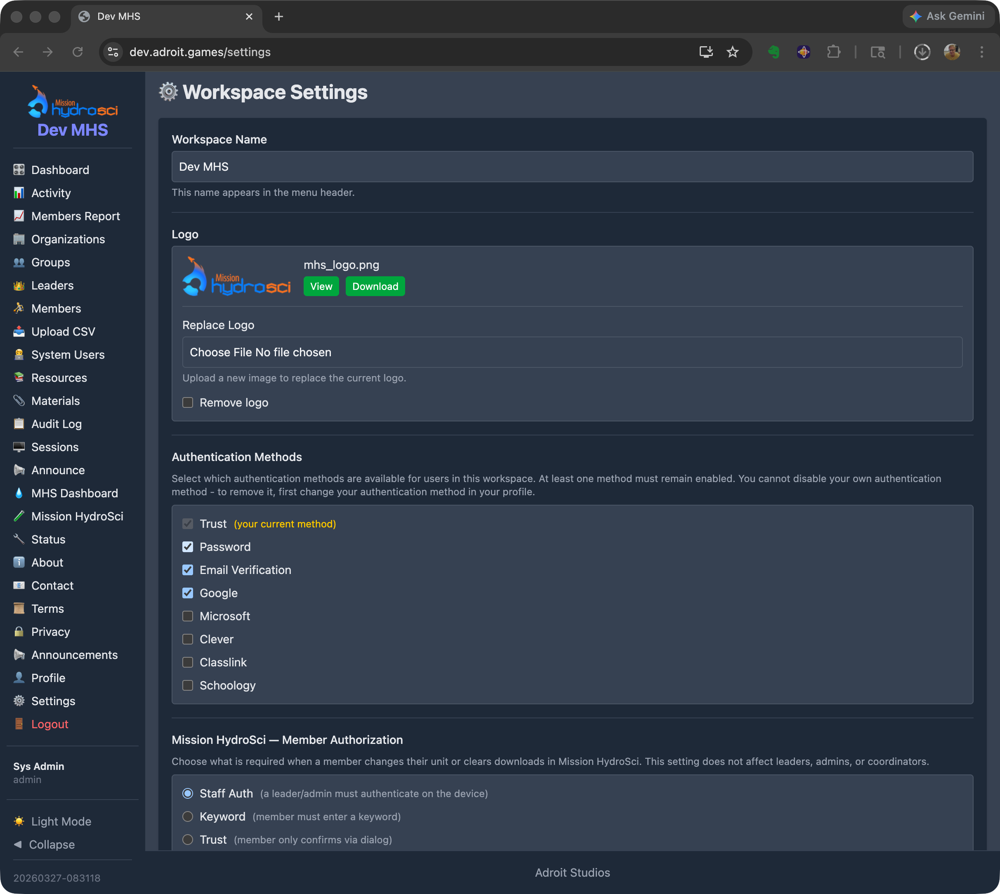
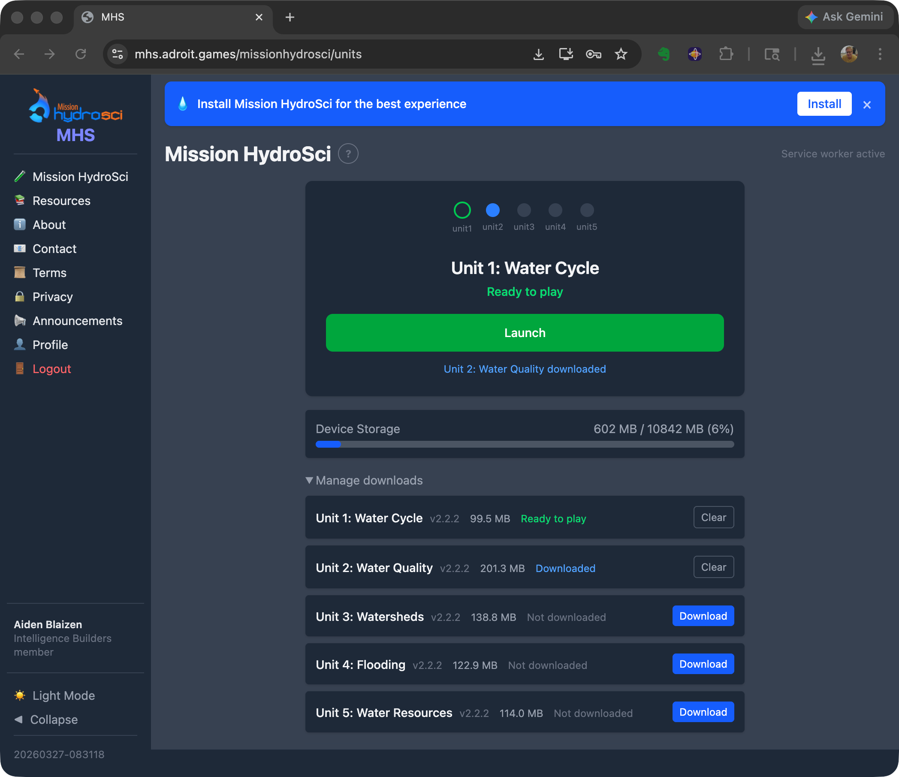
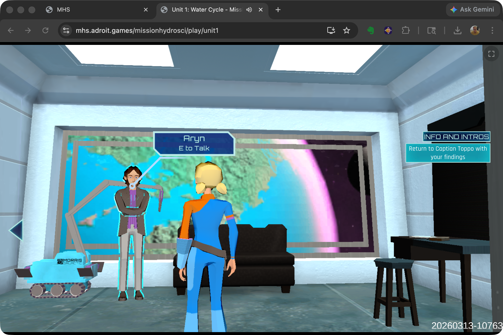

# StrataHub

## 1. Purpose and Overview

StrataHub is a web-based platform purpose-built to support the delivery, management, and research data collection for Mission HydroSci. It serves as the central hub through which teachers set up their classrooms, students access the game, and researchers monitor progress and collect data.

StrataHub was developed because no existing tools provide the specific combination of capabilities this project requires. Standard learning management systems such as Canvas or Google Classroom are designed for distributing assignments and grades, not for delivering a multi-unit educational game with fine-grained progress tracking. Game hosting platforms such as itch.io can serve game builds but offer no classroom management, student progress monitoring, or research data collection. Research data platforms do not integrate directly with game delivery or classroom workflows. StrataHub brings all of these functions together in a single platform tailored to the needs of the Mission HydroSci project.

StrataHub is one component of the broader Strata system. StrataLog collects detailed learning analytics as students play the game. StrataSave persists student game state so progress is retained across sessions. The MHS Grader analyzes log data to assess student progress against curriculum-aligned criteria. Each of these components is described in its own section of this report. StrataHub coordinates with all of them — it is where teachers and students go, while the other services work behind the scenes to collect, store, and evaluate data.

## 2. Organizational Structure

StrataHub organizes users and data in a hierarchy that mirrors the real-world structure of the research project.

**Workspaces** are the top-level containers. Each workspace is an isolated environment with its own users, settings, and data. A workspace can represent a research deployment, a school district, or any other organizational boundary that requires separation. Workspaces operate on their own subdomains, ensuring complete data isolation between deployments.

**Organizations** represent schools or research sites within a workspace. Each organization has a name, location (city and state), timezone, and contact information. The timezone setting ensures that timestamps displayed to teachers and researchers reflect the local time at each school.

**Groups** represent classes or sections within an organization. A group is typically a single teacher's class. Groups are the level at which surveys and materials are distributed, and at which students are enrolled. A teacher may have multiple groups representing different class periods or sections.

**Members** are students enrolled in one or more groups. Each member has a login identity and is associated with an organization. Their progress through Mission HydroSci, game state, and interaction data are all tied to their member identity.

This structure allows the system to naturally represent the research project's deployment across multiple districts, schools, classrooms, and students while maintaining clear boundaries for data access and management responsibilities.

## 3. User Roles

StrataHub supports five user roles, each with capabilities appropriate to their responsibilities within the research project.

**Admins** have full access to all features within a workspace. They configure workspace settings including site branding, authentication methods, and feature options. They create and manage organizations, groups, leaders, coordinators, and members. They have access to all dashboards, reports, audit logs, and activity tracking. Admins can also create announcements that are displayed to all users in the workspace, providing a communication channel for important notices such as scheduled maintenance, study updates, or instructions for teachers.

**Coordinators** are assigned to one or more organizations and serve as an intermediary management role, analogous to a district coordinator overseeing multiple schools. Coordinators can manage the organizations they are assigned to — including the groups, leaders, and members within those organizations — but cannot see or access data from organizations outside their assignment. This scoped access allows coordinators to support multiple schools without exposing data across organizational boundaries.

**Leaders** are teachers. Each leader is assigned to one or more groups (classes) and can manage the members (students) within those groups. Leaders access the Mission HydroSci Dashboard to monitor their students' progress through the game, view detailed performance data, and identify students who may need additional support. Leaders can also distribute resources and materials to their groups, track student activity, and manage unit progression for their students.

**Analysts** have read-only access to aggregate data across the workspace. This role is intended for researchers who need to view system-wide metrics — such as organization counts, group counts, and member counts — without the ability to modify data or manage users.

**Members** are students. Members log into StrataHub to access Mission HydroSci. They play the game units in sequence, with each unit unlocking only after the previous one is completed. Members can also access surveys and other resources that have been assigned to their group by their teacher or an administrator.

## 4. Delivering Mission HydroSci to Students

StrataHub manages the full lifecycle of delivering Mission HydroSci to students, from initial access through completion of all five units.

### Accessing the Game

Students log into StrataHub using credentials appropriate to their school's authentication setup. StrataHub supports multiple authentication methods to accommodate the variety of identity systems used across schools, including Google, Clever, ClassLink, email-based verification, and password-based login. Administrators configure which authentication methods are available for their workspace.

Once logged in, students navigate to Mission HydroSci where they see their current unit and overall progress.

### Sequential Unit Progression

Mission HydroSci currently consists of five curriculum-aligned units that must be completed in order. StrataHub enforces this progression, ensuring that students advance through the units of the game as they complete each one.

### Progressive Web App Delivery

Mission HydroSci is delivered as a Progressive Web App (PWA). Students can install the game directly on their devices from the browser — no app store downloads or IT department involvement required. Once installed, the PWA launches like a native application with its own icon, runs in a full-screen window without browser chrome, and loads quickly because game assets are cached locally on the device. This provides a seamless, app-like experience on Chromebooks, laptops, and desktops without the overhead of managing native app installations across a school's device fleet.

### Device Status Monitoring

StrataHub tracks the status of each student's device, including the device type, whether the PWA is installed, local storage usage, and when the device was last seen. This information is visible to teachers and administrators on the MHS Dashboard, helping them identify students who may be experiencing technical issues — such as a device running low on storage or a student who hasn't connected in several days.

## 5. Surveys and Materials

StrataHub provides two mechanisms for distributing documents and resources to participants in the research project.

**Resources** are used to provide students with access to surveys. Surveys are created as external documents or forms and distributed to specific groups through the Resources feature. Students see their assigned resources when they log into StrataHub, ensuring that the right surveys reach the right students at the right time. Resources are assigned at the group level, so a teacher's class receives the surveys appropriate to their phase of the study.

**Materials** are used to provide teachers with guides, documentation, and other support materials. Teacher guides, implementation instructions, and reference documents are uploaded and assigned to groups so that leaders (teachers) can access them directly within StrataHub. This keeps all project-related materials in one place rather than relying on separate email distribution or file sharing.

Both Resources and Materials can be managed by administrators and, where permissions allow, by coordinators.

## 6. The MHS Dashboard

The Mission HydroSci Dashboard is the primary tool for teachers and researchers to monitor student progress through the game. It provides a real-time, detailed view of every student's status across all five units and their individual progress points.

### Progress Grid

The dashboard displays a grid with one row per student and columns representing each progress point in the curriculum. Progress points are specific milestones within each unit — such as completing an investigation, answering assessment questions, or finishing a simulation activity. There are 26 progress points across the five units.

Each cell in the grid shows a visual status indicator:

- **Completed (green)** — the student has passed this progress point
- **Active (blue)** — the student is currently working on this progress point
- **Flagged (yellow)** — the student completed the progress point but with results that warrant attention
- **Not started (gray)** — the student has not yet reached this progress point

### Flagged Progress Points

When a student's performance at a progress point is flagged, the dashboard shows the specific reason. Reason codes include indicators such as exceeding the expected number of mistakes, scoring below a threshold, or requiring an unusual number of hints. This allows teachers to quickly identify which students may need additional support and what specific aspect of the content presented a challenge.

### Performance Metrics

For each progress point, the dashboard can display:

- The number of mistakes made during the activity
- The number of attempts
- The time taken to complete the activity
- Whether the student passed on their first attempt or required multiple tries

These metrics give teachers and researchers a granular view of how students are engaging with the curriculum, going well beyond a simple completion percentage.

### Device Status

The dashboard includes device information for each student, showing:

- The type of device being used
- Whether the PWA is installed
- Local storage usage and available quota
- When the student's device was last seen by the system

Devices that have not connected in more than seven days are flagged as stale, alerting teachers to potential issues with student access.

### Progress Management

Teachers and administrators can set or reset a student's current unit from the dashboard. This is useful when a student needs to repeat a unit, when technical issues require a student's progress to be adjusted, or when the research protocol calls for specific progress assignments.

### Timezone Awareness

All timestamps on the dashboard are displayed in the timezone of the student's organization, so a teacher in California sees times in Pacific time while a teacher in New York sees Eastern time. This avoids confusion when reviewing when students were last active or how long activities took.

### Visibility for Teachers and Researchers

The MHS Dashboard gives teachers a level of visibility into student game performance that would not be possible with the game alone. Without this dashboard, a teacher would have no way to know which students are struggling with specific content, which students haven't played recently, or which students are ready to advance to the next unit. For researchers, the dashboard provides a real-time window into study progress across all participating classrooms, enabling early identification of implementation issues or patterns that may require attention.

## 7. Classroom and Research Site Management

StrataHub provides a complete set of tools for setting up and managing the organizational structure of a research deployment.

### Organizations

Administrators create organizations to represent each participating school or research site. Organization records include the school name, city, state, timezone, and contact information. Organizations can be activated or deactivated as schools join or leave the study.

### Groups

Within each organization, administrators or leaders create groups to represent classes or sections. Each group is associated with one organization and can have one or more leaders (teachers) assigned to it. Groups are the unit at which students are enrolled, surveys are distributed, and materials are assigned.

### Member Management

Students are added to groups as members. Administrators, coordinators, and leaders can add and remove members from groups, and manage member information. Members are associated with an organization and enrolled in one or more groups.

### Coordinator and Leader Assignment

Coordinators are assigned to specific organizations, giving them management access scoped to those schools. Leaders are assigned to specific groups, giving them access to the students in their classes. These assignments ensure that each person in the system sees only the data relevant to their role and responsibilities.

### Activity Tracking

StrataHub tracks user activity including login sessions and engagement. Leaders can view activity summaries for their students, and administrators can view activity across the workspace. This helps identify patterns such as students who are not logging in or teachers who may need additional support.

## 8. Why Existing Tools Do Not Meet These Needs

The Mission HydroSci project requires a combination of capabilities that no single existing platform provides.

**Learning management systems** such as Canvas, Google Classroom, and Schoology are designed for managing assignments, discussions, and grades. They can link to external content, but they do not support embedding and managing a multi-unit game within the platform, enforcing sequential unit progression, or displaying fine-grained in-game progress metrics. An LMS would treat the game as an opaque external link with no visibility into what happens after the student clicks it.

**Game hosting platforms** such as itch.io or Unity Play can serve game builds to a URL, but they provide no concept of classrooms, teachers, student rosters, or progress tracking. There is no way to gate unit progression, distribute surveys, or provide teachers with dashboards showing student performance.

**Research data platforms** and survey tools like Qualtrics or REDCap are designed for data collection and analysis, not for delivering interactive content or managing classroom hierarchies. They cannot serve a game, track in-game events, or provide teachers with real-time progress dashboards.

**Custom game portals** built for individual educational games do exist, but they typically address only one piece of the puzzle — such as hosting builds or collecting telemetry. They do not provide the full stack of classroom management, role-based access, progress gating, offline capability, device monitoring, survey distribution, materials management, and research-grade data collection that this project requires.

StrataHub was built because the project needed all of these capabilities working together in a single, integrated platform. Attempting to combine multiple existing tools would have created fragile integrations, data silos, inconsistent user experiences, and significant ongoing maintenance burden — while still leaving gaps in functionality.

## 9. Scalability

StrataHub is designed to support the scale of a multi-site educational research project. The system architecture can reasonably support hundreds of schools, thousands of teachers, and tens of thousands of students within a single deployment.

The multi-workspace architecture allows separate research deployments to operate independently on isolated subdomains, each with their own organizations, users, settings, and data. This means the system can support multiple concurrent studies or deployment phases without interference between them.

The underlying infrastructure uses cloud-hosted databases and web servers on Amazon Web Services (AWS), which can be scaled to meet increasing demand as the project grows. The system has been designed so that adding more schools and students does not require architectural changes — only the allocation of additional server resources if needed.

## 10. Data Security and Privacy

StrataHub implements multiple layers of security to protect student data and ensure that access is appropriately controlled.

### Role-Based Access Control

Every action in StrataHub is governed by the user's role. Teachers can see only the students in their assigned groups. Coordinators can see only the organizations they are assigned to. Analysts have read-only access. Members can see only their own data. This ensures that no user can access data outside the scope of their responsibilities.

### Authentication

StrataHub supports multiple authentication methods to accommodate the identity systems used by participating schools. These include Google SSO, Clever, ClassLink, email-based verification, and password authentication. School-compatible SSO options allow students to log in with credentials they already use, reducing the need for separate account management and minimizing the risk of credential-related issues.

### Session Security

User sessions are secured with encrypted cookies transmitted only over HTTPS. Sessions expire after a configurable period of inactivity, with a warning displayed before automatic logout. This protects against unauthorized access on shared or unattended devices — a common scenario in school computer labs.

### Data Protection in Transit and at Rest

All communication between users and StrataHub is encrypted using TLS (HTTPS). The system enforces CSRF (Cross-Site Request Forgery) protection on all state-changing operations, preventing unauthorized actions from being triggered by malicious external sites. Data is stored in managed database services on AWS infrastructure, which provides encryption at rest and access controls at the infrastructure level.

### Audit Logging

StrataHub maintains audit logs of administrative actions, including user creation, role changes, group membership modifications, and configuration changes. These logs record who performed each action and when, providing an accountability trail for all management operations.

### Data Isolation

The multi-workspace architecture ensures complete data isolation between separate deployments. Organizations, groups, members, and all associated data are scoped to their workspace and cannot be accessed from other workspaces. Within a workspace, role-based access control further restricts visibility to only the data each user is authorized to see.

## 11. Summary of Features

StrataHub provides the following capabilities in support of the Mission HydroSci research project:

- **Multi-workspace architecture** — isolated environments for independent research deployments
- **Organizational hierarchy** — workspaces, organizations, groups, and members mirroring the structure of districts, schools, classrooms, and students
- **Role-based access** — five user roles (admin, coordinator, leader, analyst, member) with scoped permissions appropriate to each responsibility
- **Multiple authentication methods** — Google, Clever, ClassLink, email verification, and password login to accommodate school identity systems
- **Mission HydroSci game delivery** — browser-based access to all game units with sequential progression enforcement
- **Progressive Web App** — installable game experience with fast loading and no app store requirements
- **MHS Dashboard** — real-time progress grid showing every student's status across all units and 26 progress points
- **Flagged progress detection** — automatic identification of students whose performance warrants teacher attention, with specific reason codes
- **Performance metrics** — mistake counts, attempt tracking, and completion times for each progress point
- **Device status monitoring** — device type, PWA installation status, storage usage, and last-seen tracking for each student
- **Progress management** — ability for teachers and administrators to set or reset student unit progression
- **Survey distribution** — delivery of research surveys to students via the Resources feature
- **Materials distribution** — delivery of teacher guides and documentation via the Materials feature
- **Organization management** — creation and management of schools and research sites with location, timezone, and contact information
- **Group management** — creation and management of classes with leader assignment, member enrollment, and resource assignment
- **Member management** — student roster management with add, remove, and bulk CSV upload capabilities
- **Coordinator assignment** — scoped management access for district-level coordinators across multiple organizations
- **Activity tracking** — login session and engagement monitoring for students and teachers
- **Announcements** — workspace-wide communication to all users
- **Audit logging** — accountability trail for all administrative actions
- **Timezone-aware display** — timestamps shown in each organization's local timezone
- **Session security** — encrypted cookies, HTTPS, idle timeout with warning, and CSRF protection
- **Data isolation** — complete separation of data between workspaces and role-scoped visibility within workspaces
- **Cloud infrastructure** — hosted on AWS with managed databases, scalable to hundreds of schools and tens of thousands of students
