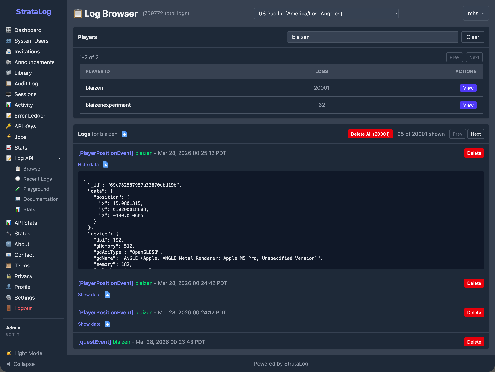
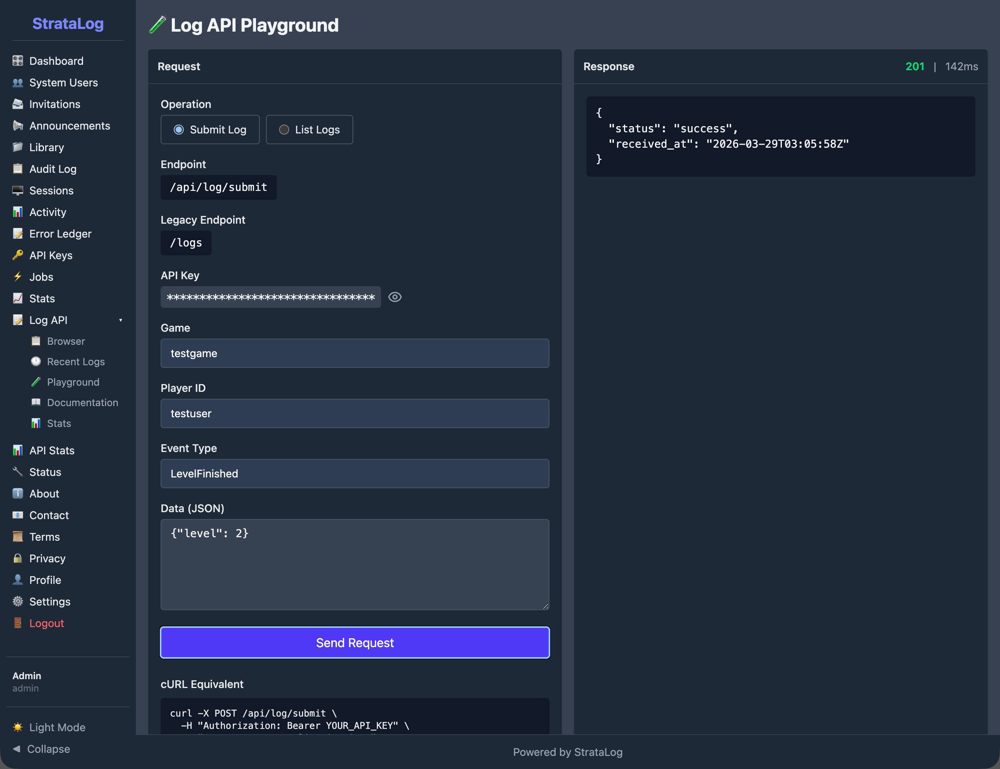
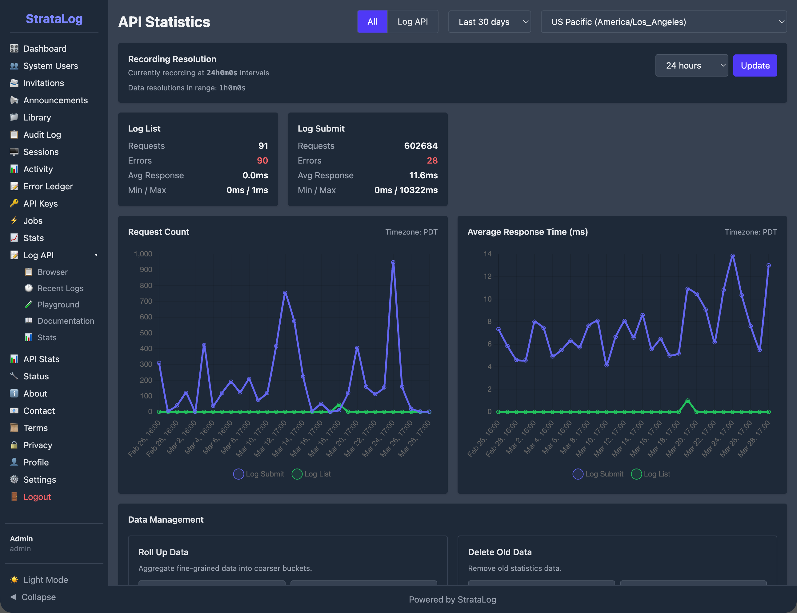

# StrataLog

## 1. Purpose and Overview

StrataLog is the learning analytics service for the Mission HydroSci project. It captures, stores, and provides access to detailed gameplay event data generated as students play the game. Key gameplay actions a student takes, including interactions such as starting an investigation, answering an assessment question, and completing a simulation, are recorded by StrataLog as structured events with precise timing information.

This data serves two critical purposes. First, it is the foundation for all automated student assessment. The MHS Grader, described in its own section of this report, continuously analyzes StrataLog data to determine whether students have passed, are struggling with, or are actively working on each progress point in the curriculum. Without StrataLog, there would be no data for the grader to evaluate. Second, the collected data constitutes a rich research dataset capturing how students interact with the game at a granular level, enabling analysis of learning behaviors, interaction patterns, and curriculum effectiveness.

StrataLog was purpose-built because the project requires a logging service that can accept high-volume, flexible event data from a game client in near-real-time, store it reliably, and make it available for both automated processing and research queries. General-purpose analytics platforms are designed for web traffic or application monitoring, not for capturing the specific structure of educational gameplay events. StrataLog is tailored to this role. StrataLog captures gameplay interaction data and does not store survey responses or unrelated student information.

## 2. What Gets Logged

As students play Mission HydroSci, the game sends event data to StrataLog throughout each session. These events capture what the student is doing at each moment during gameplay.

### Event Structure

Each event recorded by StrataLog includes a standard set of fields:

- **Game identifier:** which game generated the event (currently Mission HydroSci)
- **Player identifier:** which student (member) produced the event, linked to their StrataHub identity
- **Event type:** the category of action that occurred (for example, a dialogue interaction, an assessment response, a simulation action, or a navigation event)
- **Event key:** a specific identifier for the exact action within the game, used by the grading system to determine when a student has reached a particular progress point
- **Client timestamp:** the time at which the event occurred on the student's device
- **Server timestamp:** the time at which the event was received and stored by StrataLog
- **Event data:** additional details specific to the event type, such as which dialogue node was visited, what answer was selected, how many attempts were made, or what score was achieved

### Flexible Schema

StrataLog uses a flexible data model that accepts any additional fields the game includes with an event. This means the game development team can add new event types or include new data fields at any time without requiring changes to StrataLog itself. As the game evolves and new units are added, StrataLog automatically accommodates the new event data. This flexibility is important for a research project where the instrumentation of the game may be refined over time as researchers identify new behaviors they want to capture.

### Volume and Continuity

A single student playing a single unit of Mission HydroSci may generate dozens to hundreds of individual events. Across classrooms and schools, event volumes grow rapidly from tens of thousands to hundreds of thousands of events as usage scales. StrataLog is designed to handle this volume reliably, ensuring that events are captured even when many students are playing simultaneously across multiple schools.

## 3. How Events Are Collected

### Near-Real-Time Ingestion

The Mission HydroSci game sends events to StrataLog through a secure API as students play, with support for batching when connectivity is limited. Events can be submitted individually or in batches for efficiency. When network conditions require it, the game can accumulate events locally and submit them in a batch when connectivity is restored, ensuring that gameplay data is reliably captured despite temporary network interruptions.

### Timestamp Integrity

Each event carries two timestamps. The client timestamp records when the event actually occurred on the student's device. The server timestamp records when StrataLog received and stored the event. This dual-timestamp design is essential for accurate analysis. If a batch of events is submitted after a brief network delay, the client timestamps still reflect the true timing of student actions, allowing the grading system and researchers to accurately measure how long activities took and in what order events occurred.

### Authentication

All event submissions are authenticated using secure, session-scoped API credentials issued by StrataHub. The game receives these credentials when the student launches the game, ensuring that only authorized game sessions can submit log data. This prevents unauthorized data from entering the system and ensures that every event can be traced to a legitimate game session.

## 4. How StrataLog Data Powers the Dashboard

StrataLog is the data source that makes the MHS Dashboard possible. The connection between gameplay and the teacher-facing dashboard flows through a processing pipeline:

1. **Students play the game.** As they interact with Mission HydroSci, events are sent to StrataLog in near-real-time.

2. **The MHS Grader evaluates events.** The grading engine continuously monitors StrataLog for specific trigger events that correspond to curriculum-aligned progress points. When a trigger event is detected, the grader evaluates the student's performance at that progress point based on the surrounding event data.

3. **Progress evaluations are produced.** For each progress point, the grader determines whether the student passed, was flagged for performance that warrants attention, or is still actively working. It also records metrics such as mistake counts, attempt counts, and time spent.

4. **The dashboard displays results.** The MHS Dashboard in StrataHub reads these progress evaluations and presents them as the color-coded progress grid that teachers and researchers use to monitor student progress.

Without StrataLog capturing relevant gameplay events with accurate timing and detail, none of this downstream processing would be possible. The grader would have nothing to evaluate, and the dashboard would have nothing to display.

## 5. Supporting Research Data Collection

Beyond powering the automated assessment pipeline, StrataLog serves as a comprehensive research data collection system.

### Detailed Behavioral Record

StrataLog captures a detailed record of student interactions with the game. This goes well beyond what a simple completion or score record would provide. Researchers can examine:

- The sequence of actions a student took during an activity
- How long a student spent on each part of an investigation
- How many attempts a student made before succeeding
- Which dialogue options a student explored
- How a student's performance changed across units over time

This level of detail supports research questions about learning processes, not just learning outcomes.

### Data Export

StrataLog provides tools for querying and exporting event data. Researchers can filter events by game, student, event type, and time range, then download the results for analysis in external tools. This allows the research team to work with the raw event data using their preferred statistical and analytical methods.

### Developer Console

StrataLog includes an administrative console that provides authorized team members with tools to browse, search, and inspect log data. This console is used during development to verify that the game is generating the expected events, during deployment to confirm that data is flowing correctly, and during research to explore event patterns and verify data quality.

The Log Browser allows team members to search for individual students and inspect their event history. Each event can be expanded to reveal the full data payload, providing visibility into exactly what the game recorded for each interaction.

The API Playground allows developers to test event submission directly from the console, verifying that the API is functioning correctly and that events are being accepted and stored as expected.

### API Statistics

StrataLog tracks operational metrics for its API, including the total number of events submitted, request counts, average response times, and error rates. These statistics are displayed on a dashboard with time-series charts, giving the team visibility into system health and data flow volume.

## 6. Data Security and Integrity

### Secure Transmission

All communication between the game and StrataLog is encrypted using TLS (HTTPS). Event data is never transmitted in plain text.

### Access Control

The StrataLog API requires authentication for all data submission and retrieval. The administrative console uses role-based access with separate permissions for administrators and developers. The system is designed to handle high-volume requests efficiently.

### Audit Trail

StrataLog maintains an audit log of administrative actions and authentication events. Failed API requests are recorded for debugging and compliance purposes.

### Data Reliability

Events are stored in a managed database with automatic indexing for efficient querying. The system is designed so that events are persisted reliably, ensuring that the research dataset remains complete and accurate throughout the study.

## 7. Relationship to Other Strata Components

StrataLog operates as part of the broader Strata system, with specific relationships to each other component:

- **StrataHub** provides the authentication credentials that the game uses when submitting events to StrataLog. StrataHub also hosts the MHS Dashboard, which displays the results of processing StrataLog data.

- **The MHS Grader** reads event data from StrataLog to evaluate student performance at each progress point. StrataLog is the grader's primary data source.

- **StrataSave** handles a different aspect of the student experience: persisting game state so students can resume where they left off. StrataLog and StrataSave are independent services that both receive data from the game, but for different purposes. StrataLog records what happened (events). StrataSave records where the student is (game state).

Together, these components form a pipeline in which StrataLog is the foundational data collection layer. Everything that the system knows about how students interact with Mission HydroSci originates as events captured by StrataLog.

## 8. Why a Custom Logging Service Was Necessary

Several categories of existing tools were considered before building StrataLog:

**Web analytics platforms** such as Google Analytics or Mixpanel are designed for tracking page views, clicks, and user flows on websites. They do not support the structured, high-frequency event data generated by an educational game, and they do not provide the precise timestamp control needed for measuring activity durations. They also raise data privacy concerns when used with student data.

**Application performance monitoring tools** such as Datadog or New Relic are designed for monitoring server health, error rates, and response times. They are not built to capture and store gameplay events as a research dataset.

**Research data platforms** such as REDCap are designed for survey data and clinical trial records, not for near-real-time ingestion of thousands of gameplay events per student session.

**Generic logging services** such as the ELK stack (Elasticsearch, Logstash, Kibana) can ingest flexible data, but they are designed for system logs and infrastructure monitoring. Adapting them to serve as a research-grade gameplay event store with precise timing, student identity tracking, and integration with a custom grading pipeline would require substantial customization while introducing unnecessary complexity.

StrataLog was built because the project needed a logging service that combines near-real-time ingestion of flexible gameplay events, precise dual-timestamp recording, secure authenticated access, reliable storage, research-quality data export, and tight integration with the grading and dashboard pipeline. No existing tool provides this combination.

## 9. Summary of Capabilities

StrataLog provides the following capabilities in support of the Mission HydroSci research project:

- **Near-real-time event capture:** gameplay events ingested as students play, with support for individual and batch submission
- **Flexible event schema:** accepts any event type and data fields without requiring schema changes
- **Dual timestamps:** client and server timestamps for accurate timing analysis regardless of network conditions
- **Authenticated ingestion:** secure, session-scoped API credentials ensure only authorized game sessions submit data
- **Automated assessment foundation:** event data feeds the MHS Grader, which produces the progress evaluations displayed on the teacher dashboard
- **Research data collection:** detailed behavioral record of student gameplay interactions available for research analysis
- **Data export:** query and download tools for researchers to extract event data by game, student, event type, and time range
- **Developer console:** administrative interface for browsing, searching, and inspecting log data
- **Secure transmission:** all data encrypted in transit using TLS
- **Access control:** role-based permissions for the administrative console and API key authentication for data submission
- **API statistics:** operational metrics tracking request volume, response times, and error rates for system monitoring
- **Audit logging:** administrative actions and authentication events recorded for accountability
- **Scalable storage:** designed to handle high volumes of events across many students and schools, with over 700,000 log submissions recorded to date, prior to the primary study period, demonstrating sustained system operation under real usage conditions
- **Integration with the Strata system:** purpose-built to work with StrataHub, the MHS Grader, and the MHS Dashboard as part of a unified analytics pipeline
