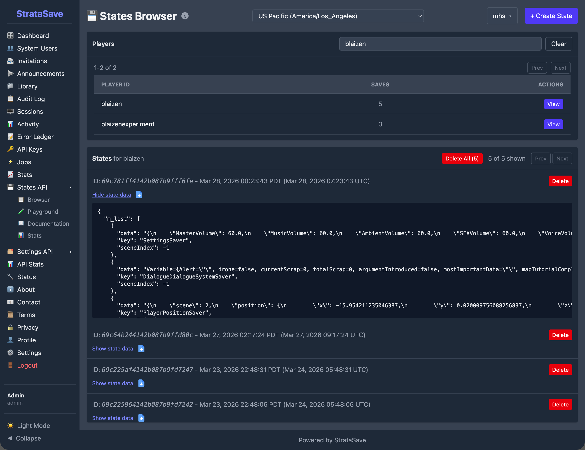
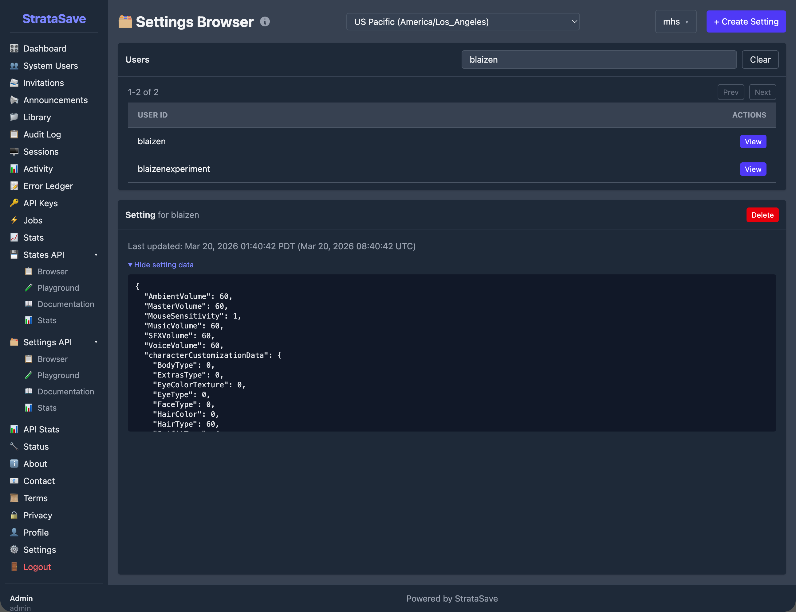
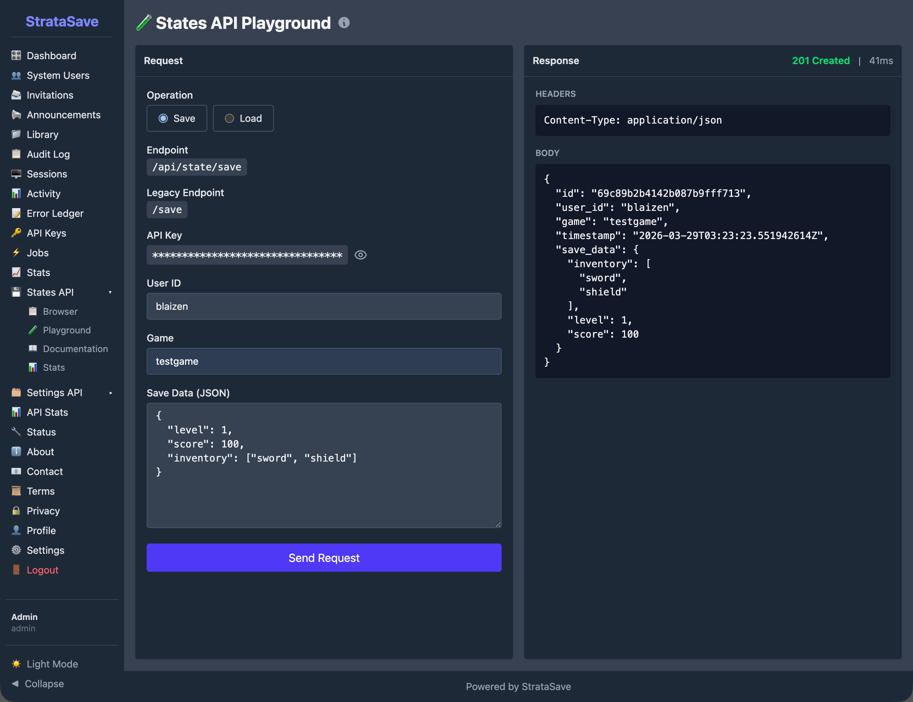

# StrataSave

## 1. Purpose and Overview

StrataSave is the game state persistence service for the Mission HydroSci project. It saves and restores two categories of player data: game state (where a student is in the game and what they have accomplished within gameplay) and player settings (personal preferences such as audio volume and character appearance). Together, these capabilities allow students to close the game at any point and resume exactly where they left off in a later session, with all of their preferences intact.

This continuity is essential for classroom use. Students typically play Mission HydroSci in scheduled class periods that do not align with natural stopping points in the game. A student may be partway through an investigation, in the middle of a dialogue sequence, or navigating between locations when class ends. Without reliable state persistence, that student would need to replay completed content in the next session, wasting instructional time and disrupting the learning experience. StrataSave ensures that every session picks up precisely where the previous one ended.

StrataSave was purpose-built because the project requires a persistence service tailored to the structure of game engine state data (Unity), with support for authenticated access, per-player storage, configurable retention policies, and integration with the broader Strata system. General-purpose storage solutions do not provide this combination of features in a form suitable for educational deployment. StrataSave stores only game state and player preference data necessary to resume gameplay and does not store survey responses or unrelated student information.

## 2. What Gets Saved

StrataSave manages two distinct types of player data, each stored and retrieved through its own dedicated API.

### Game State

Game state captures the complete internal state of a student's game session. When the game saves, it serializes its internal systems into a structured data payload and submits it to StrataSave. This payload includes:

- **Player position:** the student's location within the game world, including coordinates and the current scene
- **Dialogue system state:** which conversations have been completed, which dialogue nodes have been visited, and where the student is within any active dialogue sequence
- **Investigation progress:** which tasks have been started, which steps have been completed, and what data the student has collected
- **Inventory and collected items:** objects, tools, or samples the student has gathered during gameplay
- **Active quest state:** which objectives are currently assigned and what progress has been made toward each one

Each save operation creates a new save record associated with the player and game. StrataSave supports multiple saved states per player, allowing the system to retain a history of save points rather than overwriting previous saves. A configurable retention policy defined at the game level controls how many saves are kept per player, with older saves cleaned up automatically. This ensures predictable and bounded storage per player.

### Player Settings

Player settings capture personal preferences that affect how the game looks, sounds, and controls for each student. These settings are separate from game state because they persist independently: a student's preferred audio volume and character appearance should remain consistent regardless of which save point they load. Settings include:

- **Audio preferences:** master volume, music volume, sound effects volume, and dialogue volume, each stored as independent values
- **Control preferences:** mouse sensitivity, inversion settings, and other input configuration
- **Character customization:** the student's chosen character appearance, including selections for hair, skin, clothing, and accessories
- **Display preferences:** any visual settings the student has adjusted

Settings use an upsert model. Each player has exactly one settings record per game. When settings are saved, the existing record is replaced entirely, ensuring that the stored settings always reflect the student's most recent choices.

## 3. How State Persistence Works

### Save Operations

When the game triggers a save, either automatically at designated checkpoints or when a student exits, the game client serializes its internal state and sends it to StrataSave through a secure API call. The request includes the game identifier, the player identifier (linked to the student's StrataHub account), and the complete state payload. StrataSave stores this as a new save record with a server-generated timestamp.

The save operation is designed to be fast and non-blocking so that it does not interrupt gameplay. The game can continue running while the save is transmitted and confirmed.

### Load Operations

When a student launches Mission HydroSci, the game requests the most recent save state from StrataSave. If a saved state exists, the game deserializes the payload and restores all internal systems to their saved condition: the student appears at the correct location, with the correct inventory, at the correct point in any active dialogue or investigation. If no saved state exists, the game starts from the beginning.

For player settings, the game loads the student's settings record at startup and applies the stored preferences before the student begins interacting with the game. This ensures that audio levels, controls, and character appearance are correct from the first moment of each session.

### Authentication

All save and load operations require authentication. The game receives secure API credentials from StrataHub when the student launches the game, and these credentials are included with every request to StrataSave. This ensures that only authorized game sessions can read or write player data, and that each student can access only their own saves and settings.

## 4. Save Retention and Storage Management

StrataSave includes a configurable retention system that manages storage growth over time.

### Retention Policy

Each game can be configured with a maximum number of saved states per player. When a new save would exceed this limit, StrataSave automatically removes the oldest saves for that player, keeping the most recent ones. This prevents unbounded storage growth while preserving enough save history to recover from any issues.

### Asynchronous Cleanup

The cleanup of expired saves happens asynchronously after a successful save operation. This means the save itself completes immediately, and the removal of old saves occurs in the background. The student and the game are never delayed by housekeeping operations.

### Storage Efficiency

Because player settings use an upsert model (one record per player per game, replaced on each save), settings storage remains constant per player regardless of how many times settings are saved. Game state storage grows with each save but is bounded by the retention policy.

## 5. Administrative Console

StrataSave includes an administrative console that provides authorized team members with tools to inspect, verify, and manage saved data. This console supports development, testing, deployment verification, and troubleshooting.

### States Browser

The States Browser allows team members to search for any player and view their saved game states. Each player entry shows the total number of saves on file. Selecting a player reveals a chronological list of their save records, and expanding any save displays the complete state payload as structured data. This tool is used during development to verify that the game is saving the correct data, and during support to diagnose issues when a student reports that their progress was not preserved.

### Settings Browser

The Settings Browser provides a similar interface for player settings. Team members can search for a player and view their stored preferences, including audio volume levels, mouse sensitivity, and character customization choices. Because each player has exactly one settings record per game, this view shows the current settings rather than a history.

### API Playground

The API Playground provides an interactive interface for testing save and load operations directly from the browser. Team members can construct save or load requests, execute them against the live API, and inspect the response. The playground also displays the equivalent command-line request, making it easy to reproduce operations outside the console. This tool is valuable during development for verifying API behavior and during integration testing for confirming that the game and StrataSave are communicating correctly.

### API Statistics

StrataSave tracks operational metrics for each of its four API operations: Load State, Save State, Load Settings, and Save Settings. The statistics dashboard displays total request counts, time-series charts of request volume and average response times, and error tracking over a configurable time period.

These metrics provide visibility into how heavily the service is being used and whether it is performing within expected parameters. For example, the statistics show that Load Settings is by far the most frequent operation, reflecting the fact that settings are loaded at the start of every game session, while Save Settings occurs less frequently because settings change only when a student actively modifies a preference.

These metrics reflect sustained real-world usage during development and pilot deployment.

## 6. Data Security and Integrity

### Secure Transmission

All communication between the game and StrataSave is encrypted using TLS (HTTPS). Player state data, which may include information about a student's progress within the game, is never transmitted in plain text.

### Access Control

The StrataSave API requires authentication for all operations. API credentials are issued by StrataHub and scoped to individual game sessions. The administrative console uses role-based access with separate permissions for administrators and developers. The system includes safeguards to protect against abnormal or excessive request patterns.

### Data Isolation

Each player's saved data is associated with their unique player identifier and game identifier. The API enforces that authenticated sessions can only access data belonging to the authenticated player, preventing any cross-player data access.

### Data Reliability

Saved states and settings are stored in a managed database with automatic indexing. The upsert behavior for settings ensures that the stored record always reflects the most recent save, avoiding conflicts from concurrent writes. State saves are append-only (within retention limits), ensuring that new saves never corrupt existing ones.

## 7. Relationship to Other Strata Components

StrataSave operates as part of the broader Strata system, with specific relationships to each other component:

**StrataHub** provides the authentication credentials that the game uses when communicating with StrataSave. StrataHub manages student accounts, classroom groupings, and game access. When a student launches Mission HydroSci through StrataHub, the game receives the credentials it needs to save and load that student's data from StrataSave.

**StrataLog** is the companion data service that records gameplay events for analytics and grading purposes. StrataLog and StrataSave both receive data from the game during gameplay, but they serve different roles. StrataLog records what happened (event history for analysis). StrataSave records where the student is (current state for continuity). The two services are independent and do not read from each other.

**The MHS Grader** processes StrataLog event data to produce student grades. It does not interact with StrataSave directly. However, the continuity that StrataSave provides is important for grading accuracy: because students can resume exactly where they left off, their gameplay event stream in StrataLog forms a continuous record without gaps or repeated content that would complicate grading logic.

Together, these components ensure that students experience seamless gameplay sessions, teachers see accurate progress data, and researchers have access to clean, continuous behavioral records.

## 8. Why a Custom Save Service Was Necessary

Several categories of existing tools were considered before building StrataSave:

**Cloud storage services** such as Amazon S3 or Google Cloud Storage can store arbitrary data, but they are designed for file storage, not for structured, per-player game state management with retention policies, authentication scoping, and upsert semantics. Building these features on top of generic cloud storage would require substantial custom logic while introducing unnecessary architectural complexity.

**Game backend platforms** such as PlayFab or GameSparks offer player data storage, but they are designed for commercial multiplayer games and include pricing models, feature sets, and data governance structures that do not align with the needs of a federally funded educational research project. They also introduce external dependencies for a critical system that must remain under the project team's direct control.

**Database-as-a-service platforms** such as Firebase Realtime Database or MongoDB Atlas provide hosted database access, but they require the game client to interact with the database directly or through generic API layers. StrataSave provides a purpose-built API with domain-specific operations (save state, load latest state, save settings, load settings) that match exactly how the game needs to interact with persistent storage.

StrataSave was built because the project needed a save service that combines authenticated per-player storage, separate handling of game state and player settings, configurable retention with automatic cleanup, an administrative console for inspection and testing, and integration with the Strata authentication system. No existing tool provides this combination in a form appropriate for educational deployment under a federal grant.

## 9. Summary of Capabilities

StrataSave provides the following capabilities in support of the Mission HydroSci research project:

- **Game state persistence:** complete game state saved and restored so students resume exactly where they left off
- **Player settings persistence:** personal preferences stored independently and applied at the start of each session
- **Multiple save support:** each player can have multiple saved states, providing a history of save points
- **Configurable retention:** per-game limits on saved states with automatic cleanup of older saves
- **Asynchronous cleanup:** expired saves removed in the background without delaying active save operations
- **Upsert settings model:** one settings record per player per game, always reflecting the most recent preferences
- **Authenticated access:** secure API credentials ensure only authorized game sessions can read or write player data
- **Player data isolation:** API enforcement prevents cross-player data access
- **Secure transmission:** all data encrypted in transit using TLS
- **States Browser:** administrative tool for searching players and inspecting saved game states
- **Settings Browser:** administrative tool for viewing stored player preferences
- **API Playground:** interactive interface for testing save and load operations with live API responses
- **API Statistics:** operational metrics tracking request volume, response times, and error rates for all four API operations
- **Integration with the Strata system:** purpose-built to work with StrataHub authentication and alongside StrataLog as part of the unified data infrastructure, supporting sustained real-world usage across hundreds of thousands of API requests
