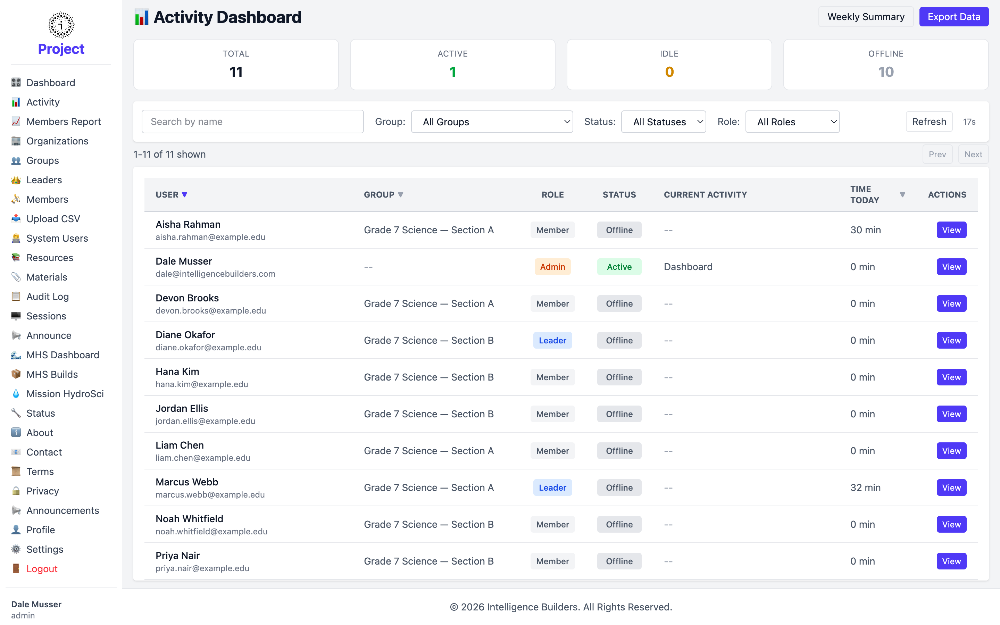
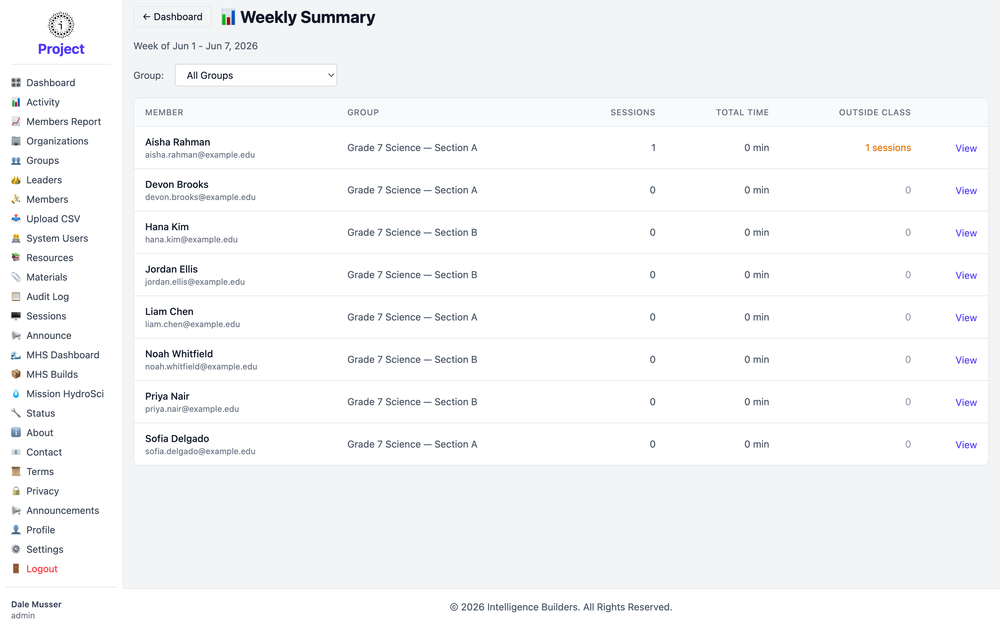

# Activity

The **Activity Dashboard** shows who is using Strata Hub right now and how much time
people have spent in it. It's a live monitoring view — useful for seeing at a glance
which members and leaders are online during a session.

<picture>
  <source media="(prefers-color-scheme: dark)" srcset="images/activity-dark.png">
  
</picture>

## Status summary

The cards across the top count everyone in the workspace by current status:

- **Total** — everyone being tracked.
- **Active** — currently using Strata Hub.
- **Idle** — signed in but not actively doing anything.
- **Offline** — not currently online.

## Filtering the list

Use the controls above the table to narrow what's shown:

- **Search by name** — find a specific person.
- **Group** — limit to one group, or **All Groups**.
- **Status** — show only Active, Idle, or Offline.
- **Role** — limit to Members, Leaders, Coordinators, Admins, or Super Admins.

The view refreshes automatically on a short interval; the countdown next to
**Refresh** shows when the next update is due, and you can select **Refresh** to
update immediately.

## The activity table

Each row is one person, with these columns:

- **User** — name and login ID.
- **Group** — the group they belong to.
- **Role** — their role in the workspace.
- **Status** — Active, Idle, or Offline.
- **Current Activity** — what they're doing right now, if anything.
- **Time Today** — how long they've spent in Strata Hub today.
- **Actions** — **View** opens a detailed activity history for that person.

## Weekly Summary

Select **Weekly Summary** (top right) for a per-member breakdown of the current
week. It lists each member's number of **Sessions**, **Total Time**, and time spent
**Outside Class**, and can be filtered to a single group. Use the week selector to
move between weeks.

<picture>
  <source media="(prefers-color-scheme: dark)" srcset="images/activity-weekly-summary-dark.png">
  
</picture>

## Export Data

Select **Export Data** to download activity data as a file for analysis outside
Strata Hub.
