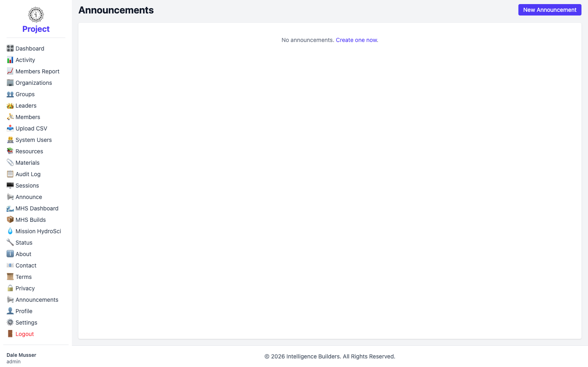
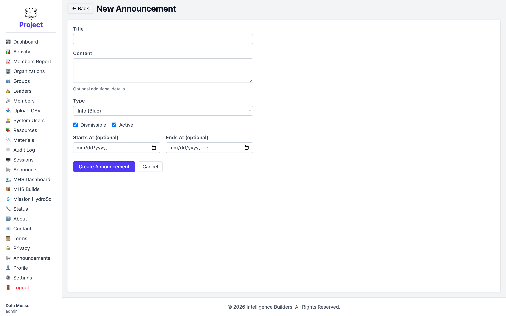

# Announce

**Announce** is where an administrator creates announcements — short messages shown
to users inside Strata Hub. The screen lists existing announcements; when there are
none, it invites you to create one.

<picture>
  <source media="(prefers-color-scheme: dark)" srcset="images/announce-list-dark.png">
  
</picture>

## Creating an announcement

Select **New Announcement** and fill in the form:

- **Title** and **Content** — the message itself (content is edited with the rich-
  text editor).
- **Type** — the visual style and urgency: **Info** (blue), **Warning** (yellow),
  or **Critical** (red).
- **Dismissible** — when checked, users can close the announcement.
- **Active** — when checked, the announcement is live; uncheck to keep it as a draft.
- **Starts At** / **Ends At** (optional) — schedule when it appears and disappears.
  Leave blank to show it immediately and indefinitely.

Select **Create Announcement** to publish it.

<picture>
  <source media="(prefers-color-scheme: dark)" srcset="images/announce-new-dark.png">
  
</picture>

> Users see the announcements meant for them under **Announcements** in their own
> menu.
