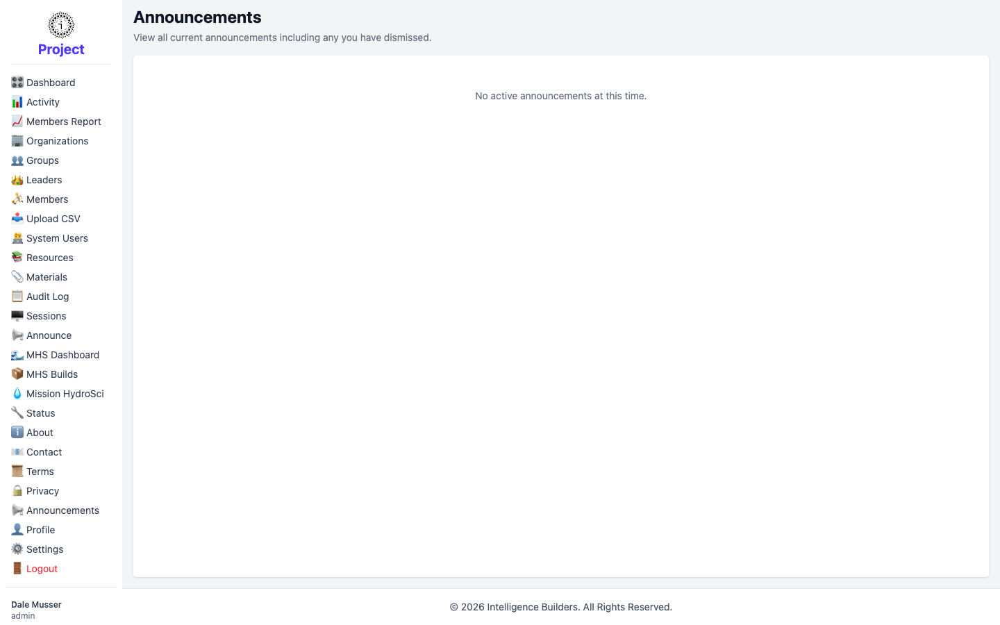

# Announcements

**Announcements** is your personal view of the announcements meant for you. It shows
the messages currently active for your account — including any you've dismissed — so
you can find one again after closing it. When there's nothing to show, it reads
*No active announcements at this time.*

<picture>
  <source media="(prefers-color-scheme: dark)" srcset="images/announcements-personal-dark.png">
  
</picture>

> This is the reading side of announcements. To **create** announcements for others,
> use [Announce](announce.md).
