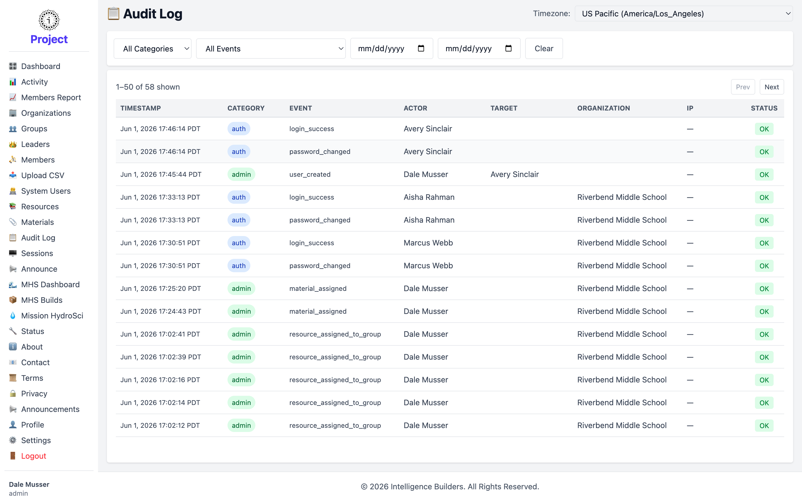

# Audit Log

The **Audit Log** is a record of significant actions taken in the workspace — sign-
ins, password changes, account creation, assignments, and more. It's useful for
reviewing who did what and when.

<picture>
  <source media="(prefers-color-scheme: dark)" srcset="images/audit-log-dark.png">
  
</picture>

## Filtering

Narrow the log with the controls along the top:

- **Category** — limit to a type of event, such as authentication or admin actions.
- **Event** — limit to a specific event type.
- **Date range** — restrict to entries between two dates.
- **Timezone** — display timestamps in the time zone you choose.

Select **Clear** to reset the filters.

## What each entry shows

- **Timestamp** — when it happened.
- **Category** and **Event** — what kind of action it was (for example `auth` /
  `login_success`).
- **Actor** — who performed it.
- **Target** — who or what it affected, if applicable.
- **Organization** — the organization involved, if applicable.
- **IP** — the network address the action came from.
- **Status** — the outcome (for example **OK**).

> The IP column is blank in the example screenshot above; in a live workspace it
> shows the source address for each entry.
