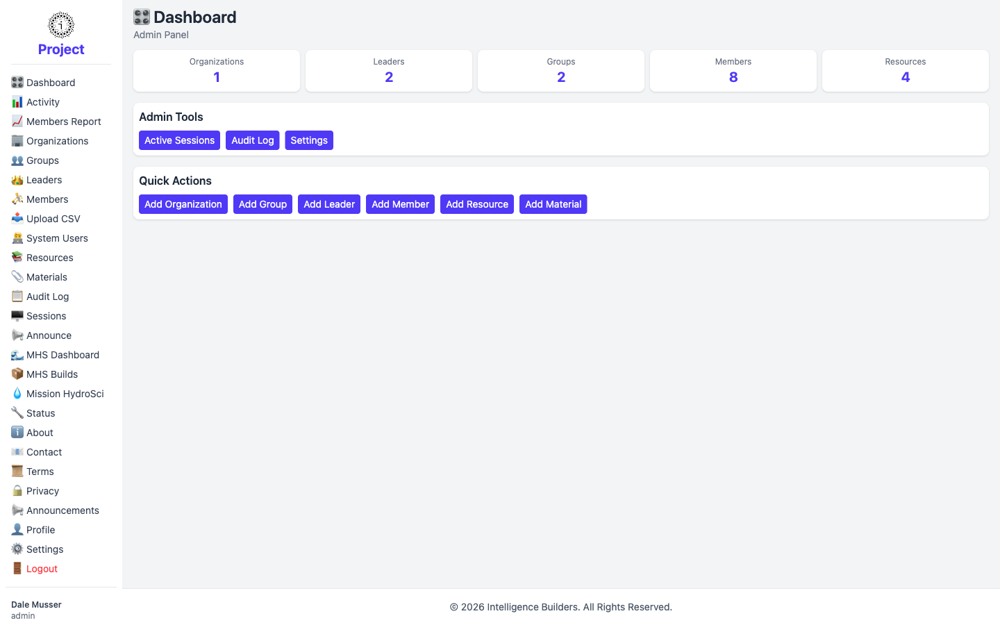

# Dashboard

The **Dashboard** is the first screen an administrator sees after signing in, and
the first item in the navigation menu. It gives an at-a-glance summary of the
workspace and quick shortcuts to the most common actions. The heading reads
**Dashboard**, with **Admin Panel** beneath it to show you're viewing it as an
administrator.

<picture>
  <source media="(prefers-color-scheme: dark)" srcset="images/dashboard-dark.png">
  
</picture>

## Summary cards

The row of cards across the top shows how much of each item exists in the
workspace:

- **Organizations** — the schools or institutions in the workspace.
- **Leaders** — the teachers or group facilitators.
- **Groups** — the classes or sections within organizations.
- **Members** — the students or participants.
- **Resources** — the assignable content available to members.

Each card is also a shortcut: select one to open that item's full list (for
example, selecting **Members** opens the Members screen). The counts update as you
add or remove items, so the Dashboard always reflects the current state.

## Admin Tools

The **Admin Tools** section links to workspace-wide administrative screens:

- **Active Sessions** — see who is currently signed in and manage active sessions.
- **Audit Log** — review a record of changes made in the workspace.
- **Settings** — configure site-wide options such as the site name, logo, and
  footer.

## Quick Actions

The **Quick Actions** section provides one-click shortcuts to create new items
without first navigating to each feature:

- **Add Organization**
- **Add Group**
- **Add Leader**
- **Add Member**
- **Add Resource**
- **Add Material**

Each opens the same creation form you'd reach from that feature's screen, and
returns you to the Dashboard when you're done. Step-by-step instructions for
creating each item are in [Getting Started](../getting-started.md).
