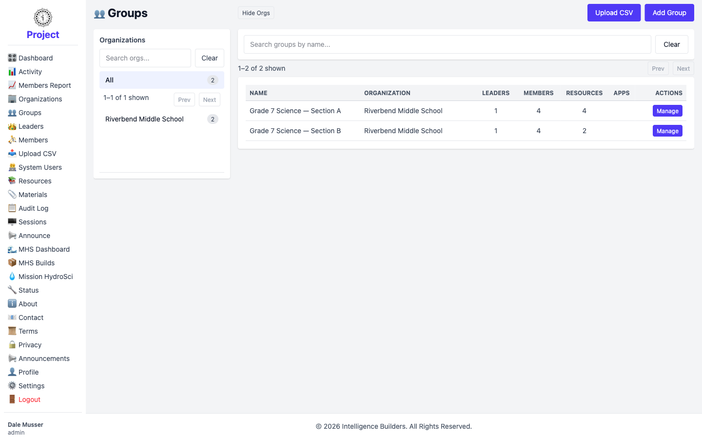
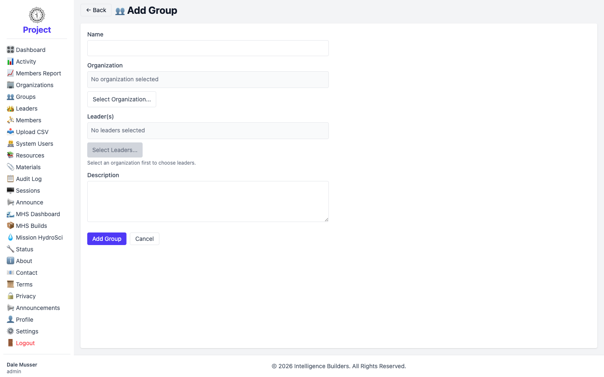
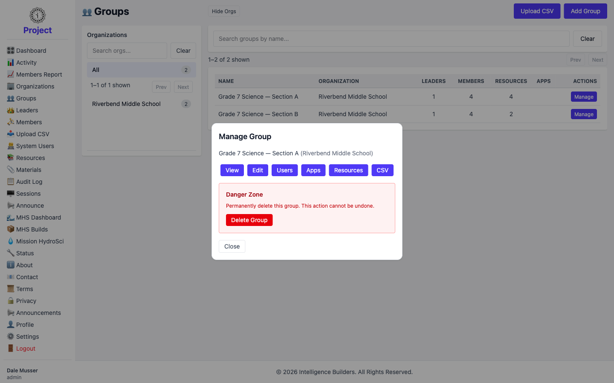
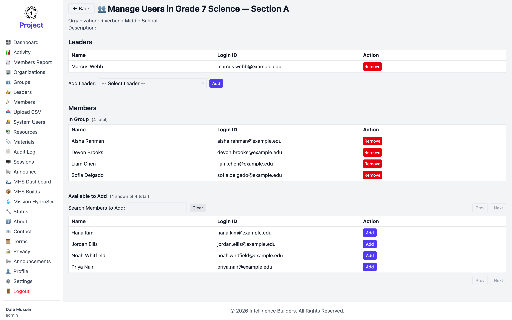
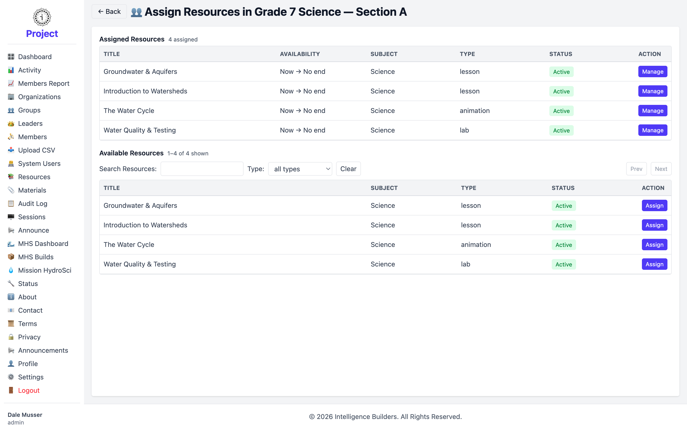
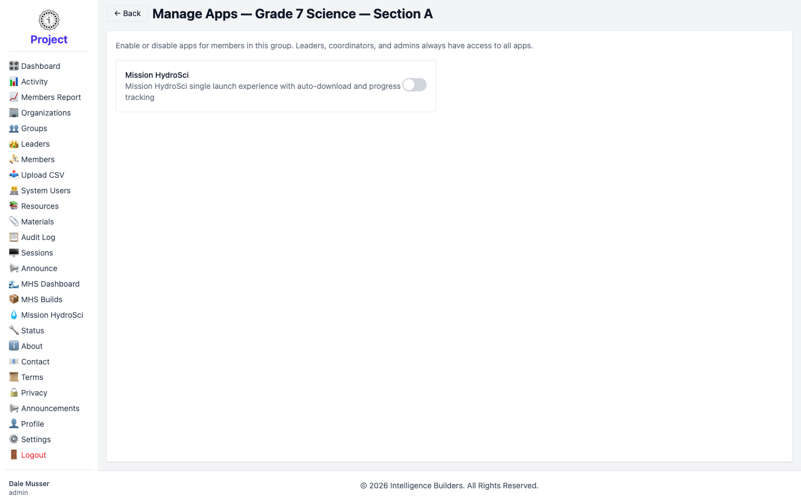

# Groups

A **group** is a class, section, or cohort inside an organization. Members belong to
groups, and resources are made available to members through the groups they're in.
The **Groups** screen is where an administrator creates groups and manages who and
what is in them.

## The groups list

The screen has two panes: organizations on the left (select one to filter), and the
groups in the selected organization on the right. Each group row shows its
organization and counts of **Leaders**, **Members**, **Resources**, and **Apps**.
Select **Add Group** to create one, or **Manage** on a row to work with it.

<picture>
  <source media="(prefers-color-scheme: dark)" srcset="images/groups-list-dark.png">
  
</picture>

## Adding a group

Give the group a **Name**, choose its **Organization** with **Select Organization…**,
and optionally add a **Description**. You can assign leaders now or leave that for
later. Select **Add Group** to save.

<picture>
  <source media="(prefers-color-scheme: dark)" srcset="images/group-new-dark.png">
  
</picture>

## Managing a group

Selecting **Manage** opens a panel of everything you can do for the group:

- **View** — see the group's details.
- **Edit** — change its name or description.
- **Users** — add or remove leaders and members (see below).
- **Apps** — enable or disable apps for the group (see below).
- **Resources** — assign resources to the group (see below).
- **CSV** — bulk-import members for the group from a file.
- **Delete Group** — permanently remove the group.

<picture>
  <source media="(prefers-color-scheme: dark)" srcset="images/group-manage-dark.png">
  
</picture>

## Managing users in a group

The **Users** page has two parts. Under **Leaders**, choose a person from the
**Add Leader** dropdown and select **Add**; remove one with **Remove**. Under
**Members**, search the **Available to Add** list and select **Add** to place
someone in the group, or **Remove** to take them out. The **In Group** list shows
the current members.

<picture>
  <source media="(prefers-color-scheme: dark)" srcset="images/group-users-dark.png">
  
</picture>

## Assigning resources to a group

The **Resources** page lists the group's **Assigned Resources** and the
**Available Resources** you can add. Select **Assign** next to a resource, confirm
its availability window, and it moves into the assigned list — making it visible to
every member of the group. Resources can be removed here too.

<picture>
  <source media="(prefers-color-scheme: dark)" srcset="images/group-resources-dark.png">
  
</picture>

## Managing apps for a group

The **Apps** page lets you enable or disable individual apps for the members of a
group. Leaders, coordinators, and admins always have access to all apps; this
setting controls what members can use. Select an app to toggle it on or off.

<picture>
  <source media="(prefers-color-scheme: dark)" srcset="images/group-apps-dark.png">
  
</picture>
