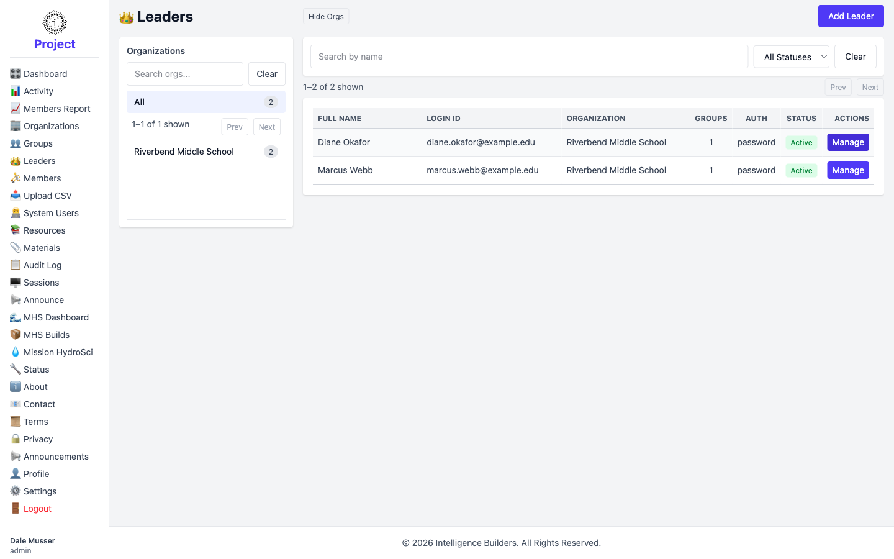
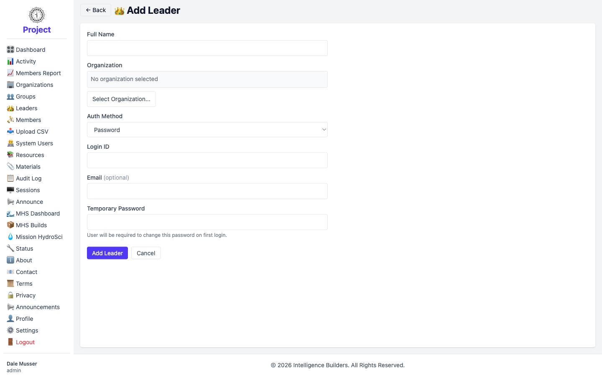
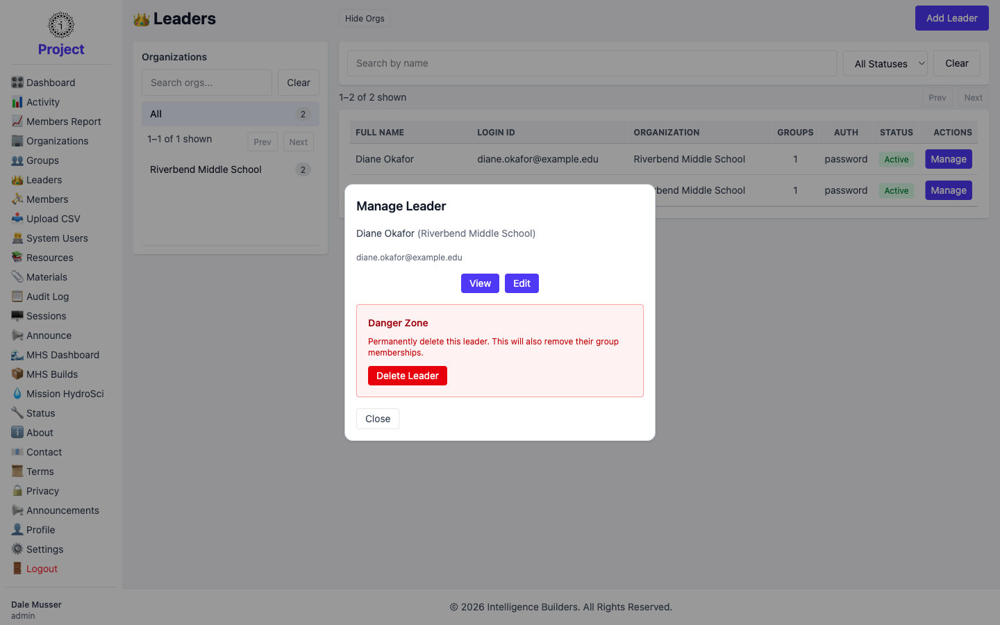
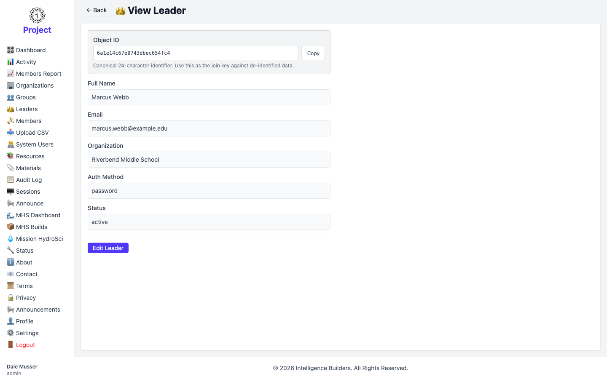
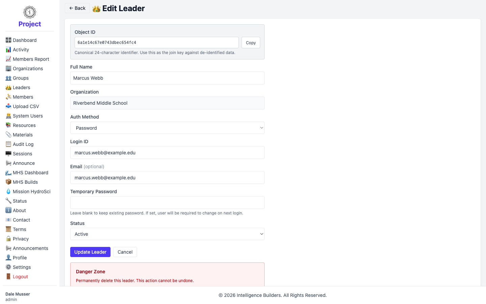

# Leaders

A **leader** is a teacher or group facilitator. Leaders manage groups and members
within their own organization. The **Leaders** screen is where an administrator
creates and manages leader accounts.

## The leaders list

Organizations are listed on the left (select one to filter); leaders appear on the
right with their **Login ID**, **Organization**, the number of **Groups** they lead,
their **Auth** method, and **Status**. Search by name or filter by status, and
select **Add Leader** to create one or **Manage** to work with an existing leader.

<picture>
  <source media="(prefers-color-scheme: dark)" srcset="images/leaders-list-dark.png">
  
</picture>

## Adding a leader

Enter the leader's **Full Name** and choose their **Organization**. Set the
**Auth Method** — **Password** lets them sign in with a temporary password you
provide, which they're prompted to change on first login. Enter a **Login ID** (an
email works well) and an optional **Email**, then select **Add Leader**.

<picture>
  <source media="(prefers-color-scheme: dark)" srcset="images/leader-new-dark.png">
  
</picture>

> **Assigning a leader to a group** is done from the group, not here — open
> **Groups → Manage → Users** and add the leader there. See [Groups](groups.md).

## Managing a leader

Selecting **Manage** opens a panel with **View**, **Edit**, and a **Danger Zone**
for deleting the leader. Deleting a leader also removes their group memberships.

<picture>
  <source media="(prefers-color-scheme: dark)" srcset="images/leader-manage-dark.png">
  
</picture>

## Viewing details

The **View** screen shows the leader's full name, email, organization, auth method,
and status, along with the **Object ID** — a fixed identifier for matching against
exported data.

<picture>
  <source media="(prefers-color-scheme: dark)" srcset="images/leader-view-dark.png">
  
</picture>

## Editing

The **Edit** screen lets you update the leader's details and **Status** (Active or
Disabled). Setting a new **Temporary Password** here resets their password and
prompts them to choose a new one at their next login; leave it blank to keep the
current password. Save with **Update Leader**.

<picture>
  <source media="(prefers-color-scheme: dark)" srcset="images/leader-edit-dark.png">
  
</picture>
