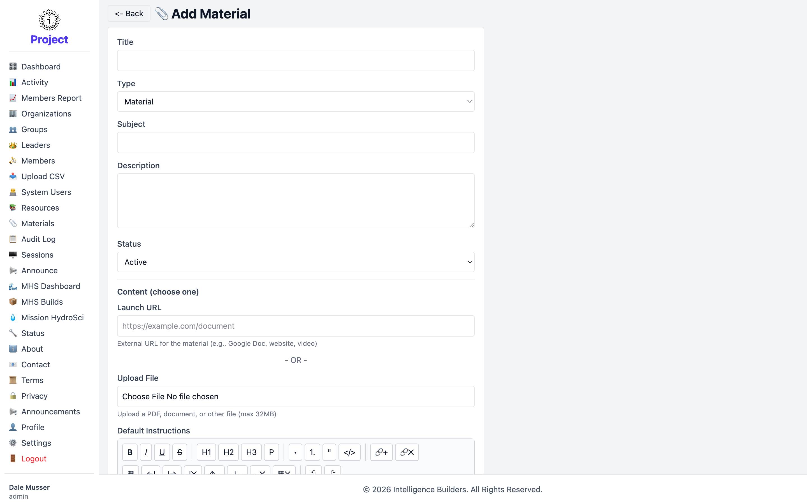
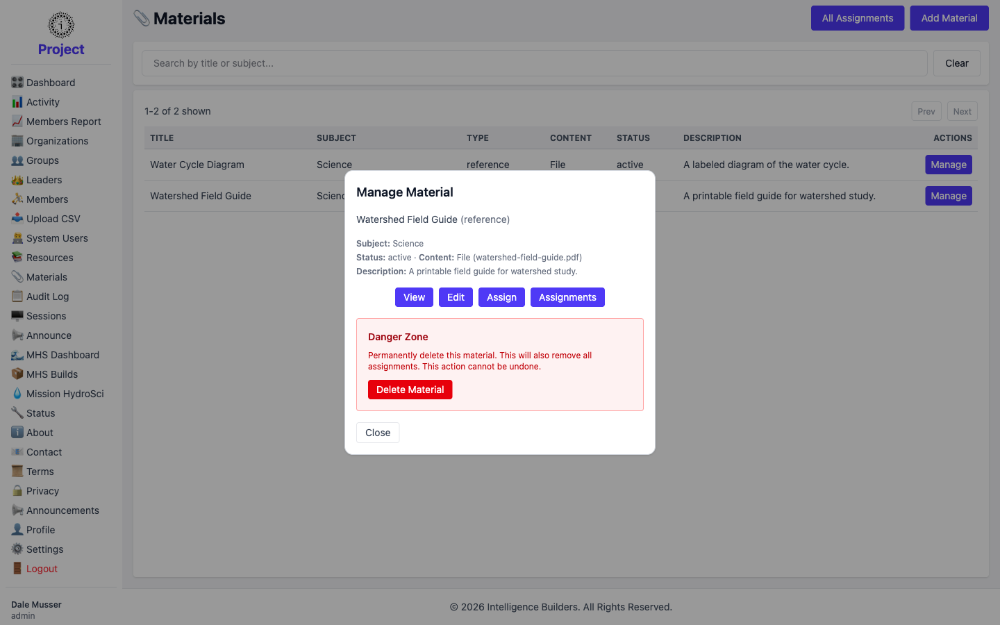
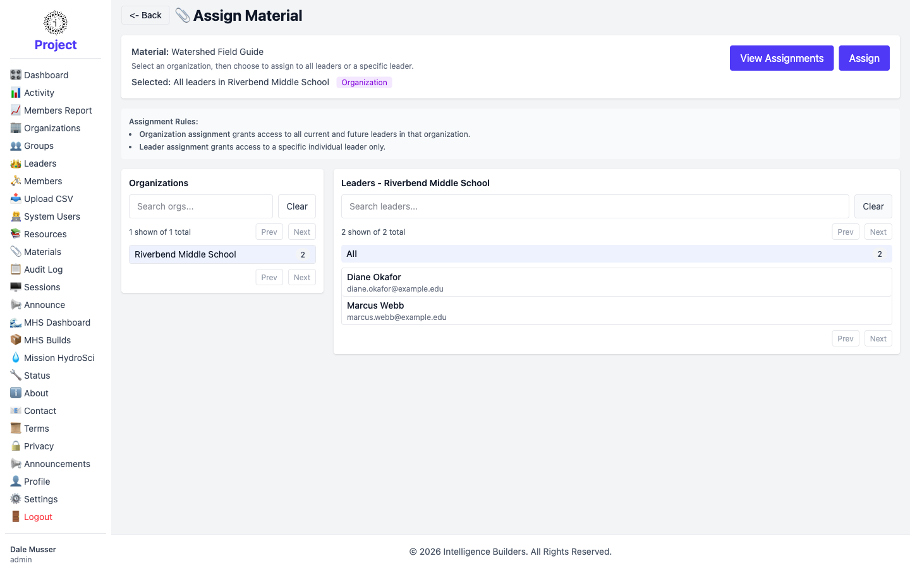
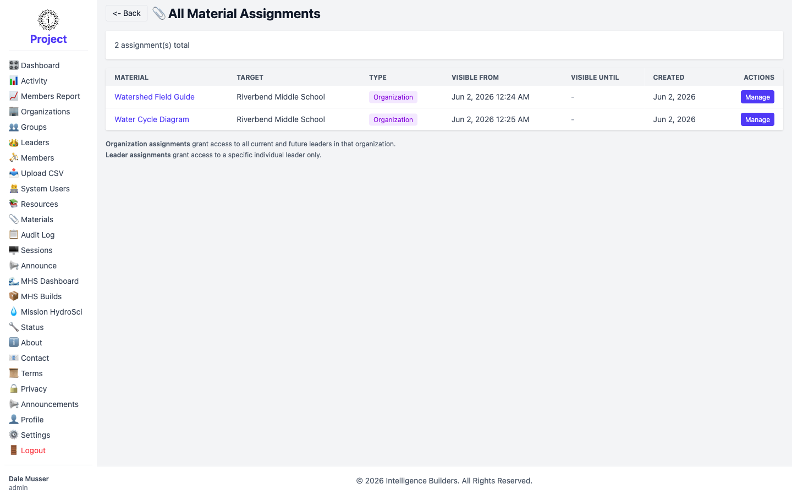

# Materials

A **material** is a link or uploaded file made available to **leaders** — for
example a teaching guide or a reference diagram. Materials work just like
[resources](resources.md), except resources go to members and materials go to
leaders. The two are independent of each other.

## The materials list

The list shows every material with its **Subject**, **Type**, **Content** (file or
link), and **Status**. Select **Add Material** to create one, **Manage** to work
with an existing material, or **All Assignments** to see every material assignment
in one place.

<picture>
  <source media="(prefers-color-scheme: dark)" srcset="images/materials-list-dark.png">
  
</picture>

## Adding a material

The form mirrors the resource form: give the material a **Title**, **Type**,
**Subject**, and **Description**, set its **Status**, and provide content as a
**Launch URL** or an uploaded **file**. Select **Add Material** to save.

<picture>
  <source media="(prefers-color-scheme: dark)" srcset="images/material-new-dark.png">
  
</picture>

## Managing a material

Selecting **Manage** opens a panel with **View**, **Edit**, **Assign**,
**Assignments**, and a **Danger Zone** for deleting the material.

<picture>
  <source media="(prefers-color-scheme: dark)" srcset="images/material-manage-dark.png">
  
</picture>

## Assigning a material to leaders

Select **Assign**, then pick the **Organization** on the left. On the right, choose
**All** to grant every leader in that organization access (including any added
later), or pick an individual leader. Select **Assign**, set the visibility window
on the confirmation screen, and select **Assign Material**.

<picture>
  <source media="(prefers-color-scheme: dark)" srcset="images/material-assign-dark.png">
  
</picture>

## Reviewing assignments

**All Assignments** (from the Materials list) lists every material assignment across
the workspace — which material, which target, and its visibility dates. The
per-material **Assignments** link shows the same for a single material.

<picture>
  <source media="(prefers-color-scheme: dark)" srcset="images/material-assignments-dark.png">
  
</picture>
