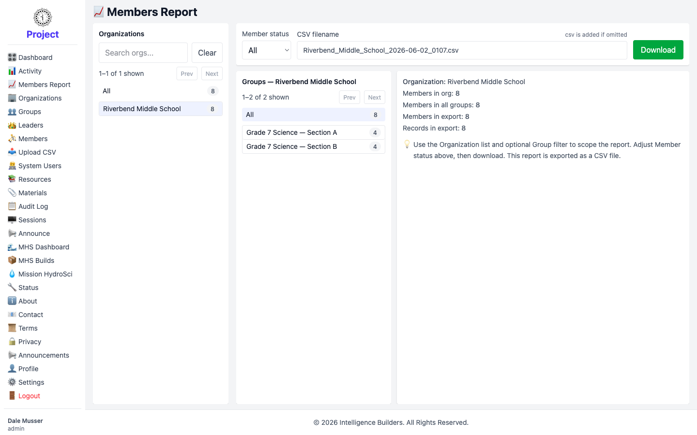

# Members Report

The **Members Report** exports member data as a CSV file for use outside Strata Hub
— for example in a spreadsheet or a school information system. You scope the report
with a few filters, confirm the totals, and download.

<picture>
  <source media="(prefers-color-scheme: dark)" srcset="images/members-report-dark.png">
  
</picture>

## Scoping the report

Work left to right across the panels:

1. **Organizations** — choose **All** to include every organization, or select one
   to limit the report to it. A search box helps when there are many.
2. **Groups** — once an organization is selected, its groups appear. Choose **All**
   for the whole organization, or a single group to narrow further.
3. **Member status** — include **All** members, or only **Active** or **Disabled**
   ones.

## Checking the totals

As you adjust the filters, the summary updates to show exactly what the export will
contain:

- **Members in org** — total members in the selected organization.
- **Members in all groups** — how many belong to groups.
- **Members in export** — how many the current filters will include.
- **Records in export** — the number of rows the file will contain.

## Downloading

Optionally type a **CSV filename** (the `.csv` extension is added automatically if
you leave it off), then select **Download** to save the file.
