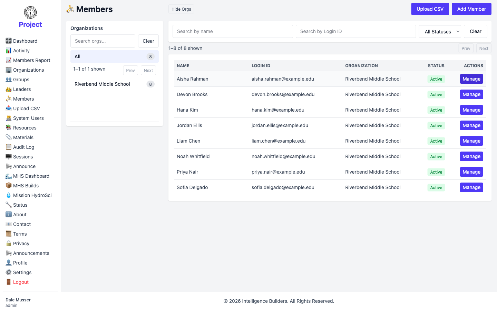
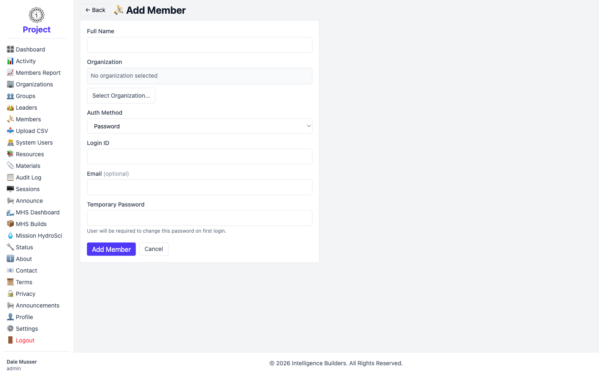
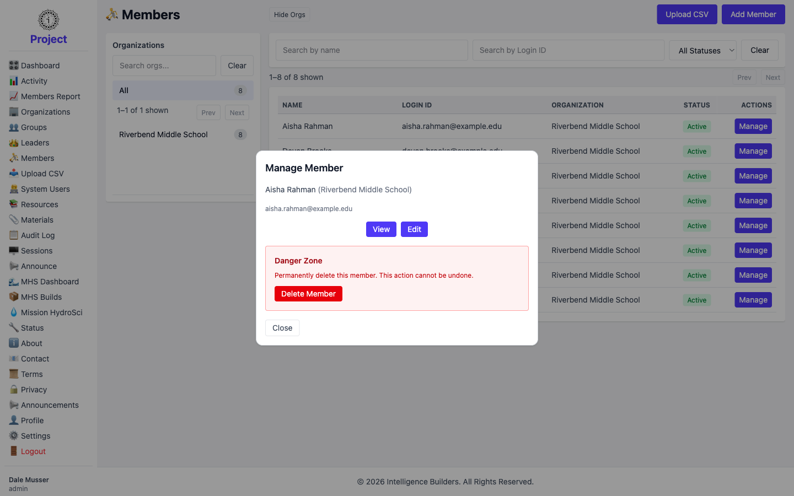
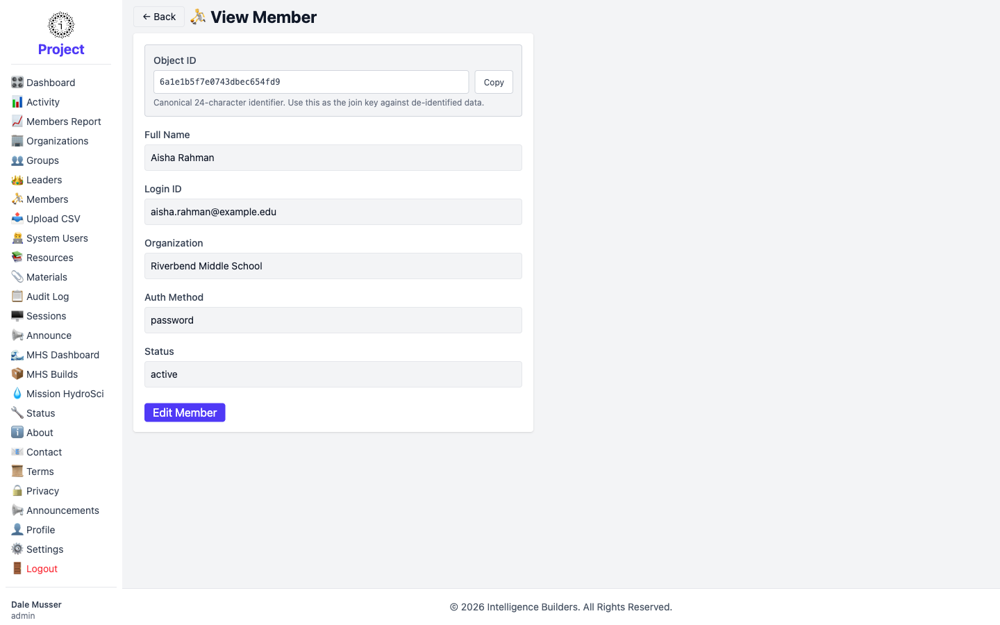
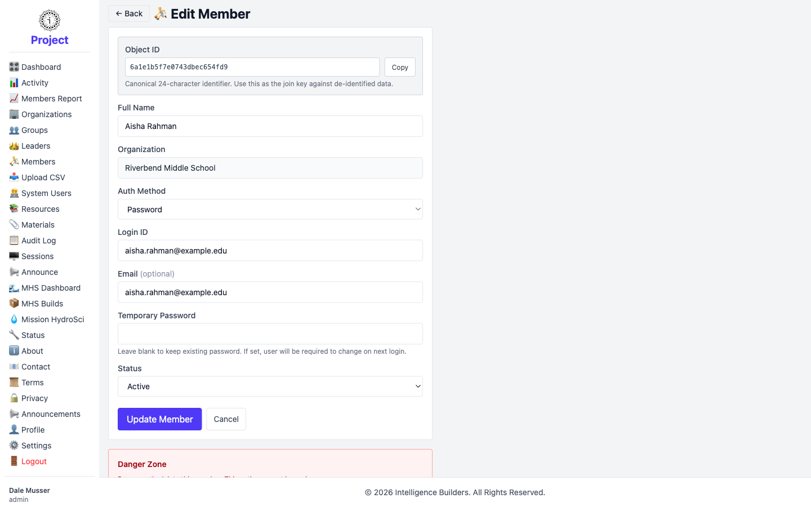

# Members

A **member** is a student or participant. Members belong to groups and open the
resources assigned to those groups. The **Members** screen is where an administrator
creates and manages member accounts.

## The members list

Organizations are listed on the left (select one to filter); members appear on the
right with their **Login ID**, **Organization**, and **Status**. Search by name or
filter by status. Select **Add Member** to create one or **Manage** to work with an
existing member.

<picture>
  <source media="(prefers-color-scheme: dark)" srcset="images/members-list-dark.png">
  
</picture>

## Adding a member

Enter the member's **Full Name** and choose their **Organization**. Set the
**Auth Method** — **Password** lets them sign in with a temporary password you
provide, which they change on first login. Enter a **Login ID** and an optional
**Email**, then select **Add Member**.

<picture>
  <source media="(prefers-color-scheme: dark)" srcset="images/member-new-dark.png">
  
</picture>

> **Placing a member in a group** is done from the group, not here — open
> **Groups → Manage → Users** and add them under **Members**. See
> [Groups](groups.md). A member only sees resources once they're in a group the
> resources are assigned to.

## Managing a member

Selecting **Manage** opens a panel with **View**, **Edit**, and a **Danger Zone**
for deleting the member. Deleting a member also removes their group memberships.

<picture>
  <source media="(prefers-color-scheme: dark)" srcset="images/member-manage-dark.png">
  
</picture>

## Viewing details

The **View** screen shows the member's details and their **Object ID** — a fixed
identifier for matching against exported data.

<picture>
  <source media="(prefers-color-scheme: dark)" srcset="images/member-view-dark.png">
  
</picture>

## Editing

The **Edit** screen lets you update the member's details and **Status** (Active or
Disabled). Setting a new **Temporary Password** resets their password and prompts
them to choose a new one at their next login; leave it blank to keep the current
password. Save with **Update Member**.

<picture>
  <source media="(prefers-color-scheme: dark)" srcset="images/member-edit-dark.png">
  
</picture>
