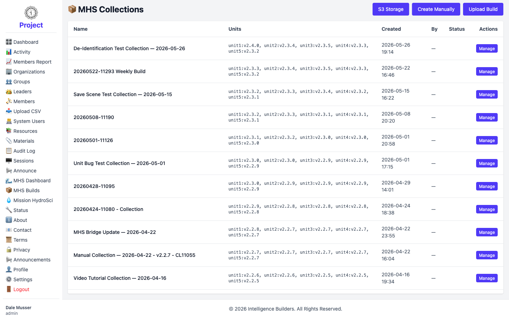

# MHS Builds

**MHS Builds** lists the **Mission HydroSci collections** — bundles of the game's
units at specific versions. A collection is what gets made available to members, so
this screen is the catalog of available builds. (This feature appears in workspaces
that include the Mission HydroSci app.)

<picture>
  <source media="(prefers-color-scheme: dark)" srcset="images/mhs-builds-dark.png">
  
</picture>

## What the list shows

Each row is one collection:

- **Name** — the collection's name.
- **Units** — the unit versions bundled in it (for example `unit1:v2.4.0`).
- **Created** — when it was made.
- **By** — who created it (masked in the screenshot above).
- **Status** — its current state.
- **Actions** — management options for the collection.

> Mission HydroSci collections are maintained centrally and shared across all
> workspaces, so this guide covers only viewing the catalog. Creating, uploading, or
> changing collections is handled by the Mission HydroSci team and isn't part of
> day-to-day workspace administration.
