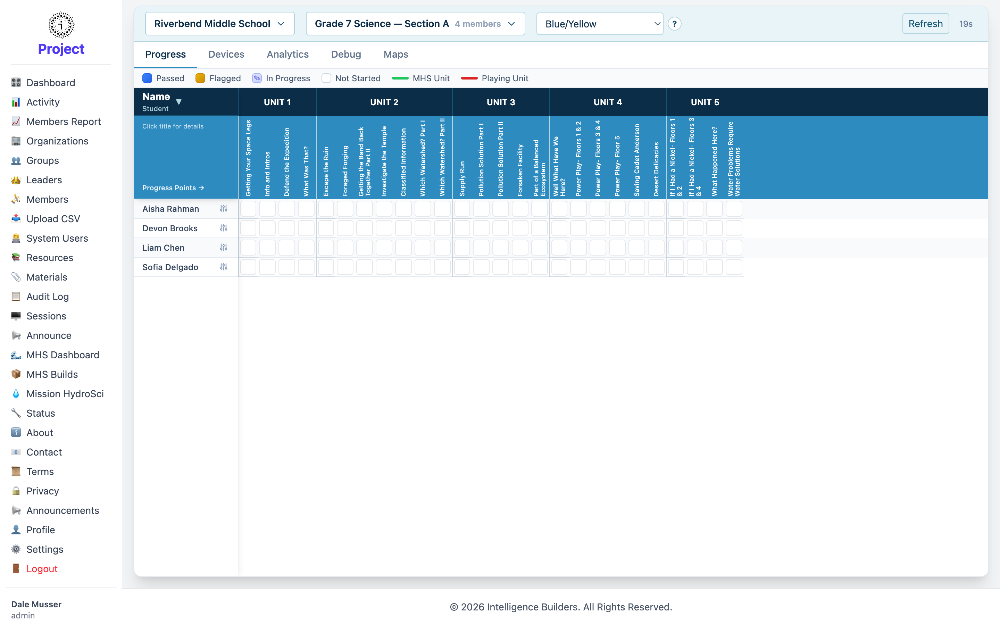

# MHS Dashboard

The **MHS Dashboard** is the monitoring view for **Mission HydroSci**, the learning
app that members play. It lets an administrator or leader follow how the members of a
group are progressing through the Mission HydroSci units. (This feature appears in
workspaces that include the Mission HydroSci app.)

<picture>
  <source media="(prefers-color-scheme: dark)" srcset="images/mhs-dashboard-dark.png">
  
</picture>

## Choosing what to view

At the top, pick the **organization** and **group** you want to look at — the member
count for the selected group is shown. Select **Refresh** to pull the latest data.

## Views

Tabs switch between different ways of looking at the same group:

- **Progress** — each member's progress through the units (shown above).
- **Devices** — the devices members are playing on.
- **Analytics** — summarized activity and performance.
- **Debug** and **Maps** — additional diagnostic and map views.

## Reading the progress grid

In the **Progress** view, each row is a member and the columns are the units
(**Unit 1** through **Unit 5**), broken into progress points. The colored legend
explains each state:

- **Passed** — completed successfully.
- **Flagged** — needs attention.
- **In Progress** — currently working through it.
- **Not Started** — not yet begun.

Markers also indicate the **MHS Unit** and the member's currently **Playing Unit**.
Select a member to set or review their progress in detail.
