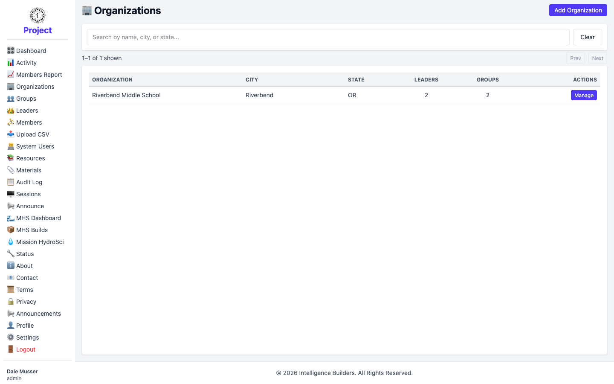
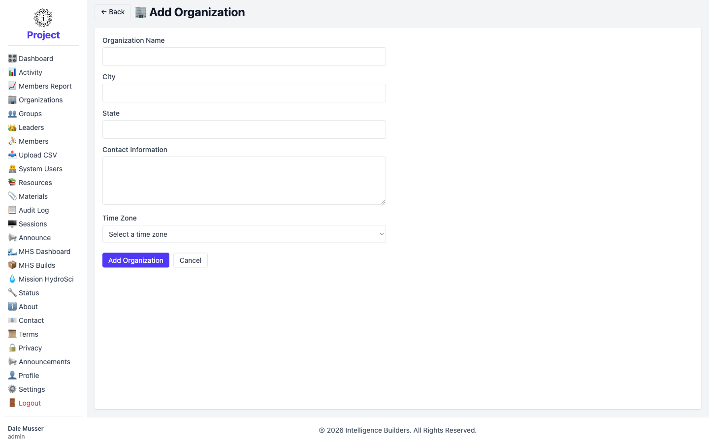
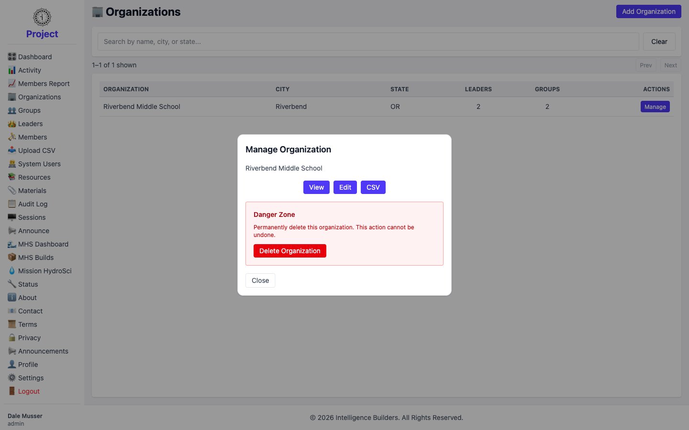
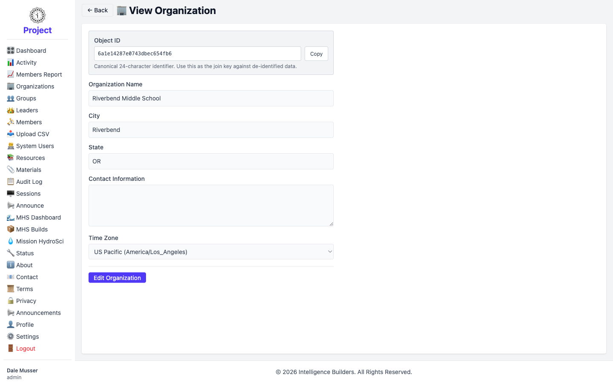
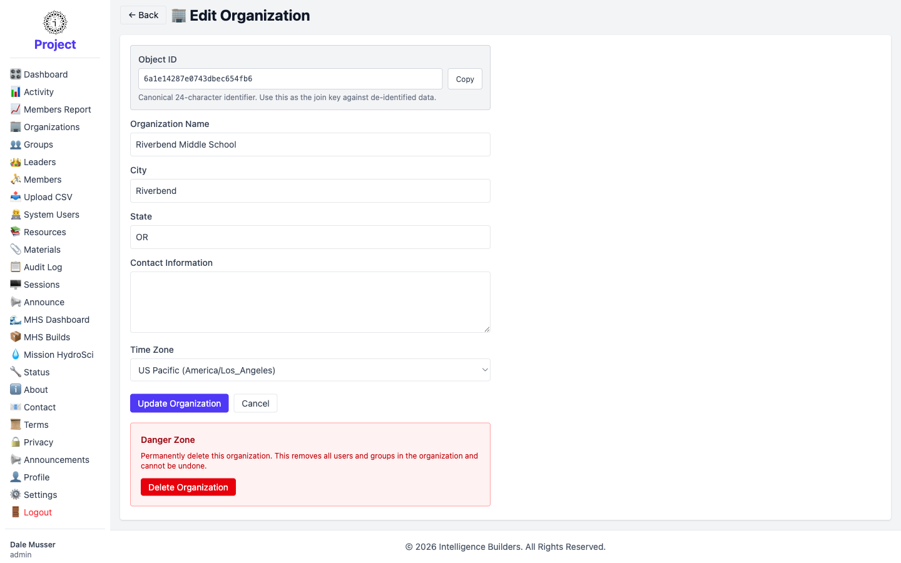

# Organizations

An **organization** is the top-level container in Strata Hub — a school or
institution that owns its own groups, leaders, and members. The **Organizations**
screen is where an administrator creates and manages them.

## The organizations list

The list shows every organization with its **City** and **State** and a count of its
**Leaders** and **Groups**. Use the search box to filter by name, city, or state.
Select **Add Organization** to create one, or **Manage** on a row to work with an
existing organization.

<picture>
  <source media="(prefers-color-scheme: dark)" srcset="images/organizations-list-dark.png">
  
</picture>

## Adding an organization

Select **Add Organization** and fill in the form. Only **Organization Name** is
required; **City**, **State**, **Contact Information**, and **Time Zone** are
optional but recommended. The time zone is used when scheduling and reporting on
the organization's activity. Select **Add Organization** to save.

<picture>
  <source media="(prefers-color-scheme: dark)" srcset="images/organization-new-dark.png">
  
</picture>

## Managing an organization

Selecting **Manage** opens a panel with everything you can do for that organization:

- **View** — see its details.
- **Edit** — change its details.
- **CSV** — bulk-import groups and members for this organization from a file.
- **Delete Organization** — permanently remove it (see Deleting, below).

<picture>
  <source media="(prefers-color-scheme: dark)" srcset="images/organization-manage-dark.png">
  
</picture>

## Viewing details

The **View** screen shows the organization's information read-only, along with its
**Object ID** — a fixed 24-character identifier you can use as a stable key when
matching against exported or de-identified data. Select **Edit Organization** to
make changes.

<picture>
  <source media="(prefers-color-scheme: dark)" srcset="images/organization-view-dark.png">
  
</picture>

## Editing

The **Edit** screen lets you update the name, city, state, contact information, and
time zone. Save your changes with **Update Organization**.

<picture>
  <source media="(prefers-color-scheme: dark)" srcset="images/organization-edit-dark.png">
  
</picture>

## Deleting

Use **Delete Organization** in the Manage panel's **Danger Zone** to remove an
organization permanently. This cannot be undone, so make sure the organization is no
longer needed — deleting it also removes its related assignments.
