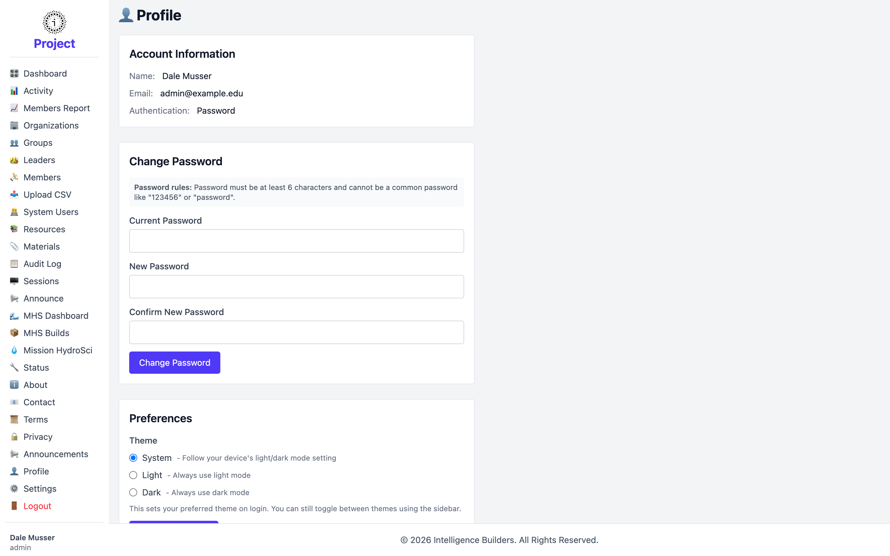

# Profile

**Profile** is your own account page — every signed-in user has one. It shows your
account details and lets you change your password and theme.

<picture>
  <source media="(prefers-color-scheme: dark)" srcset="images/profile-dark.png">
  
</picture>

## Account information

Shows your **Name**, **Email**, and **Authentication** method (how you sign in).

## Change password

Enter your **Current Password**, then a **New Password** and confirmation, and select
**Change Password**. Passwords must be at least 6 characters and can't be a common
password like "123456" or "password".

## Preferences

The **Theme** preference sets which appearance you get when you sign in:

- **System** — follow your device's light/dark setting (the default).
- **Light** — always use light mode.
- **Dark** — always use dark mode.

You can still switch themes at any time with the toggle in the sidebar. Select
**Save Preferences** to keep your choice.
