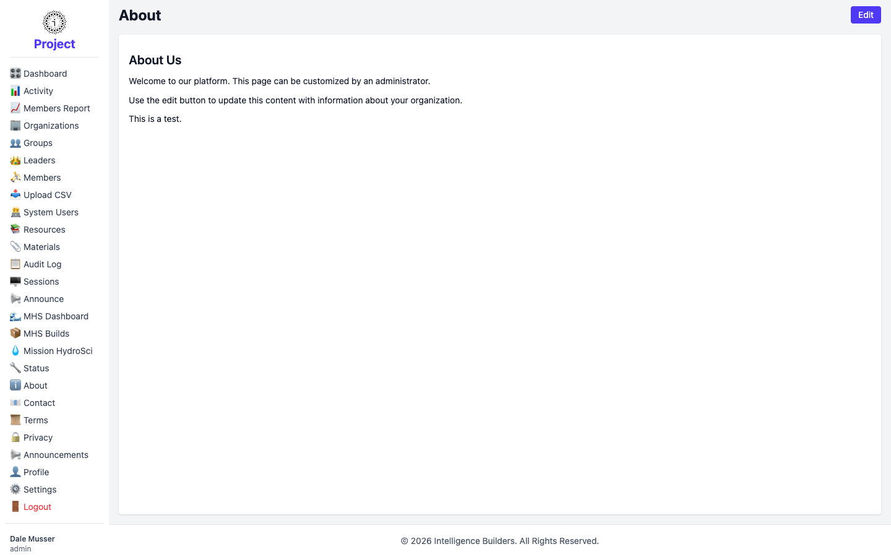
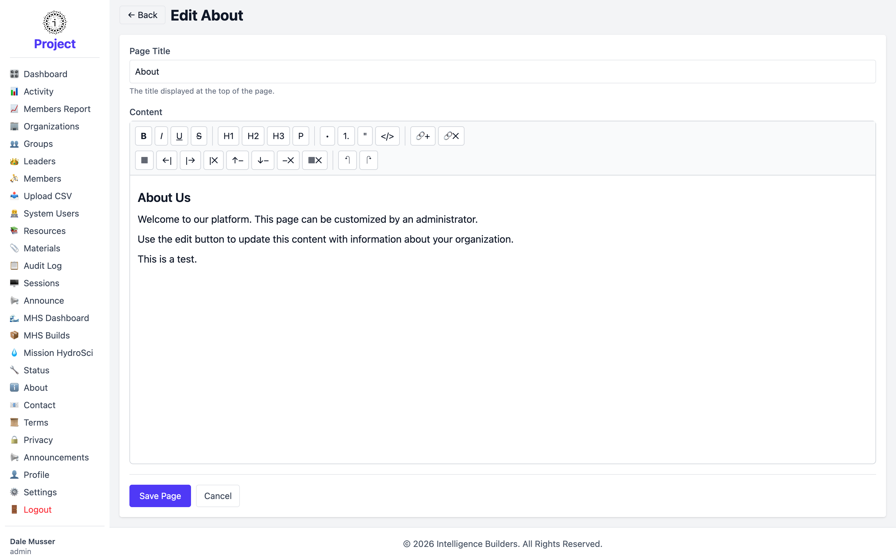

# Public pages (About, Contact, Terms, Privacy)

The **About**, **Contact**, **Terms**, and **Privacy** items at the bottom of the
menu are informational pages that anyone can read, including visitors who aren't
signed in. As an administrator you can edit their content to suit your organization.

<picture>
  <source media="(prefers-color-scheme: dark)" srcset="images/public-page-dark.png">
  
</picture>

## Editing a page

On any of these pages, select **Edit**. You can change the **Page Title** and edit
the **Content** with the rich-text editor — add headings, links, lists, and
formatting. Select **Save Page** to publish your changes.

<picture>
  <source media="(prefers-color-scheme: dark)" srcset="images/public-page-edit-dark.png">
  
</picture>

The same steps apply to **Contact**, **Terms**, and **Privacy** — each has its own
editable content.
