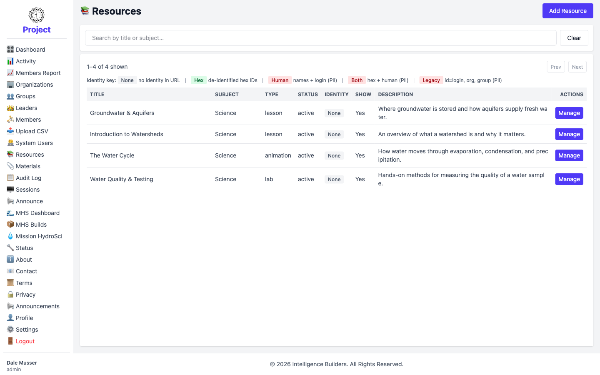
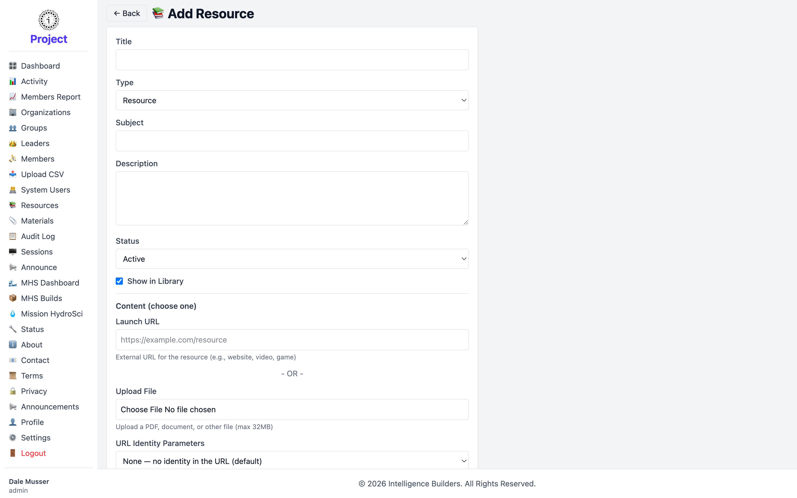
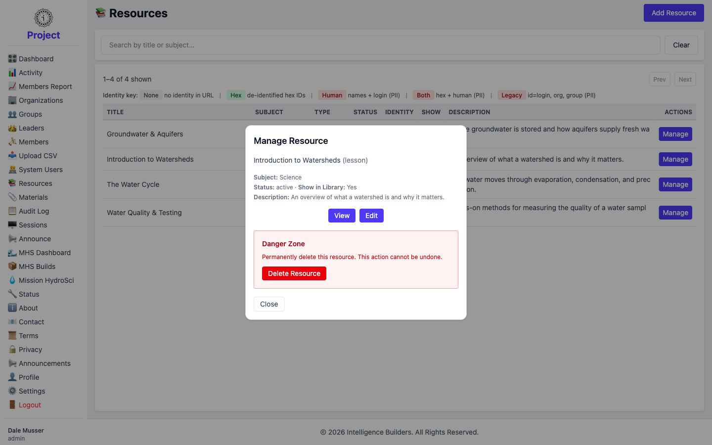

# Resources

A **resource** is a piece of learning content — a link or an uploaded file — that
members open. Resources are created here and then made available to members by
assigning them to groups.

## The resources list

The list shows every resource with its **Subject**, **Type**, **Status**, and
whether it appears in the library. Use the search box to find one. Select **Add
Resource** to create one, or **Manage** to work with an existing resource.

<picture>
  <source media="(prefers-color-scheme: dark)" srcset="images/resources-list-dark.png">
  
</picture>

## Adding a resource

Fill in the resource's details:

- **Title**, **Type** (lesson, video, lab, and so on), **Subject**, and a short
  **Description**.
- **Status** — **Active** makes it usable by members; **Disabled** hides it from
  members even where it's assigned.
- **Show in Library** — when checked, leaders can find it when assigning to their
  groups.
- **Content** — provide either a **Launch URL** (an external page, video, or
  activity) **or** upload a **file**.
- **URL Identity Parameters** — optionally pass identity information (such as
  de-identified IDs) along to the launch URL when a member opens the resource.
- **Default Instructions** — optional guidance shown to members, edited with the
  built-in rich-text editor.

The on-screen reference table explains exactly how **Status** and **Show in Library**
affect what members and leaders see.

<picture>
  <source media="(prefers-color-scheme: dark)" srcset="images/resource-new-dark.png">
  
</picture>

## Managing a resource

Selecting **Manage** opens a panel with **View**, **Edit**, and a **Danger Zone**
for deleting the resource.

<picture>
  <source media="(prefers-color-scheme: dark)" srcset="images/resource-manage-dark.png">
  
</picture>

## Making a resource available to members

Creating a resource doesn't show it to anyone on its own — it becomes visible when
it's assigned to a group. Do this from the group: **Groups → Manage → Resources**.
See [Groups](groups.md). Members then see it on their own Resources screen.
