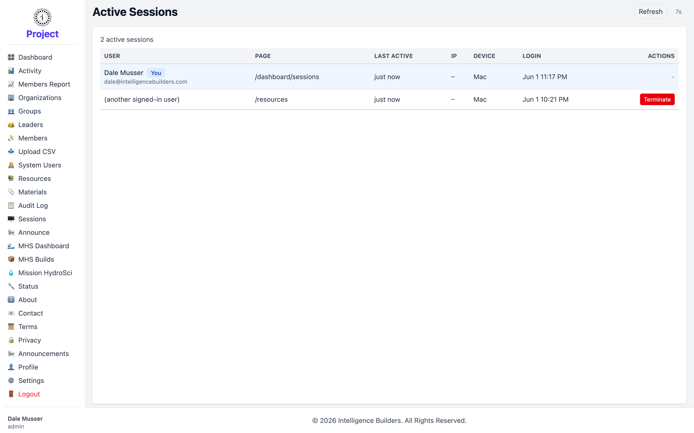

# Sessions

**Active Sessions** shows who is currently signed in to the workspace and lets you
end a session if needed. (It's also reachable from the Dashboard's **Admin Tools**.)

<picture>
  <source media="(prefers-color-scheme: dark)" srcset="images/sessions-dark.png">
  
</picture>

## What each row shows

- **User** — who is signed in. Your own session is marked **You**.
- **Page** — the screen they're currently on.
- **Last Active** — when they were last seen.
- **IP** — the network address they're connecting from.
- **Device** — the kind of device they're using.
- **Login** — when their session started.
- **Actions** — **Terminate** ends another user's session (you can't terminate your
  own here).

Select **Refresh** to update the list; it also refreshes on its own periodically.
