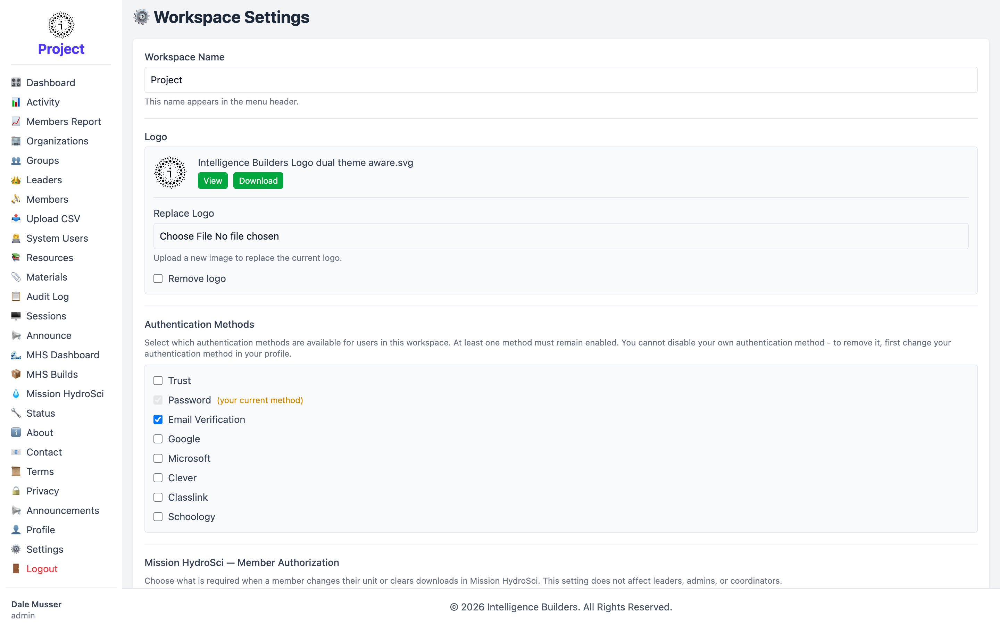

# Settings

**Workspace Settings** controls how the whole workspace looks and how people can
sign in to it. (It's also reachable from the Dashboard's **Admin Tools**.)

<picture>
  <source media="(prefers-color-scheme: dark)" srcset="images/settings-dark.png">
  
</picture>

## Workspace name

The **Workspace Name** appears in the menu header at the top of the navigation. Edit
the field and save to change it everywhere.

## Logo

The **Logo** section shows the current logo with options to **replace** it (upload a
new image) or **remove** it. A theme-aware logo automatically adapts to light and
dark mode.

## Authentication methods

Choose which **Authentication Methods** are available to users in the workspace —
for example Password, Email Verification, Google, Microsoft, Clever, or ClassLink.
At least one method must stay enabled, and you can't disable the method you're
currently signed in with (change your own method in your [Profile](profile.md)
first).

## Footer

The **Footer** is edited with the rich-text editor and appears at the bottom of
every page — useful for a copyright line or organization details.

Save your changes to apply them across the workspace.
