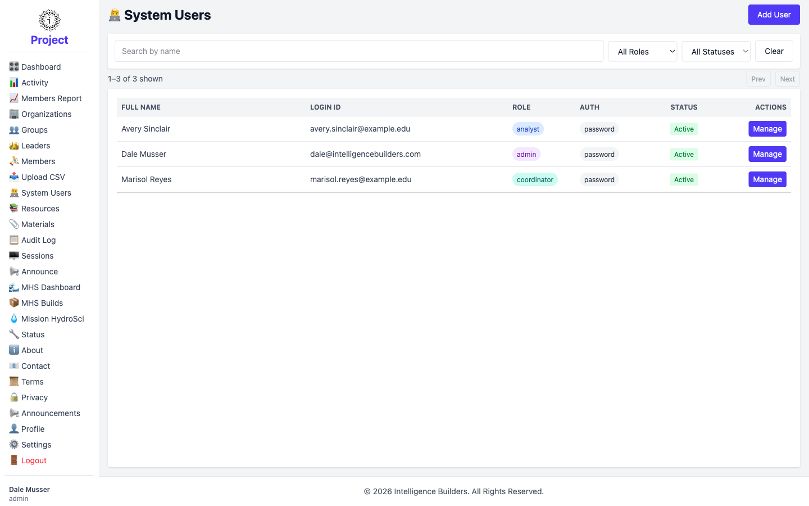
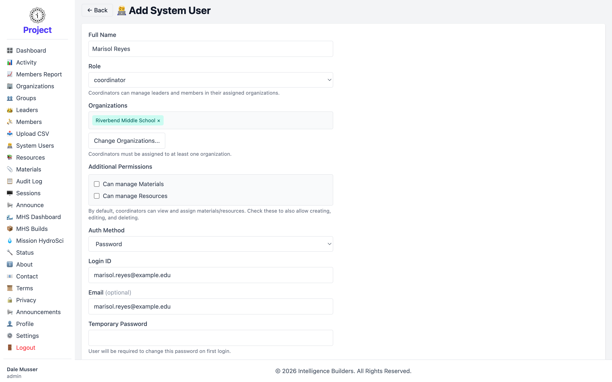
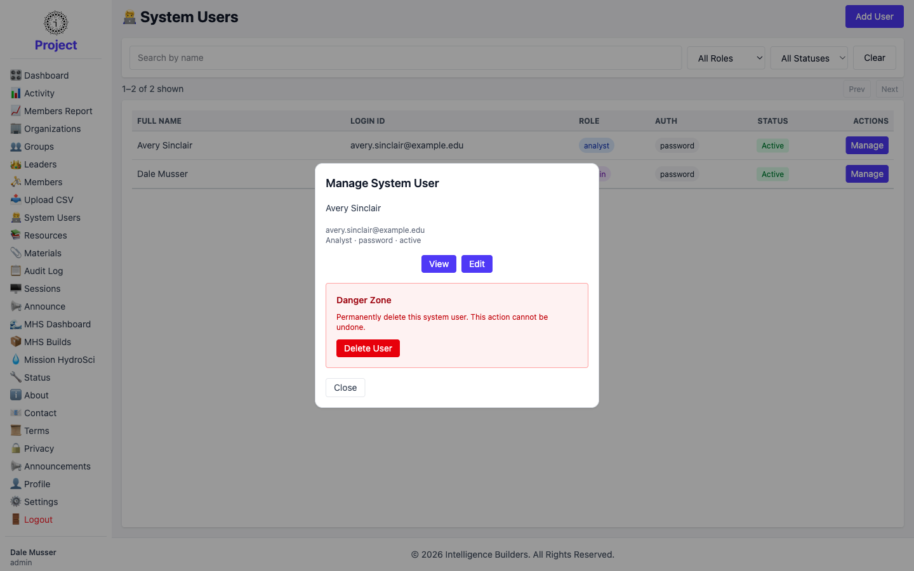

# System Users

**System Users** are the administrative accounts that run the workspace itself —
**administrators**, **analysts**, and **coordinators**. (Leaders and members are
managed on their own screens; this screen is for staff-level access.)

## The system users list

The list shows each system user with their **Login ID**, **Role**, **Auth** method,
and **Status**. Select **Add User** to create one, or **Manage** to work with an
existing account.

<picture>
  <source media="(prefers-color-scheme: dark)" srcset="images/system-users-list-dark.png">
  
</picture>

## Adding a system user

Enter the **Full Name** and choose a **Role**:

- **admin** — full access to everything in the workspace.
- **analyst** — read-only access to the dashboard and the Members Report.
- **coordinator** — manages leaders and members within one or more assigned
  organizations.

Then choose an **Auth Method** (for example **Password**, which provides a temporary
password the user changes on first login), set a **Login ID** and optional
**Email**, and select **Add System User**.

### Creating a coordinator

Coordinators have two extra steps because they're scoped to organizations. The
screenshot below shows adding a coordinator, **Marisol Reyes**:

- **Organizations** — select **Select Organizations…** and choose one or more
  organizations. A coordinator must be assigned at least one.
- **Additional Permissions** — by default a coordinator can view and assign
  materials and resources. Check **Can manage Materials** and/or **Can manage
  Resources** to also let them create, edit, and delete those items.

<picture>
  <source media="(prefers-color-scheme: dark)" srcset="images/system-user-new-dark.png">
  
</picture>

## Managing a system user

Selecting **Manage** opens a panel with **View**, **Edit**, and — for accounts other
than your own — **Delete User**. You cannot delete the account you're signed in with,
which protects against locking yourself out.

<picture>
  <source media="(prefers-color-scheme: dark)" srcset="images/system-user-manage-dark.png">
  
</picture>
