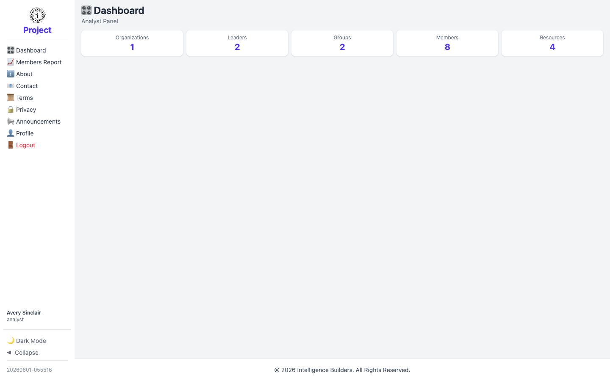
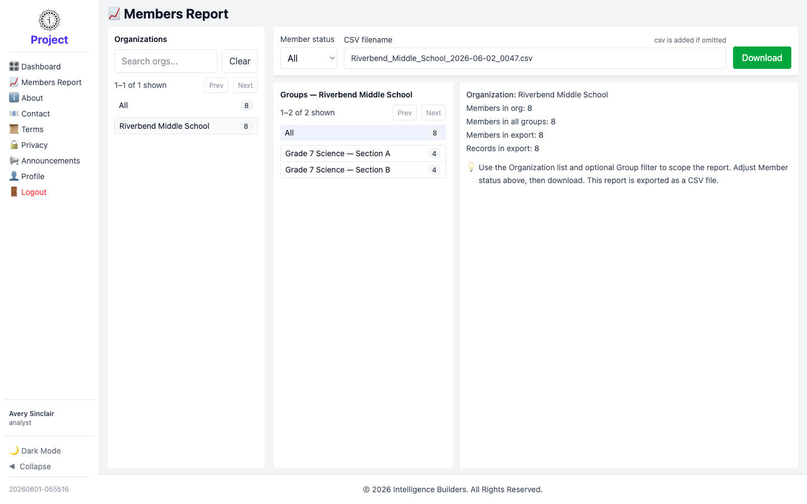

# The analyst view

An **analyst** has read-only access for reporting. Analysts don't create or change
anything — they see an overview of the workspace and can export member data for
analysis. This guide shows what an analyst sees after signing in. (Creating accounts
and setting up the workspace is covered in [Getting Started](getting-started.md).)

> **Signing in:** an analyst signs in with the **Login ID** and temporary password
> created for their account, and is prompted to choose their own password the first
> time.

---

## Dashboard

After signing in, an analyst lands on the **Dashboard** — an **Analyst Panel** with
the same summary cards an administrator sees: Organizations, Leaders, Groups,
Members, and Resources. The figures are for reference only; an analyst has no
create or edit actions.

<picture>
  <source media="(prefers-color-scheme: dark)" srcset="images/analyst-dashboard-dark.png">
  
</picture>

---

## Members Report

Select **Members Report** to export member data as a CSV file. Scope the report
using the panels left to right: pick an **Organization**, then optionally narrow to
a single **Group**, and choose a **Member status** (All, Active, or Disabled). The
summary on the right shows how many members and records the export will contain.
Give the file a name if you like — `.csv` is added automatically — and select
**Download**.

<picture>
  <source media="(prefers-color-scheme: dark)" srcset="images/analyst-members-report-dark.png">
  
</picture>
