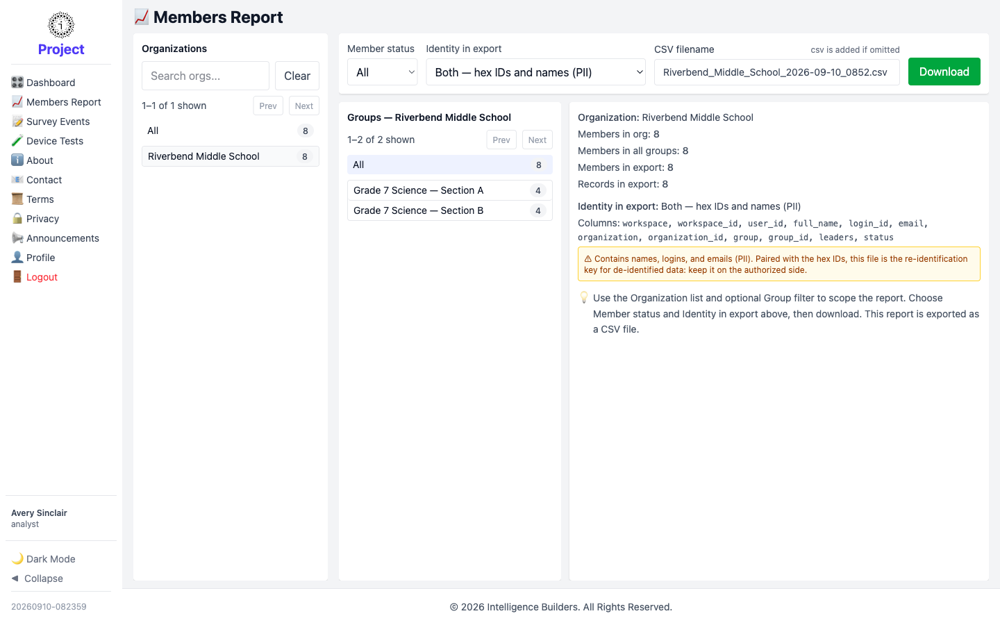

# Members Report

The **Members Report** exports member data as a CSV file for analysis outside Strata
Hub. An analyst can report on any organization in the workspace.

<picture>
  <source media="(prefers-color-scheme: dark)" srcset="images/members-report-dark.png">
  
</picture>

## Scoping the report

Work left to right across the panels:

1. **Organizations** — choose **All** or a single organization.
2. **Groups** — once an organization is selected, narrow to **All** or one group.
3. **Member status** — include **All** members, or only **Active** or **Disabled**.
4. **Identity in export** — **De-identified** (hex IDs only), **Identified**
   (names, logins, and emails), or **Both** (the default, every column). Use
   **De-identified** for a roster that goes to someone working with
   de-identified data; the summary shows a green note when the file is safe to
   share that way and an amber note when it carries personal information.

## Checking the totals and downloading

The summary shows how many **members** and **records** the export will contain
and lists the **columns** it will have. Optionally type a **CSV filename** (the
`.csv` extension is added automatically; the suggested name includes
`_deidentified` or `_identified` when you pick one of those), then select
**Download**.
