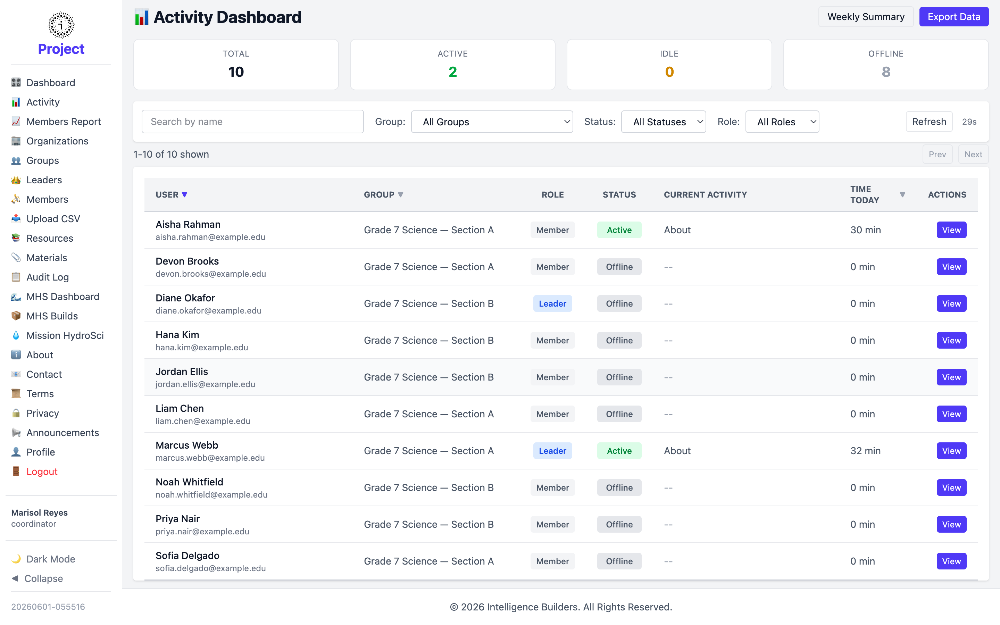
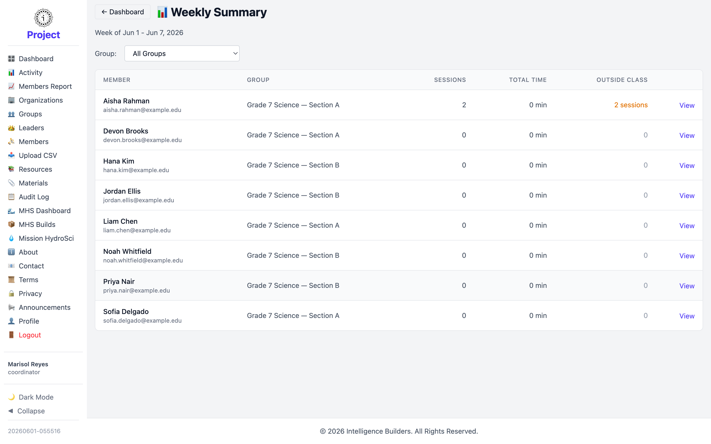

# Activity

The **Activity Dashboard** shows who in your organization is using Strata Hub right
now and how much time they've spent in it.

<picture>
  <source media="(prefers-color-scheme: dark)" srcset="images/activity-dark.png">
  
</picture>

## Status summary and filters

The cards across the top count everyone in your organization by status — **Total**,
**Active**, **Idle**, and **Offline**. Below them you can search by name and filter
by group, status, and role. The view refreshes automatically; **Refresh** updates it
immediately.

## The activity table

Each row is one person, showing their **Group**, **Role**, **Status**, **Current
Activity**, and **Time Today**. Select **View** to see a person's detailed activity
history.

## Weekly Summary

Select **Weekly Summary** for a per-member breakdown of the current week — each
member's **Sessions**, **Total Time**, and time spent **Outside Class** — filterable
by group.

<picture>
  <source media="(prefers-color-scheme: dark)" srcset="images/activity-weekly-summary-dark.png">
  
</picture>
