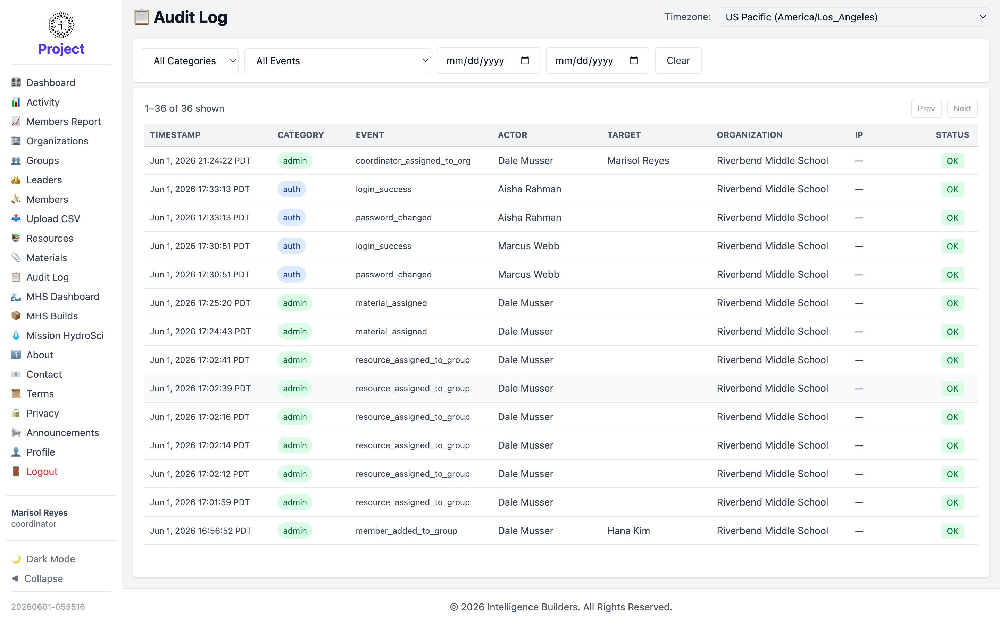

# Audit Log

The **Audit Log** is a record of significant actions taken in your organization —
sign-ins, account changes, assignments, and more.

<picture>
  <source media="(prefers-color-scheme: dark)" srcset="images/audit-log-dark.png">
  
</picture>

## Filtering and reading entries

Narrow the log by **Category**, **Event**, and **date range**, and choose the
**Timezone** for the timestamps. Each entry shows when it happened, its category and
event, the **Actor**, any **Target**, the organization, and the outcome (**Status**).

> The IP column is blank in the example screenshot above; in a live workspace it
> shows the source address for each entry.
