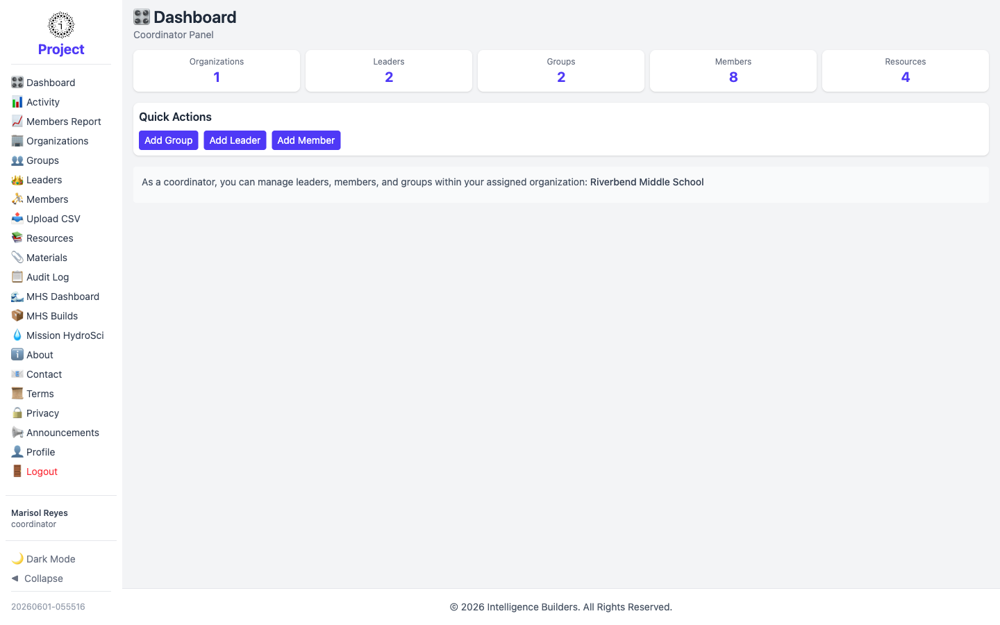

# Dashboard

The **Dashboard** is a coordinator's landing screen. The heading reads **Dashboard**
with **Coordinator Panel** beneath it, and a note confirms the organization(s) you're
assigned to.

<picture>
  <source media="(prefers-color-scheme: dark)" srcset="images/dashboard-dark.png">
  
</picture>

## Summary cards

The cards across the top count the **Organizations**, **Leaders**, **Groups**,
**Members**, and **Resources** in your assigned organization. The figures reflect
only what's within your scope.

## Quick Actions

The **Quick Actions** give one-click shortcuts to the things a coordinator creates
most often — **Add Group**, **Add Leader**, and **Add Member** — each opening the
matching form.

## Your scope

A line at the bottom states the organization you manage (for example *Riverbend
Middle School*). Everything you do across the other screens is limited to that
organization.
