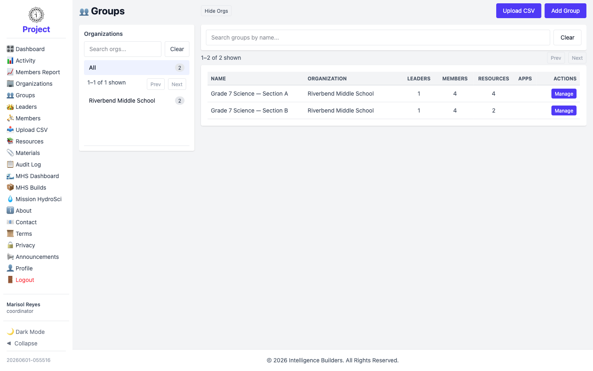
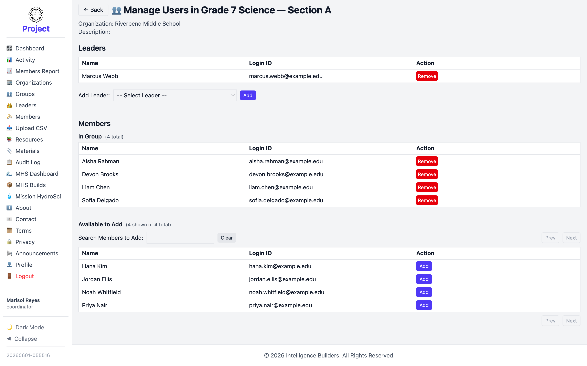
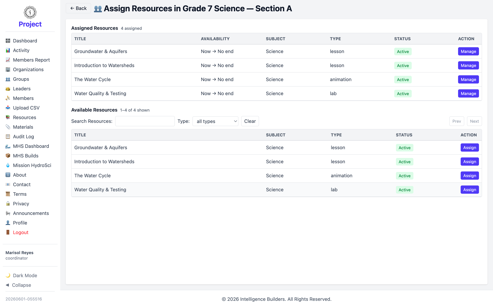

# Groups

The **Groups** screen lists the groups in your organization. A coordinator can create
groups and fully manage their members, resources, and apps.

<picture>
  <source media="(prefers-color-scheme: dark)" srcset="images/groups-list-dark.png">
  
</picture>

## Managing a group

Select **Manage** on a group for a panel of options — **View**, **Edit**, **Users**,
**Apps**, **Resources**, and **CSV**.

<picture>
  <source media="(prefers-color-scheme: dark)" srcset="images/group-manage-dark.png">
  
</picture>

## Managing users in a group

The **Users** page lists the group's **Leaders** and **Members**. Add a member from
the **Available to Add** list with **Add**, or remove someone with **Remove**, and
add or remove leaders the same way.

<picture>
  <source media="(prefers-color-scheme: dark)" srcset="images/group-users-dark.png">
  
</picture>

## Assigning resources to a group

The **Resources** page lists the group's **Assigned Resources** and the
**Available Resources** you can add. Select **Assign** next to a resource and confirm
its availability window to make it visible to the group's members.

<picture>
  <source media="(prefers-color-scheme: dark)" srcset="images/group-resources-dark.png">
  
</picture>
