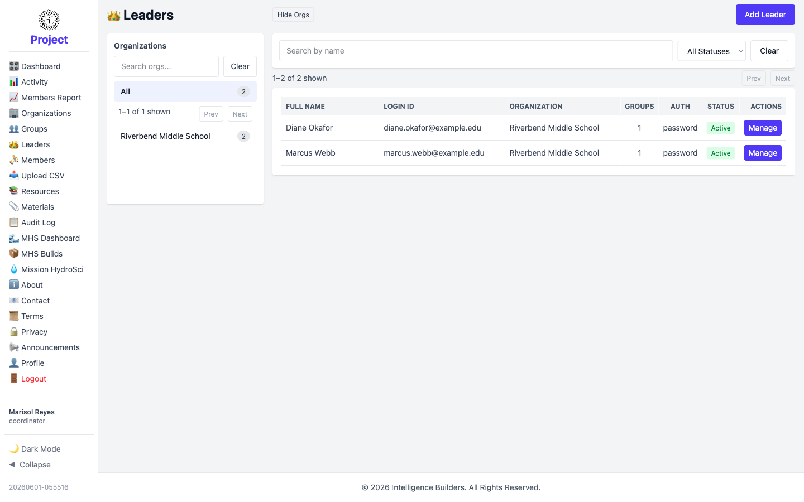
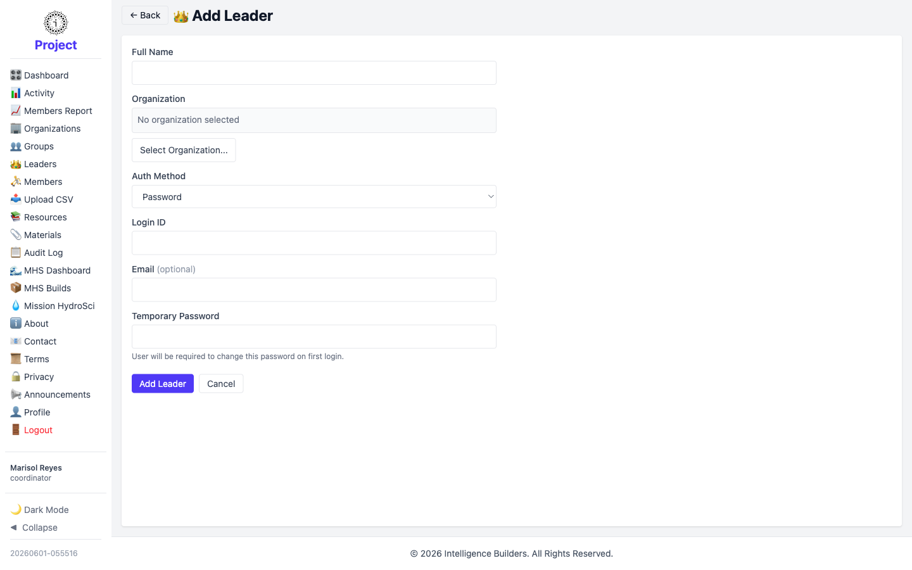
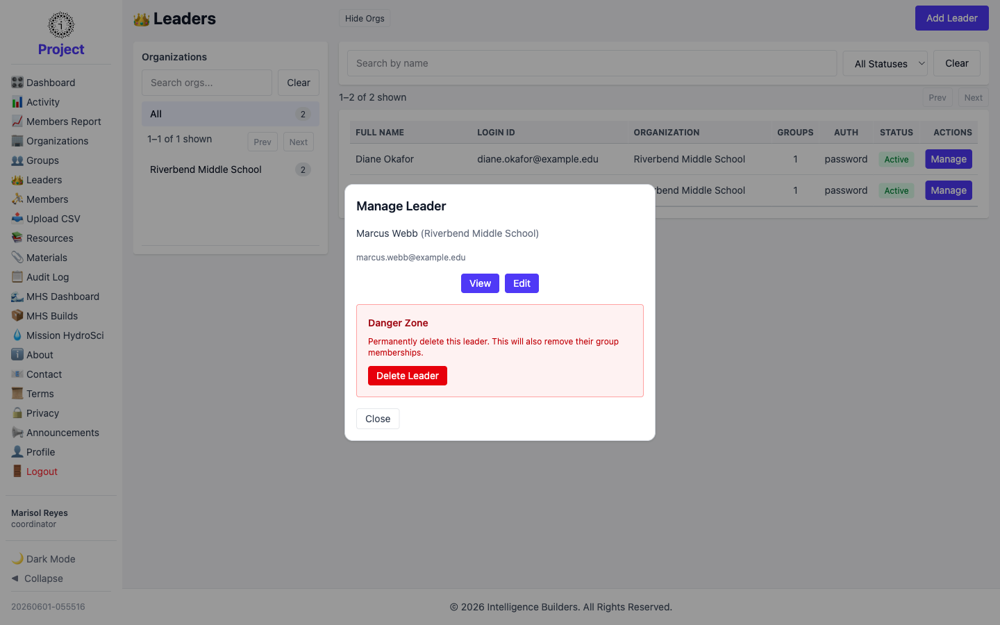

# Leaders

The **Leaders** screen lists the leaders in your organization. A coordinator can
create new leaders and manage existing ones.

<picture>
  <source media="(prefers-color-scheme: dark)" srcset="images/leaders-list-dark.png">
  
</picture>

## Adding a leader

Select **Add Leader**, enter the **Full Name**, set the **Auth Method** (for example
**Password**, which gives a temporary password to change on first login), enter a
**Login ID** and optional **Email**, and select **Add Leader**.

<picture>
  <source media="(prefers-color-scheme: dark)" srcset="images/leader-new-dark.png">
  
</picture>

> Assign a leader to a group from **Groups → Manage → Users**. See
> [Groups](groups.md).

## Managing a leader

Selecting **Manage** opens a panel with **View**, **Edit**, and a **Danger Zone**
for deleting the leader. Editing lets you update their details and status or reset
their password.

<picture>
  <source media="(prefers-color-scheme: dark)" srcset="images/leader-manage-dark.png">
  
</picture>
