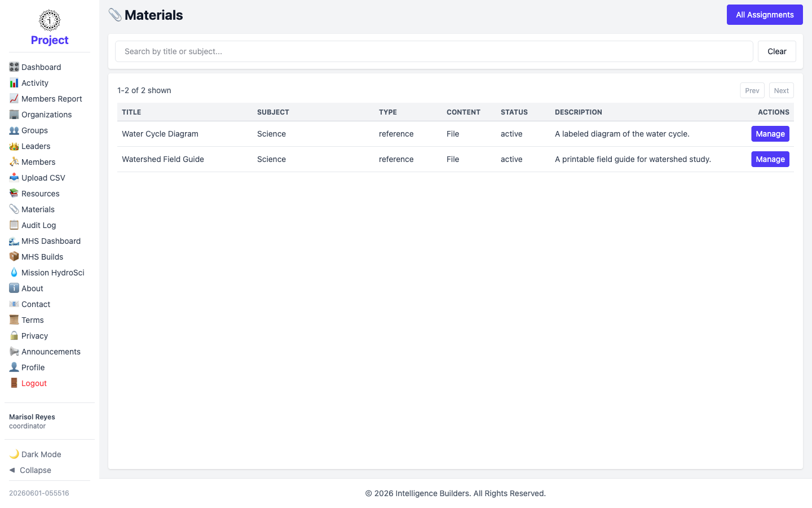

# Materials

The **Materials** screen lists the materials available in the workspace. A
coordinator can view materials and assign them to leaders, but by default can't
create, edit, or delete them (an administrator can grant the **Can manage Materials**
permission to allow that).

<picture>
  <source media="(prefers-color-scheme: dark)" srcset="images/materials-list-dark.png">
  
</picture>

## Assigning a material

Select **Manage** on a material, then **Assign**. Choose your organization and grant
access to **all** leaders or a specific leader, confirm the visibility window, and
the material becomes available to those leaders under their **My Materials**. The
**Assignments** option shows where a material is already assigned.
