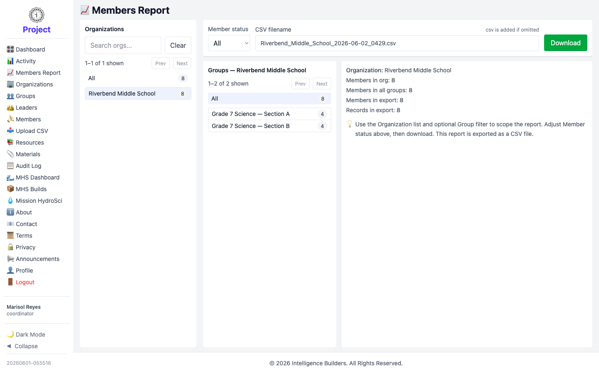

# Members Report

The **Members Report** exports member data as a CSV file. As a coordinator the report
is limited to your assigned organization.

<picture>
  <source media="(prefers-color-scheme: dark)" srcset="images/members-report-dark.png">
  
</picture>

## Scoping and downloading

Choose a **Group** (or **All**) and a **Member status** (All, Active, or Disabled).
The summary shows how many members and records the export will contain. Optionally
type a **CSV filename** — `.csv` is added automatically — then select **Download**.
