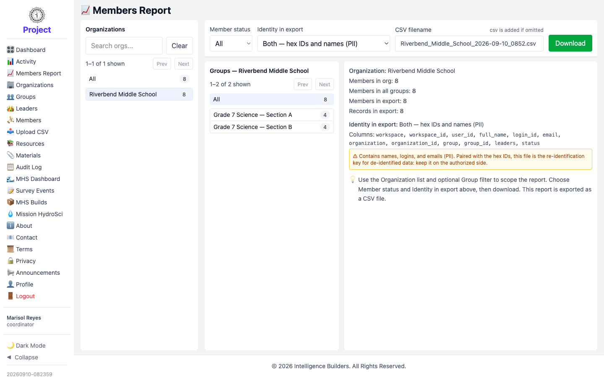

# Members Report

The **Members Report** exports member data as a CSV file. As a coordinator the report
is limited to your assigned organization.

<picture>
  <source media="(prefers-color-scheme: dark)" srcset="images/members-report-dark.png">
  
</picture>

## Scoping and downloading

Choose a **Group** (or **All**), a **Member status** (All, Active, or Disabled),
and an **Identity in export**: **De-identified** (hex IDs only), **Identified**
(names, logins, and emails), or **Both** (the default, every column). The summary
shows how many members and records the export will contain and which columns it
will have, with a green note when the file is safe to share with someone working
with de-identified data and an amber note when it carries personal information.
Optionally type a **CSV filename** — `.csv` is added automatically — then select
**Download**.
