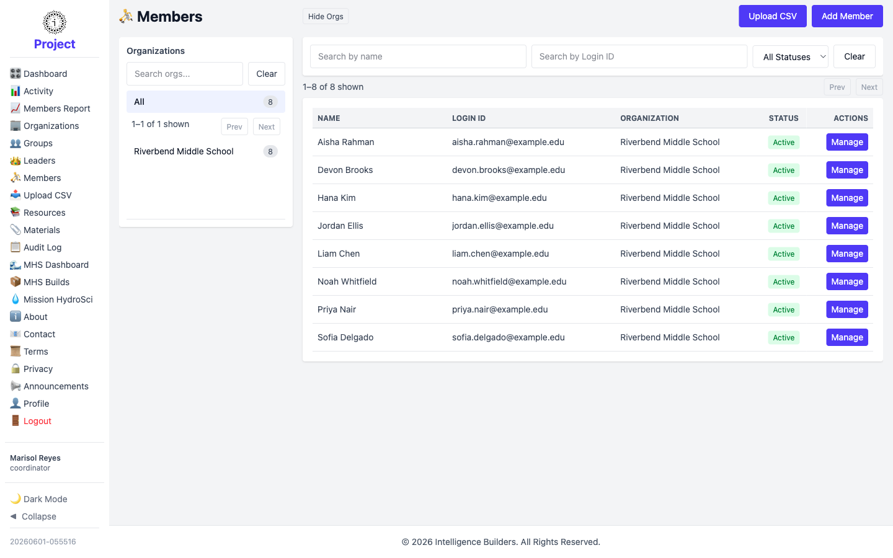
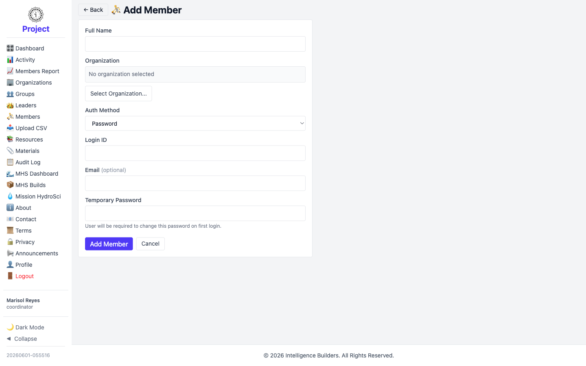
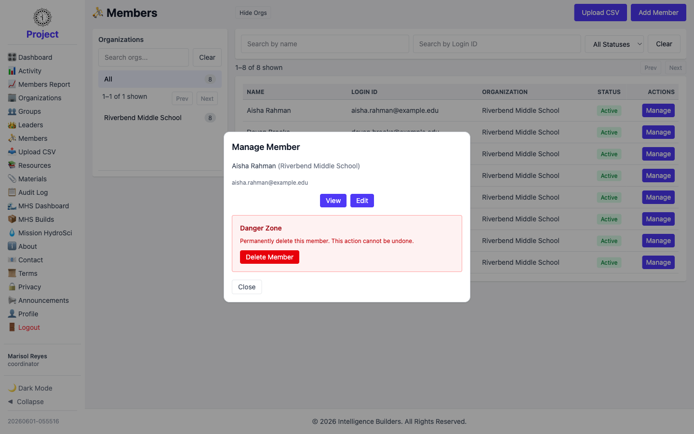

# Members

The **Members** screen lists the members in your organization. A coordinator can add
new members and manage existing ones.

<picture>
  <source media="(prefers-color-scheme: dark)" srcset="images/members-list-dark.png">
  
</picture>

## Adding a member

Select **Add Member**, enter the **Full Name**, set the **Auth Method** (for example
**Password**), enter a **Login ID** and optional **Email**, and select **Add Member**.

<picture>
  <source media="(prefers-color-scheme: dark)" srcset="images/member-new-dark.png">
  
</picture>

> Place a member in a group from **Groups → Manage → Users**. See [Groups](groups.md).

## Managing a member

Selecting **Manage** opens a panel with **View**, **Edit**, and a **Danger Zone**
for deleting the member. Editing lets you update their details and status or reset
their password.

<picture>
  <source media="(prefers-color-scheme: dark)" srcset="images/member-manage-dark.png">
  
</picture>
