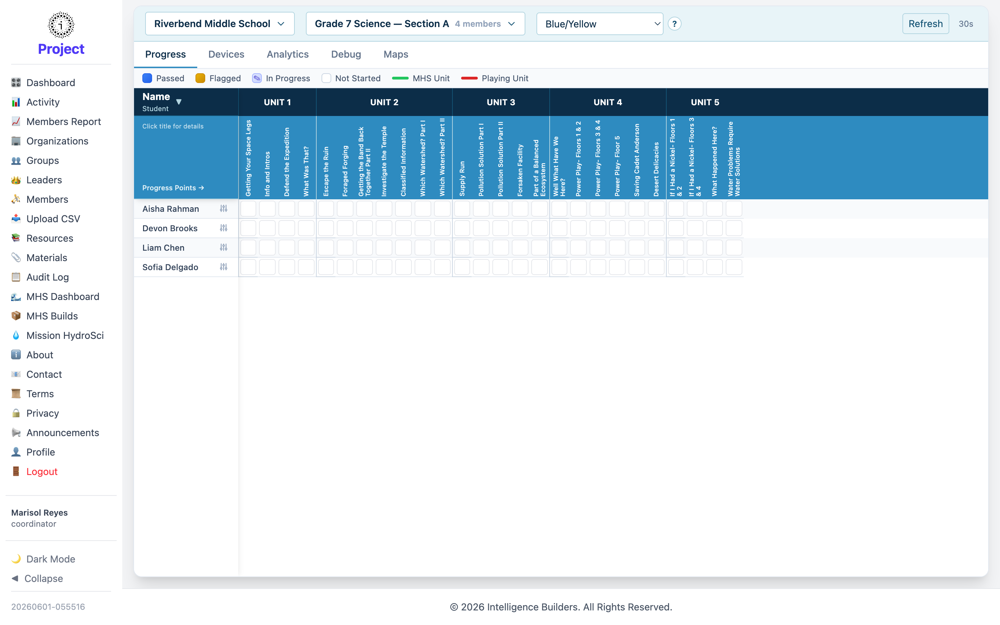

# MHS Dashboard

The **MHS Dashboard** lets you follow how members are progressing through **Mission
HydroSci**, the learning app they play. A coordinator can view the groups in their
organization. (This feature appears in workspaces that include the Mission HydroSci
app.)

<picture>
  <source media="(prefers-color-scheme: dark)" srcset="images/mhs-dashboard-dark.png">
  
</picture>

## Choosing what to view

Pick the **group** to look at, then use the **Progress**, **Devices**, and
**Analytics** tabs. In the **Progress** view, each row is a member and the columns
are the units (**Unit 1** through **Unit 5**); the legend explains each state —
**Passed**, **Flagged**, **In Progress**, and **Not Started**. Select a member to
review their progress in detail.
