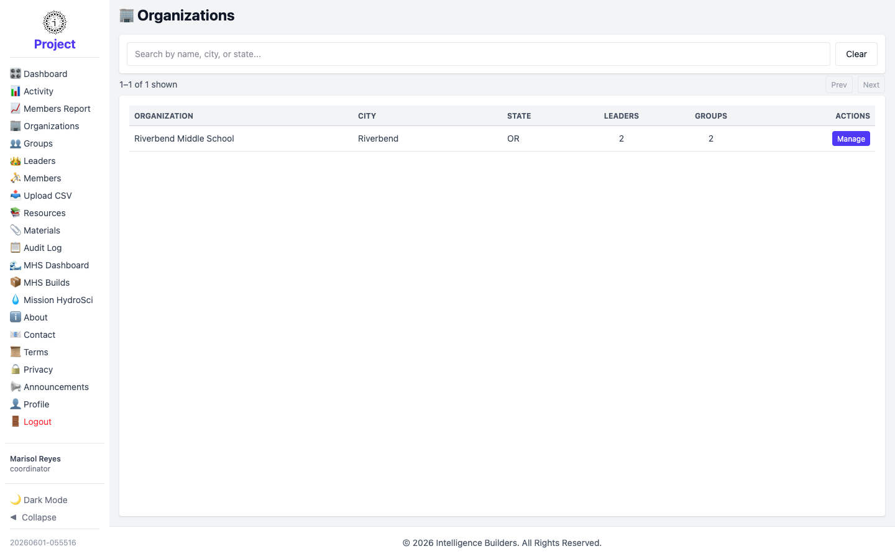

# Organizations

The **Organizations** screen shows the organization (or organizations) you're
assigned to. A coordinator can view and edit their organization's details but can't
create new organizations or delete existing ones.

<picture>
  <source media="(prefers-color-scheme: dark)" srcset="images/organizations-list-dark.png">
  
</picture>

## Managing your organization

Select **Manage** on your organization to open a panel with:

- **View** — see its details.
- **Edit** — update its name, city, state, contact information, and time zone.
- **CSV** — bulk-import groups and members for the organization from a file.

There's no option to add or delete organizations — those are administrator actions.
