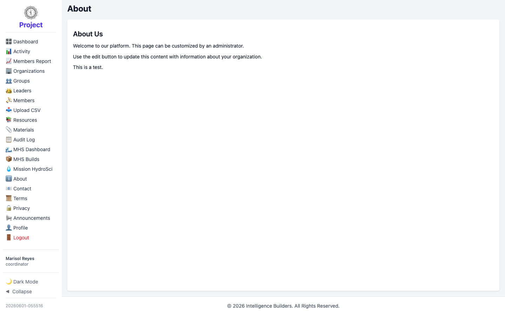

# Public pages (About, Contact, Terms, Privacy)

The **About**, **Contact**, **Terms**, and **Privacy** items at the bottom of the
menu are informational pages anyone can read. As a coordinator you can read them;
their content is maintained by an administrator.

<picture>
  <source media="(prefers-color-scheme: dark)" srcset="images/public-page-dark.png">
  
</picture>
