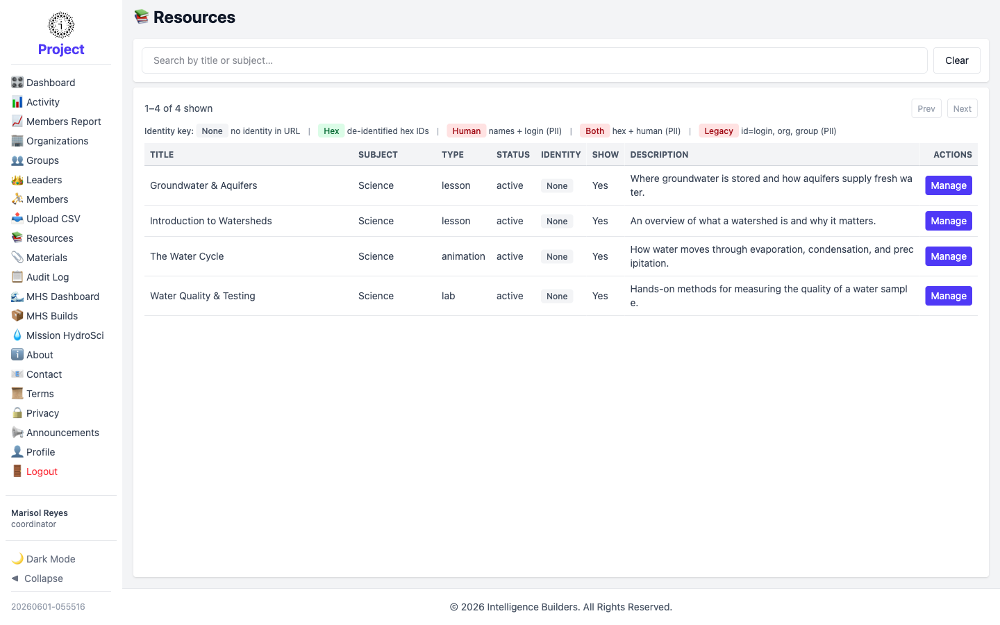

# Resources

The **Resources** screen lists the resources available in the workspace. A
coordinator can view resources and assign them to their groups, but by default can't
create, edit, or delete them (an administrator can grant the **Can manage Resources**
permission to allow that).

<picture>
  <source media="(prefers-color-scheme: dark)" srcset="images/resources-list-dark.png">
  
</picture>

## Assigning a resource

You make a resource available to members by assigning it to a group. Do this from
the group: **Groups → Manage → Resources**, then **Assign**. See [Groups](groups.md).
Members in the group then see it on their own Resources screen.
