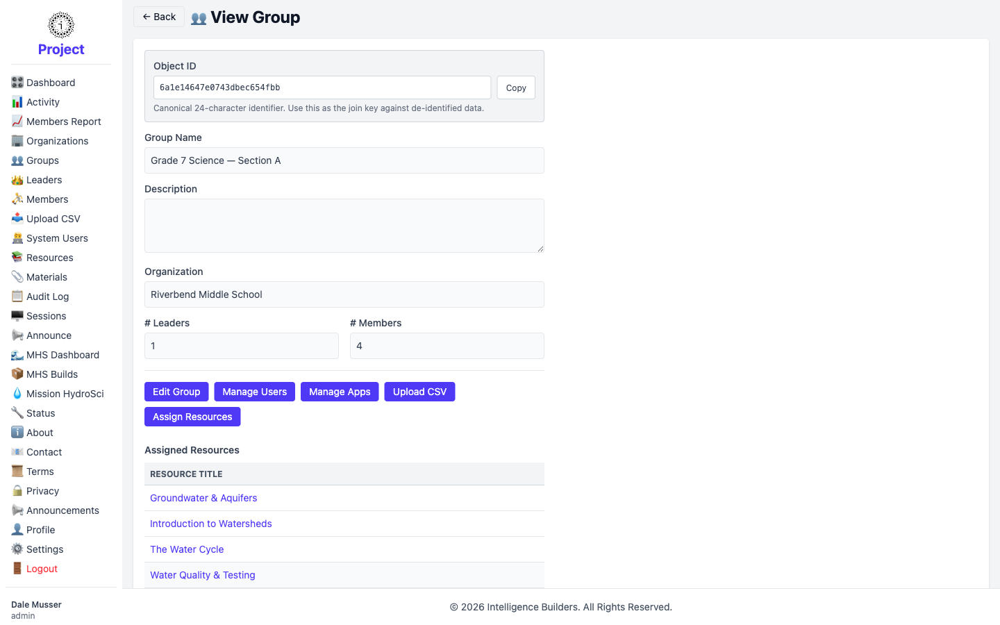
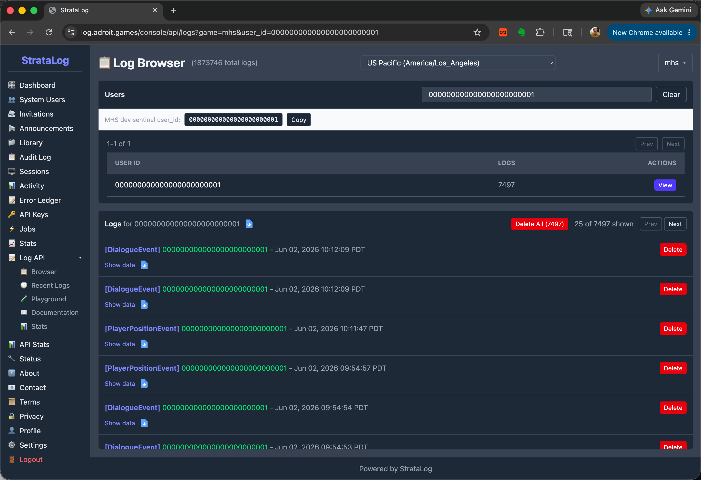
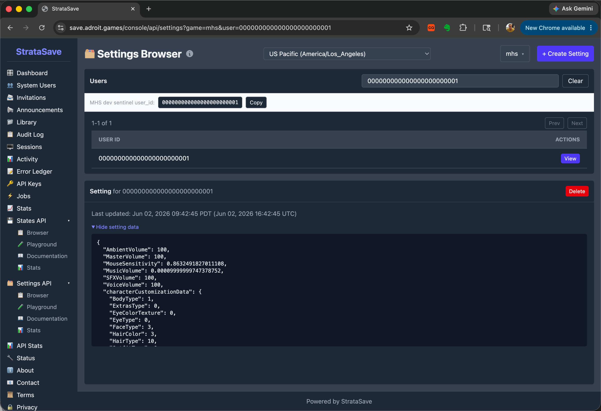
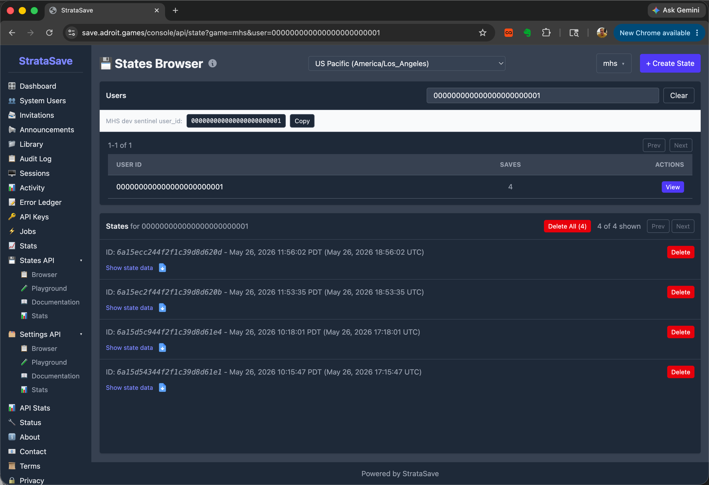

# Object IDs

Every **user**, **group**, **organization**, and **workspace** in Strata Hub is
identified by a canonical **24-character hexadecimal Object ID** — for example
`6a1e1b5f7e0743dbec654fd9`. This ID is permanent and unique, and it's the stable
**join key** used to match Strata Hub entities against de-identified data produced by
Strata Hub and the systems that run with it.

When data is de-identified — for instance the identity parameters that can be
appended to a resource's launch URL — entities are referenced only by these hex IDs:
`ws_id` (workspace), `org_id` (organization), `group_id` (group), and `user_id`
(user). Names and emails are not included, so the Object ID is how you tie a record
back to the right entity.

In practice the one developers reach for most is the **`user_id`** — it's the key
for looking records up in StrataLog and StrataSave (below). The group and
organization IDs are available on their pages if you need them.

## Finding an Object ID in Strata Hub

The Object ID for a user, group, or organization is shown at the **top of its View
or Edit page**, in an **Object ID** box with a **Copy** button and the note
*"Canonical 24-character identifier. Use this as the join key against de-identified
data."*

### A user

Open a member or leader and choose **View** (or **Edit**). The user's `user_id` is at
the top.

<picture>
  <source media="(prefers-color-scheme: dark)" srcset="images/user-object-id-dark.png">
  
</picture>

### A group

The same box appears on a group's View or Edit page — this value is the `group_id`.

<picture>
  <source media="(prefers-color-scheme: dark)" srcset="images/group-object-id-dark.png">
  
</picture>

### An organization

And on an organization's View or Edit page — this value is the `org_id`.

<picture>
  <source media="(prefers-color-scheme: dark)" srcset="images/org-object-id-dark.png">
  
</picture>

### A workspace

A workspace also has an Object ID (referenced as `ws_id` in de-identified data),
identifying the tenant that its organizations, groups, and users belong to. It
isn't surfaced anywhere in the Strata Hub interface yet, so there's currently no
page to copy it from.

## The MHS developer sentinel user

There is one reserved user_id that isn't a real Strata Hub account:

```
000000000000000000000001
```

This is the **MHS dev sentinel**. When a developer is building a game that runs from
Strata Hub — for example **Mission HydroSci** — and runs it outside the context of a
real signed-in user, activity and save data are attributed to this sentinel
`user_id` rather than to an actual person. It gives developer-generated records a
consistent, recognizable identity to search for.

## Using Object IDs in StrataLog and StrataSave

**StrataLog** (activity/logging) and **StrataSave** (save data) identify users by
their hex `user_id`, not by name. Their API browsers each have a **Users** search
field at the top, and directly beneath it a hint with a **Copy** button:

```
MHS dev sentinel user_id: 000000000000000000000001
```

That hint lets you grab the sentinel `user_id` in one click to look up
developer-generated records.

To look up a **real** Strata Hub user's records instead:

1. In Strata Hub, open that user's **View** or **Edit** page and **Copy** the
   **Object ID** (their `user_id`).
2. In StrataLog or StrataSave, paste it into the **Users** search field.

Because these tools work in hex IDs, the Strata Hub View/Edit page is the place to
get the value first — there's no name-based lookup that crosses over from Strata Hub.

### StrataLog — Log API Browser

The **Log Browser** lists the logged events for a user. Search by `user_id` in the
**Users** field; the matching user and their log count appear, and the events are
listed below. The example searches the MHS dev sentinel.



### StrataSave — Settings API Browser

The **Settings Browser** shows a user's saved settings (for example game
preferences such as volume levels and character customization). Search by `user_id`
in the **Users** field.



### StrataSave — States API Browser

The **States Browser** shows a user's saved states (save slots). Search by `user_id`
in the **Users** field to see how many saves the user has and to inspect each one.


