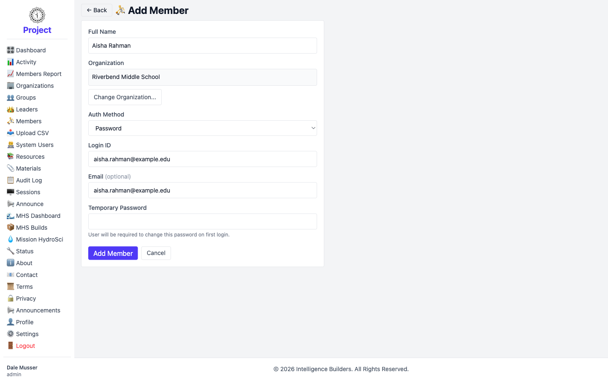
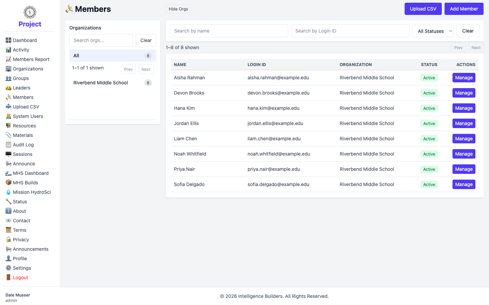
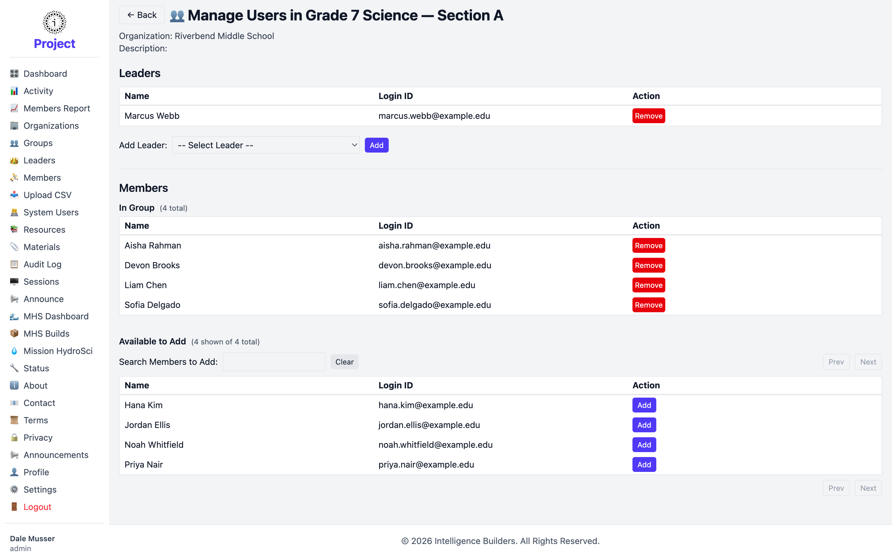
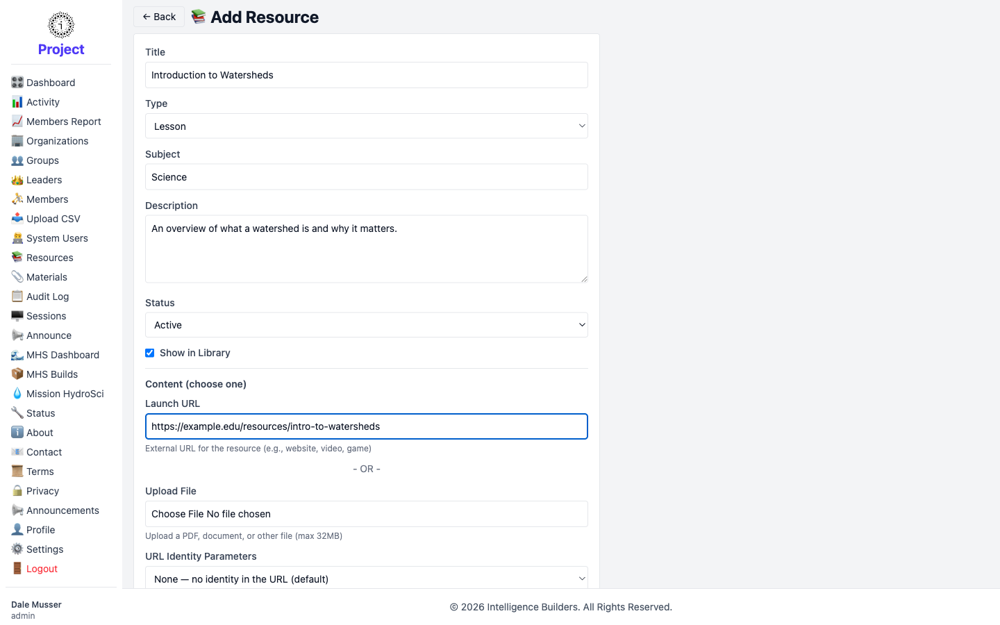
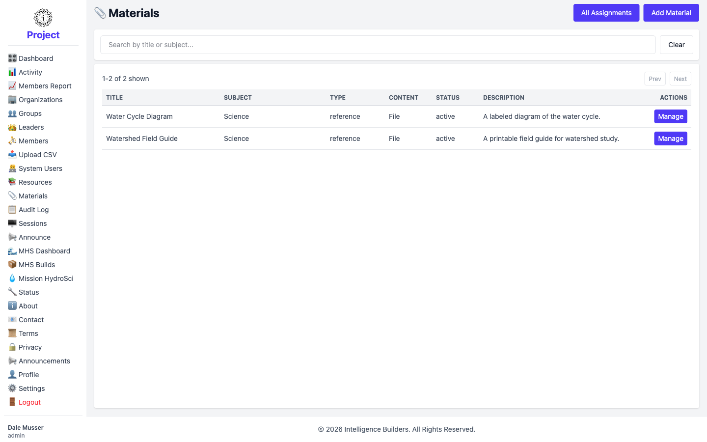
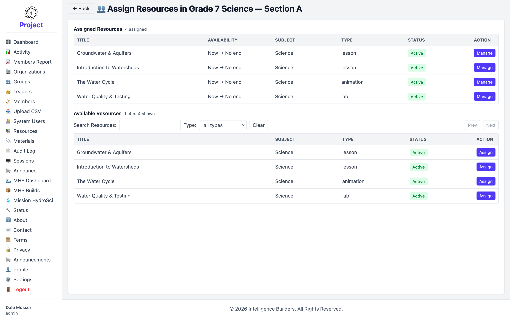

# Getting started with Strata Hub

This guide walks an administrator through setting up Strata Hub from an empty
workspace: creating an organization, adding the groups inside it, and giving each
group a leader. By the end you'll have a working structure that's ready for members
and resources.

> **Before you begin:** these steps are performed by an **administrator**. The
> examples use a fictional school, **Riverbend Middle School**, with two
> science sections. Substitute your own organization, groups, and people as you go.

---

## 1. The dashboard

After signing in, an administrator lands on the **Dashboard**. The cards across
the top summarize how much exists in the workspace — Organizations, Leaders,
Groups, Members, and Resources. In a brand-new workspace every count is **0**.

Below the cards, **Quick Actions** give you one-click shortcuts to add an
organization, group, leader, member, resource, or material. You'll use these same
actions throughout this guide.

<picture>
  <source media="(prefers-color-scheme: dark)" srcset="images/dashboard-empty-dark.png">
  
</picture>

---

## 2. Create the organization

An **organization** is the top-level container for everything else — its groups,
leaders, and members all belong to it.

Open **Organizations** from the sidebar. In an empty workspace the list shows
*No organizations found.* Select **Add Organization** to create the first one.

<picture>
  <source media="(prefers-color-scheme: dark)" srcset="images/organizations-empty-dark.png">
  
</picture>

Fill in the organization's details. **Organization Name** is required; **City**,
**State**, **Contact Information**, and **Time Zone** are optional but help keep
records clear. When you're done, select **Add Organization**.

<picture>
  <source media="(prefers-color-scheme: dark)" srcset="images/organization-new-form-dark.png">
  
</picture>

The new organization now appears in the list. The **Leaders** and **Groups**
columns start at 0 — you'll fill those in next. The **Manage** button is where you
return to edit or remove the organization later.

<picture>
  <source media="(prefers-color-scheme: dark)" srcset="images/organizations-list-dark.png">
  
</picture>

---

## 3. Create the groups

A **group** is a class, section, or cohort within an organization. Members and
resources are organized by group.

Open **Groups** from the sidebar. This screen has two panes: a list of
organizations on the left (use it to filter), and the groups in the selected
organization on the right. With no groups yet, the right pane shows
*No groups found.* Select **Add Group** to create one.

<picture>
  <source media="(prefers-color-scheme: dark)" srcset="images/groups-empty-dark.png">
  
</picture>

Give the group a **Name**, then choose its **Organization** with the
**Select Organization…** button. Assigning a leader here is optional — you can do
it after the leaders exist (covered in the next step), so leave it for now. Select
**Add Group** to save.

<picture>
  <source media="(prefers-color-scheme: dark)" srcset="images/group-new-form-dark.png">
  
</picture>

Repeat for each group you need. In this example we add two sections —
**Grade 7 Science — Section A** and **Grade 7 Science — Section B** — and both
appear in the list, each belonging to Riverbend Middle School.

<picture>
  <source media="(prefers-color-scheme: dark)" srcset="images/groups-list-dark.png">
  
</picture>

---

## 4. Add the leaders

A **leader** manages the groups and members within their organization. Each group
is led by one or more leaders.

Open **Leaders** from the sidebar. As with Groups, organizations are listed on the
left and leaders on the right. The list is empty to start — select **Add Leader**.

<picture>
  <source media="(prefers-color-scheme: dark)" srcset="images/leaders-empty-dark.png">
  
</picture>

Enter the leader's **Full Name** and choose their **Organization**. Leave
**Auth Method** set to **Password**, then enter a **Login ID** (the email address
works well) and an optional **Email**. The **Temporary Password** you set lets the
leader sign in the first time; they'll be prompted to choose their own password on
first login. Select **Add Leader** to create the account.

<picture>
  <source media="(prefers-color-scheme: dark)" srcset="images/leader-new-form-dark.png">
  
</picture>

### Assign the leader to a group

Creating a leader account doesn't place them in a group on its own — you assign
them from the group. Go to **Groups**, select **Manage** on the group, then open
**Users**. Under **Leaders**, pick the person from the **Add Leader** dropdown and
select **Add**. They now appear in the group's leader list.

<picture>
  <source media="(prefers-color-scheme: dark)" srcset="images/group-assign-leader-dark.png">
  
</picture>

Repeat for each leader. In this example **Marcus Webb** leads Section A and
**Diane Okafor** leads Section B. Back on the **Leaders** list, both appear as
**Active**, each showing the group they lead in the **Groups** column.

<picture>
  <source media="(prefers-color-scheme: dark)" srcset="images/leaders-list-dark.png">
  
</picture>

---

## 5. Add the members

A **member** is an end user — typically a student — who works with the resources
assigned to their groups.

Open **Members** from the sidebar and select **Add Member**. The form matches the
one for leaders: enter the **Full Name**, choose the **Organization**, keep
**Auth Method** on **Password**, set a **Login ID** and optional **Email**, and
give a **Temporary Password** for first sign-in. Select **Add Member** to save.

<picture>
  <source media="(prefers-color-scheme: dark)" srcset="images/member-new-form-dark.png">
  
</picture>

Repeat until everyone is added. In this example we add eight members. Back on the
**Members** list they all appear as **Active** under Riverbend Middle School.

<picture>
  <source media="(prefers-color-scheme: dark)" srcset="images/members-list-dark.png">
  
</picture>

### Place members in their groups

As with leaders, a member account isn't in a group until you add it there. Go to
**Groups**, select **Manage** on the group, then open **Users**. In the
**Members** section, find each person under **Available to Add** (use the search
box for long lists) and select **Add**. They move up into the group's member list.

<picture>
  <source media="(prefers-color-scheme: dark)" srcset="images/group-assign-members-dark.png">
  
</picture>

In this example, Section A and Section B each end up with four members.

---

## 6. Create resources and materials

**Resources** are the learning content members open from their dashboard —
links, documents, videos, and so on. **Materials** are supporting files (such as
guides and diagrams) you keep alongside them.

### Create the resources

Open **Resources** from the sidebar and select **Add Resource**. Give the resource
a **Title**, pick a **Type** and **Subject**, and add a short **Description**.
Under **Content**, either paste a **Launch URL** (for an external page, video, or
activity) or **upload a file**. Leave **Status** on **Active** and **Show in
Library** checked so leaders can find and assign it. Select **Add Resource**.

<picture>
  <source media="(prefers-color-scheme: dark)" srcset="images/resource-new-form-dark.png">
  
</picture>

Add as many as you need — here we create four watershed-science resources. They
appear together in the **Resources** list.

<picture>
  <source media="(prefers-color-scheme: dark)" srcset="images/resources-list-dark.png">
  
</picture>

### Create the materials

Open **Materials** from the sidebar and select **Add Material**. The form works
like the resource form — give a **Title**, **Type**, **Subject**, and
**Description**, then provide content by **uploading a file** or pasting a
**Launch URL**. Select **Add Material** to save. In this example we add two
files — a field guide and a diagram — which then appear in the **Materials** list.

<picture>
  <source media="(prefers-color-scheme: dark)" srcset="images/materials-list-dark.png">
  
</picture>

### Assign resources to groups

Creating a resource doesn't make it visible to anyone yet — you assign it to the
groups that should see it. Go to **Groups**, select **Manage** on the group, then
open **Resources**. Under **Available Resources**, select **Assign** next to a
resource, confirm the availability window (leave **Available from** as-is and
**Available until** blank for no end date), and select **Assign**. The resource
moves into **Assigned Resources** for that group.

<picture>
  <source media="(prefers-color-scheme: dark)" srcset="images/group-assign-resources-dark.png">
  
</picture>

Assign whichever resources each group needs. In this example all four resources go
to Section A, and the first two go to Section B — so the two sections see different
content.

---

## 7. Review the dashboard

Return to the **Dashboard**. The summary cards now reflect everything you've
created — one organization, two groups, two leaders, eight members, and four
resources. Your workspace is set up and ready to use: leaders can sign in to manage
their sections, and members can sign in to open the resources assigned to them.

<picture>
  <source media="(prefers-color-scheme: dark)" srcset="images/dashboard-populated-dark.png">
  
</picture>
