# Getting started with Strata Hub

This guide walks an administrator through setting up Strata Hub from an empty
workspace: creating an organization, adding the groups inside it, and giving each
group a leader. By the end you'll have a working structure that's ready for members
and resources.

Each screen is shown in both light and dark appearance — the images below
automatically match whichever you use.

> **Before you begin:** these steps are performed by an **administrator**. The
> examples use a fictional school, **Riverbend Middle School**, with two
> science sections. Substitute your own organization, groups, and people as you go.

---

## 1. The dashboard

After signing in, an administrator lands on the **Dashboard**. The cards across
the top summarize how much exists in the workspace — Organizations, Leaders,
Groups, Members, and Resources. In a brand-new workspace every count is **0**.

Below the cards, **Quick Actions** give you one-click shortcuts to add an
organization, group, leader, member, resource, or material. You'll use these same
actions throughout this guide.

<picture>
  <source media="(prefers-color-scheme: dark)" srcset="images/dashboard-empty-dark.png">
  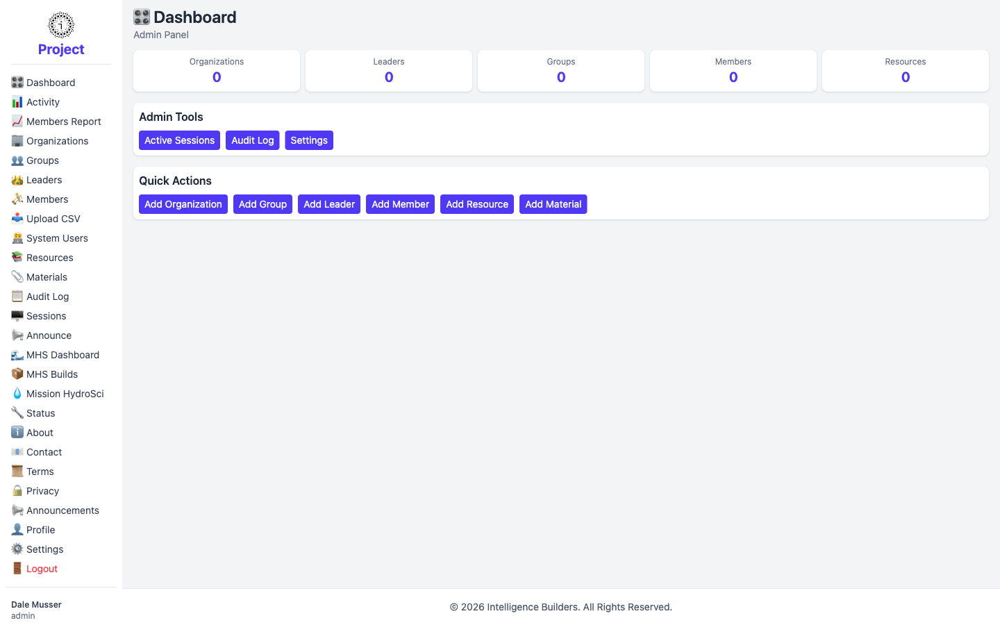
</picture>

---

## 2. Create the organization

An **organization** is the top-level container for everything else — its groups,
leaders, and members all belong to it.

Open **Organizations** from the sidebar. In an empty workspace the list shows
*No organizations found.* Select **Add Organization** to create the first one.

<picture>
  <source media="(prefers-color-scheme: dark)" srcset="images/organizations-empty-dark.png">
  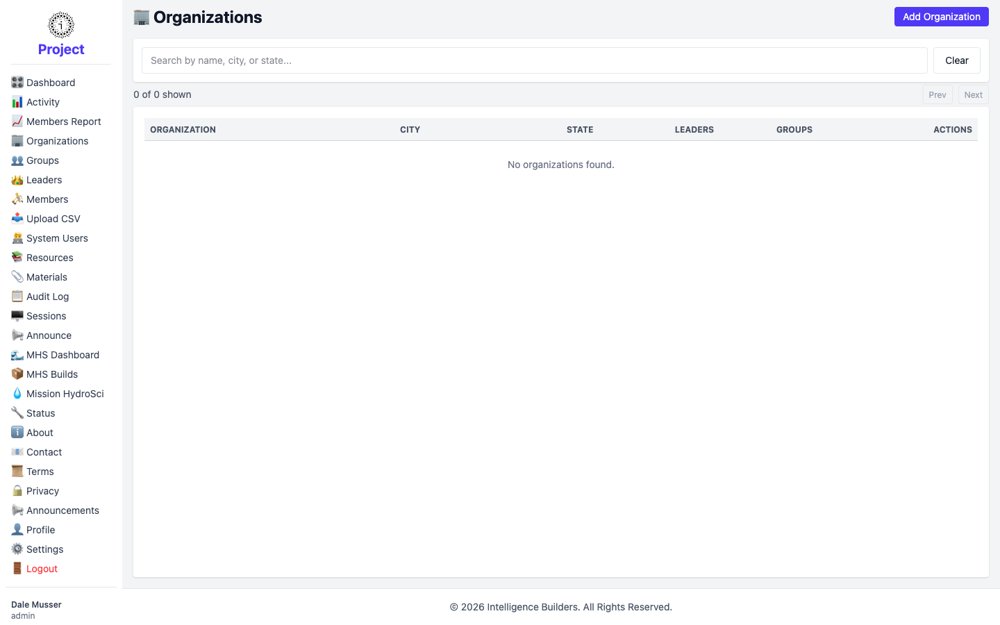
</picture>

Fill in the organization's details. **Organization Name** is required; **City**,
**State**, **Contact Information**, and **Time Zone** are optional but help keep
records clear. When you're done, select **Add Organization**.

<picture>
  <source media="(prefers-color-scheme: dark)" srcset="images/organization-new-form-dark.png">
  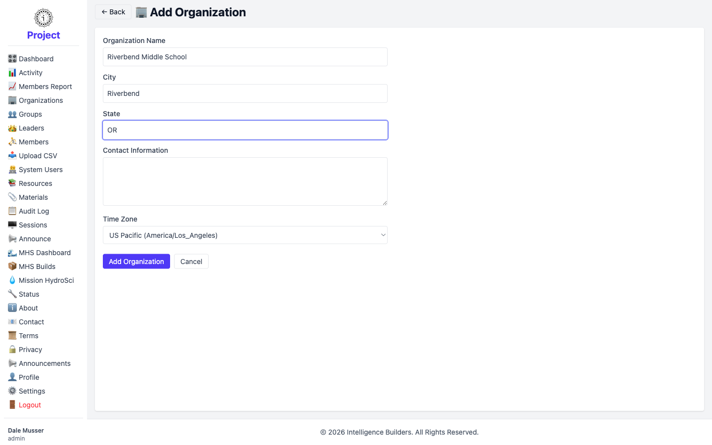
</picture>

The new organization now appears in the list. The **Leaders** and **Groups**
columns start at 0 — you'll fill those in next. The **Manage** button is where you
return to edit or remove the organization later.

<picture>
  <source media="(prefers-color-scheme: dark)" srcset="images/organizations-list-dark.png">
  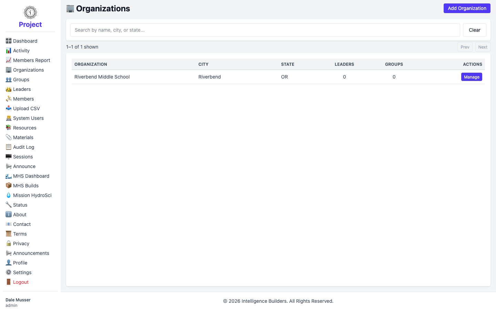
</picture>

---

## 3. Create the groups

A **group** is a class, section, or cohort within an organization. Members and
resources are organized by group.

Open **Groups** from the sidebar. This screen has two panes: a list of
organizations on the left (use it to filter), and the groups in the selected
organization on the right. With no groups yet, the right pane shows
*No groups found.* Select **Add Group** to create one.

<picture>
  <source media="(prefers-color-scheme: dark)" srcset="images/groups-empty-dark.png">
  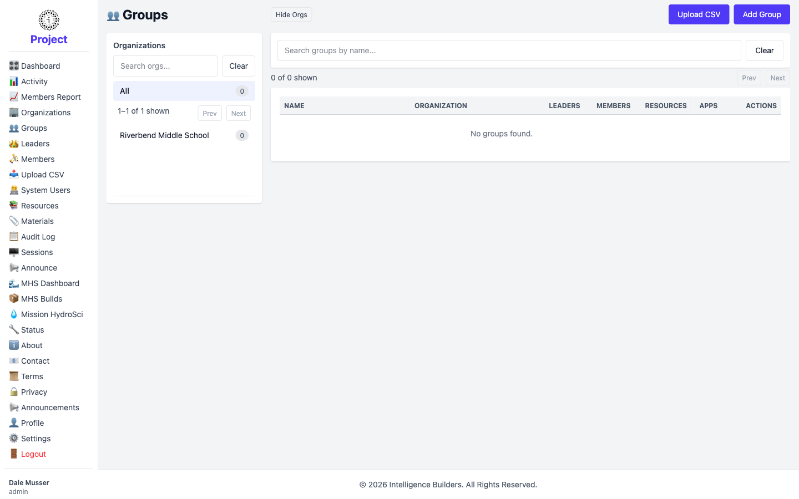
</picture>

Give the group a **Name**, then choose its **Organization** with the
**Select Organization…** button. Assigning a leader here is optional — you can do
it after the leaders exist (covered in the next step), so leave it for now. Select
**Add Group** to save.

<picture>
  <source media="(prefers-color-scheme: dark)" srcset="images/group-new-form-dark.png">
  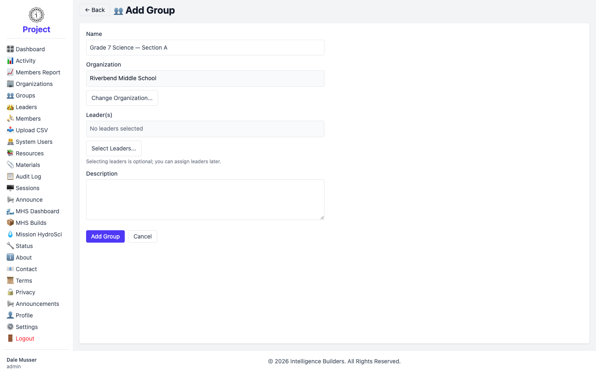
</picture>

Repeat for each group you need. In this example we add two sections —
**Grade 7 Science — Section A** and **Grade 7 Science — Section B** — and both
appear in the list, each belonging to Riverbend Middle School.

<picture>
  <source media="(prefers-color-scheme: dark)" srcset="images/groups-list-dark.png">
  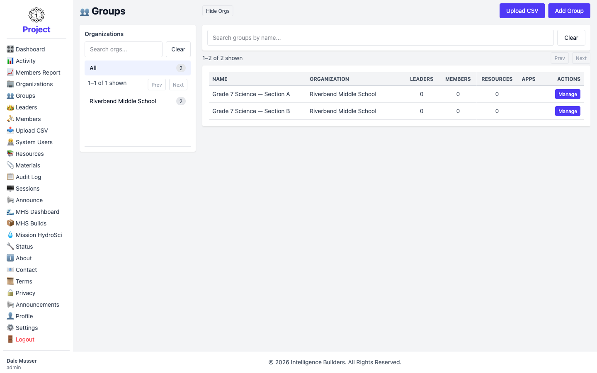
</picture>

---

## 4. Add the leaders

A **leader** manages the groups and members within their organization. Each group
is led by one or more leaders.

Open **Leaders** from the sidebar. As with Groups, organizations are listed on the
left and leaders on the right. The list is empty to start — select **Add Leader**.

<picture>
  <source media="(prefers-color-scheme: dark)" srcset="images/leaders-empty-dark.png">
  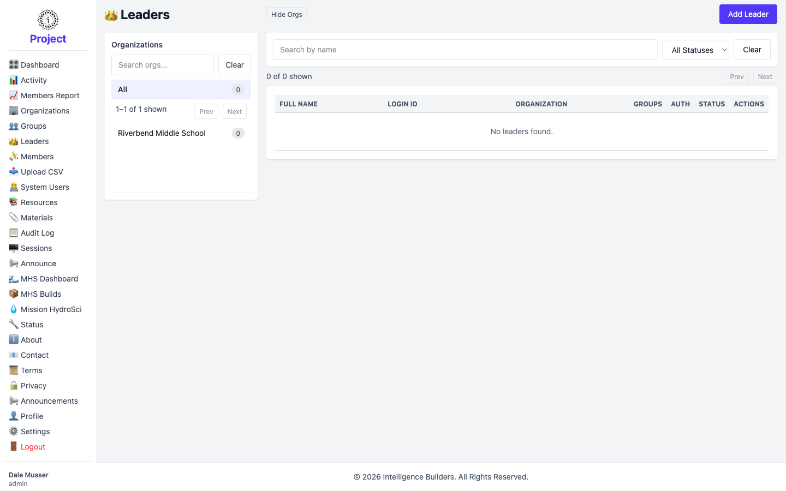
</picture>

Enter the leader's **Full Name** and choose their **Organization**. Leave
**Auth Method** set to **Password**, then enter a **Login ID** (the email address
works well) and an optional **Email**. The **Temporary Password** you set lets the
leader sign in the first time; they'll be prompted to choose their own password on
first login. Select **Add Leader** to create the account.

<picture>
  <source media="(prefers-color-scheme: dark)" srcset="images/leader-new-form-dark.png">
  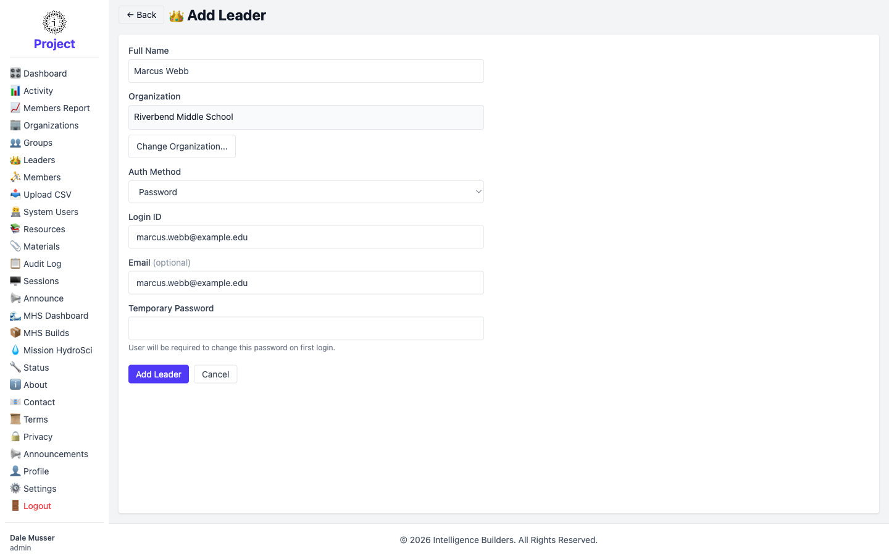
</picture>

### Assign the leader to a group

Creating a leader account doesn't place them in a group on its own — you assign
them from the group. Go to **Groups**, select **Manage** on the group, then open
**Users**. Under **Leaders**, pick the person from the **Add Leader** dropdown and
select **Add**. They now appear in the group's leader list.

<picture>
  <source media="(prefers-color-scheme: dark)" srcset="images/group-assign-leader-dark.png">
  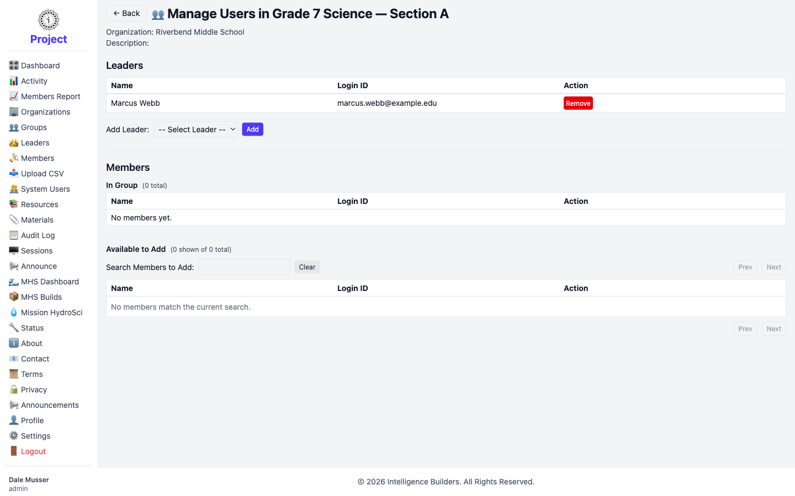
</picture>

Repeat for each leader. In this example **Marcus Webb** leads Section A and
**Diane Okafor** leads Section B. Back on the **Leaders** list, both appear as
**Active**, each showing the group they lead in the **Groups** column.

<picture>
  <source media="(prefers-color-scheme: dark)" srcset="images/leaders-list-dark.png">
  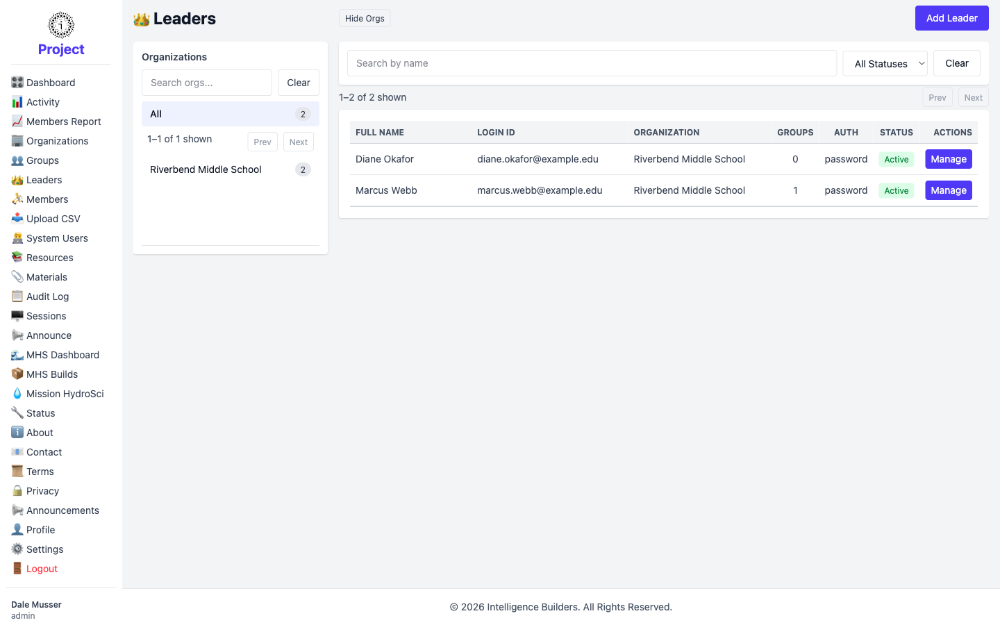
</picture>

---

## What's next

With the organization, groups, and leaders in place, the next steps are to add
**members** to each group and to create and assign **resources** so members have
something to work with. Those are covered in the following sections.
