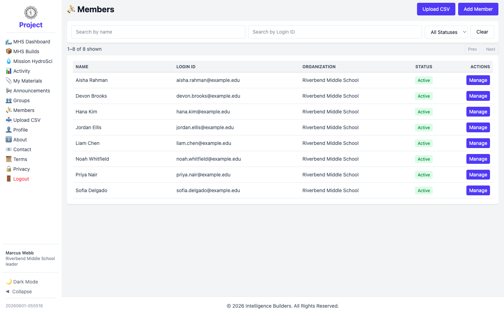
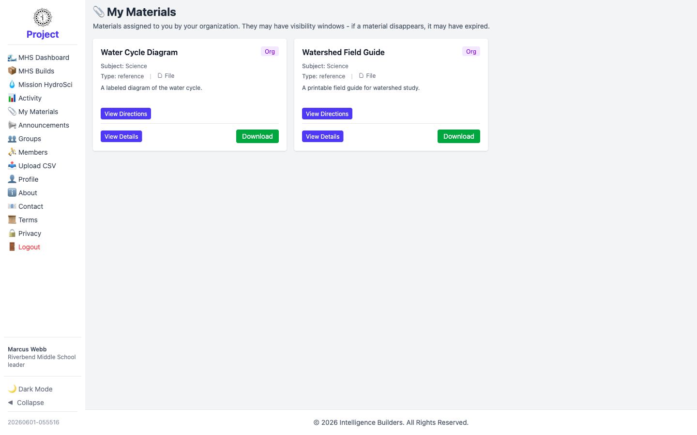

# The leader view

A **leader** is a teacher or group facilitator. Leaders work within their own
organization: they look after their group(s), keep track of the members, and use
the materials assigned to them. This guide shows what a leader sees after signing
in. (Setting up the organization, groups, leaders, and members is covered in
[Getting Started](getting-started.md).)

> **Signing in:** a leader signs in with the **Login ID** and temporary password
> created for their account, and is prompted to choose their own password the first
> time. After that they go straight to their own workspace.

---

## Your groups

Select **Groups** to see the group or groups you lead. Each row shows the group's
organization and a quick count of its leaders, members, and assigned resources.
Select a group's name, or **Manage**, to open it.

<picture>
  <source media="(prefers-color-scheme: dark)" srcset="images/leader-groups-dark.png">
  
</picture>

---

## Your members

Select **Members** to see the people in your organization. Each member shows their
login ID, organization, and status. From here you can open a member to manage their
details. Use **Groups → Manage → Users** when you want to see or change who belongs
to a particular group.

<picture>
  <source media="(prefers-color-scheme: dark)" srcset="images/leader-members-dark.png">
  
</picture>

---

## Your materials

Select **My Materials** to see the materials assigned to you. Each material shows
its subject and a short description, with **View Directions** for any instructions,
**View Details** to open it in the app, and **Download** to save the file. Materials
may have a visibility window — if one disappears, its availability has ended.

<picture>
  <source media="(prefers-color-scheme: dark)" srcset="images/leader-materials-dark.png">
  
</picture>
