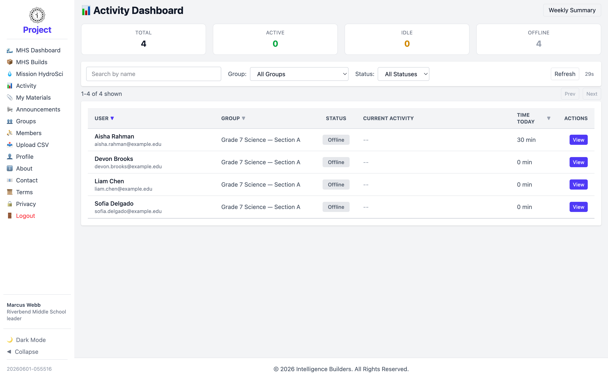
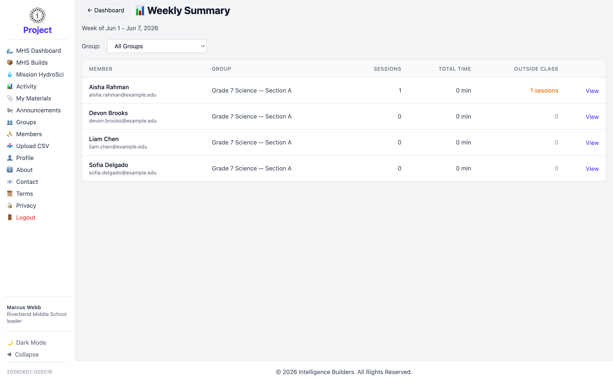

# Activity

The **Activity Dashboard** shows who in your group is using Strata Hub right now and
how much time they've spent in it. As a leader you see the members of your own
group.

<picture>
  <source media="(prefers-color-scheme: dark)" srcset="images/activity-dark.png">
  
</picture>

## Status summary and filters

The cards across the top count your members by current status — **Total**,
**Active**, **Idle**, and **Offline**. Below them you can search by name and filter
the list by status. The view refreshes automatically; select **Refresh** to update
immediately.

## The activity table

Each row is one member, showing their **Group**, **Status**, **Current Activity**,
and **Time Today**. Select **View** on a row to see a member's detailed activity
history.

## Weekly Summary

Select **Weekly Summary** for a per-member breakdown of the current week — each
member's number of **Sessions**, **Total Time**, and time spent **Outside Class**.
Use the week selector to move between weeks.

<picture>
  <source media="(prefers-color-scheme: dark)" srcset="images/activity-weekly-summary-dark.png">
  
</picture>
