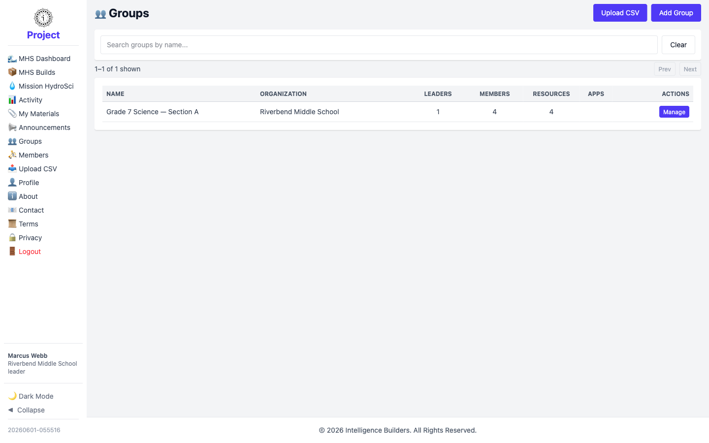
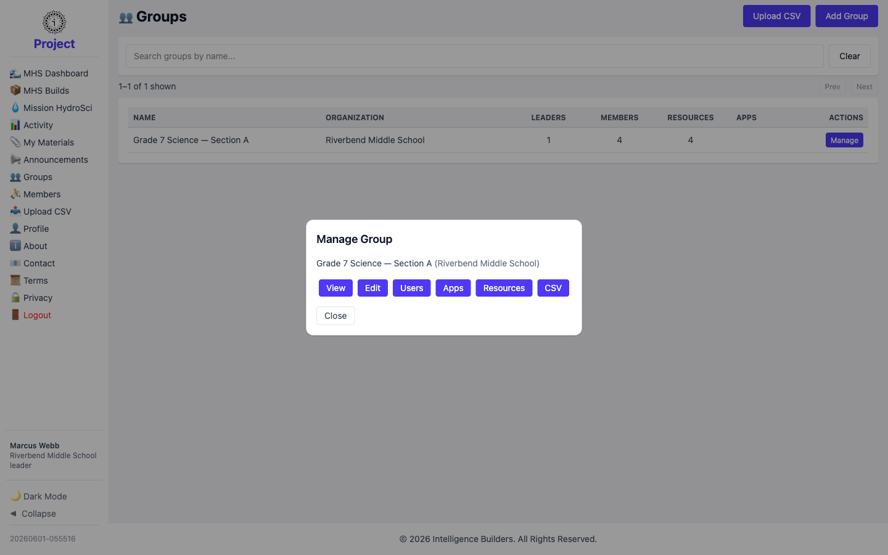
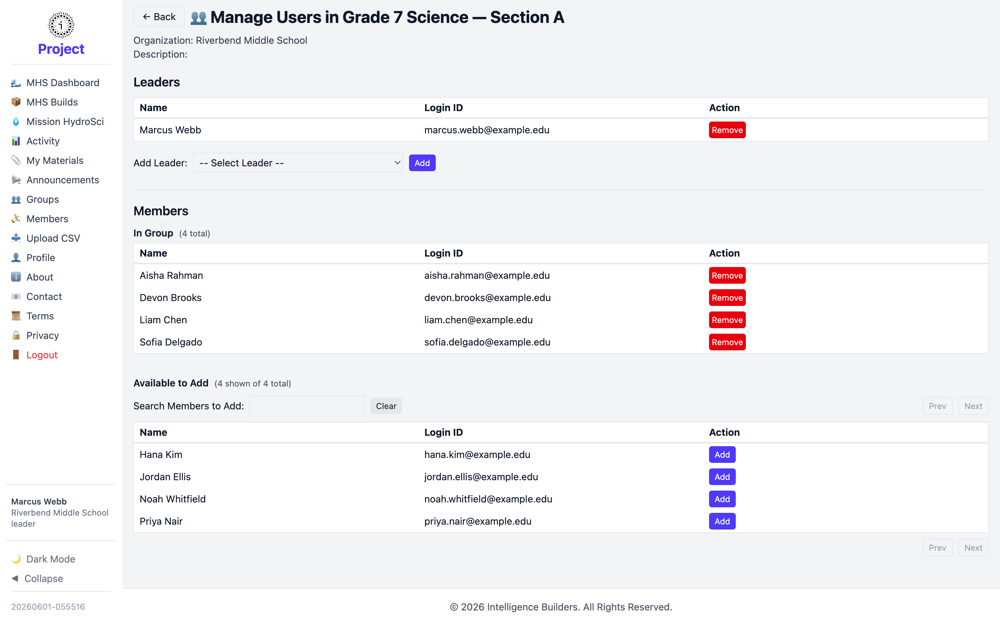
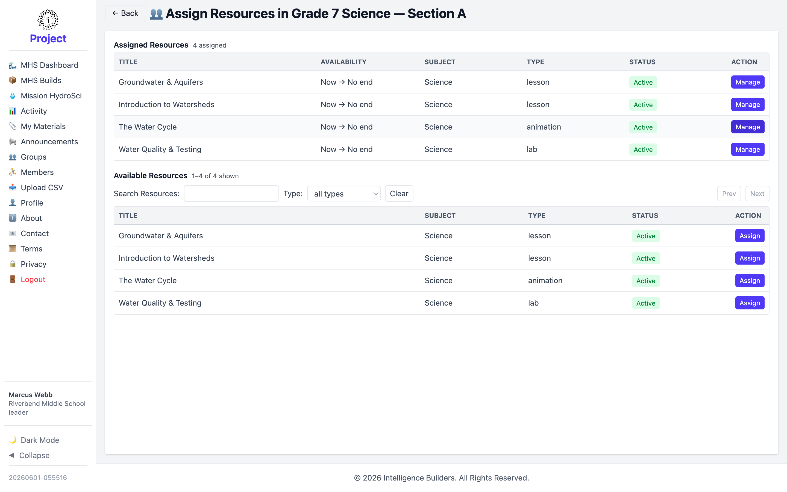

# Groups

The **Groups** screen shows the group or groups you lead. As a leader you manage your
own group — its members, the resources assigned to it, and its apps.

<picture>
  <source media="(prefers-color-scheme: dark)" srcset="images/groups-list-dark.png">
  
</picture>

## Managing your group

Select **Manage** on your group to open a panel of options:

- **View** — see the group's details.
- **Edit** — change its name or description.
- **Users** — add or remove leaders and members (see below).
- **Apps** — enable or disable apps for the group.
- **Resources** — assign resources to the group (see below).
- **CSV** — bulk-import members from a file.

<picture>
  <source media="(prefers-color-scheme: dark)" srcset="images/group-manage-dark.png">
  
</picture>

## Managing users in your group

The **Users** page lists the group's **Leaders** and **Members**. Add a member from
the **Available to Add** list with **Add**, or remove someone with **Remove**. You
can also add another leader to the group.

<picture>
  <source media="(prefers-color-scheme: dark)" srcset="images/group-users-dark.png">
  
</picture>

## Assigning resources to your group

The **Resources** page lists the group's **Assigned Resources** and the
**Available Resources** you can add. Select **Assign** next to a resource and confirm
its availability window to make it visible to every member of the group.

<picture>
  <source media="(prefers-color-scheme: dark)" srcset="images/group-resources-dark.png">
  
</picture>
