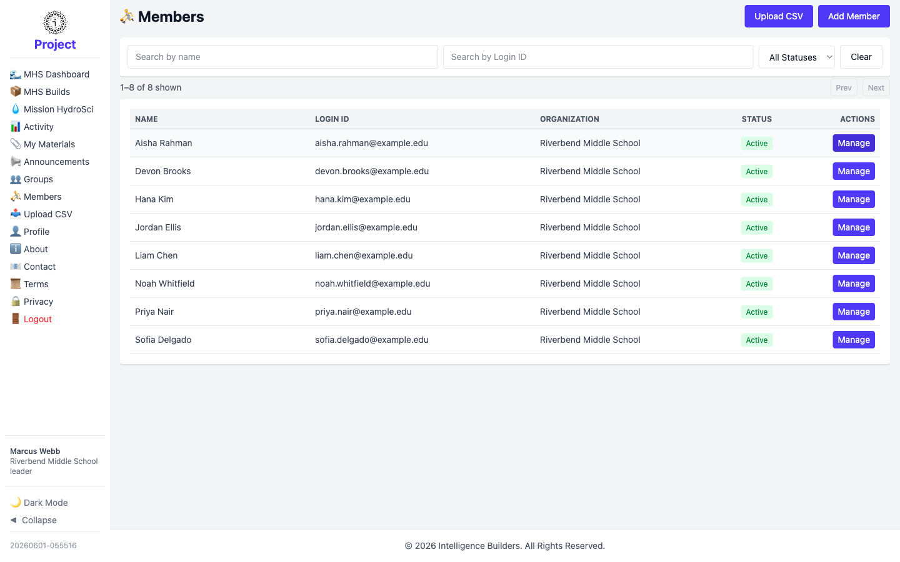
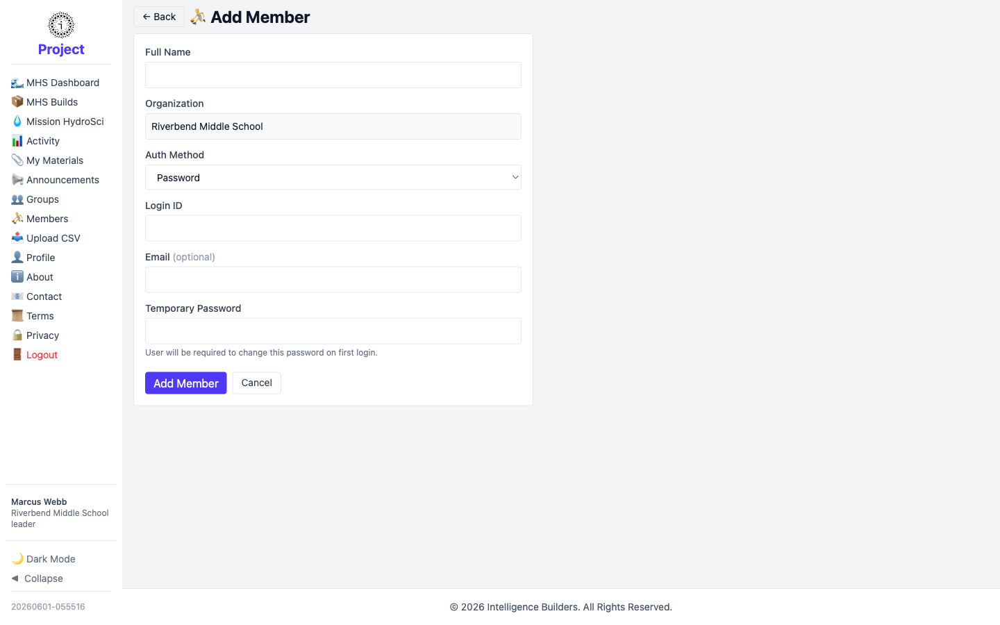
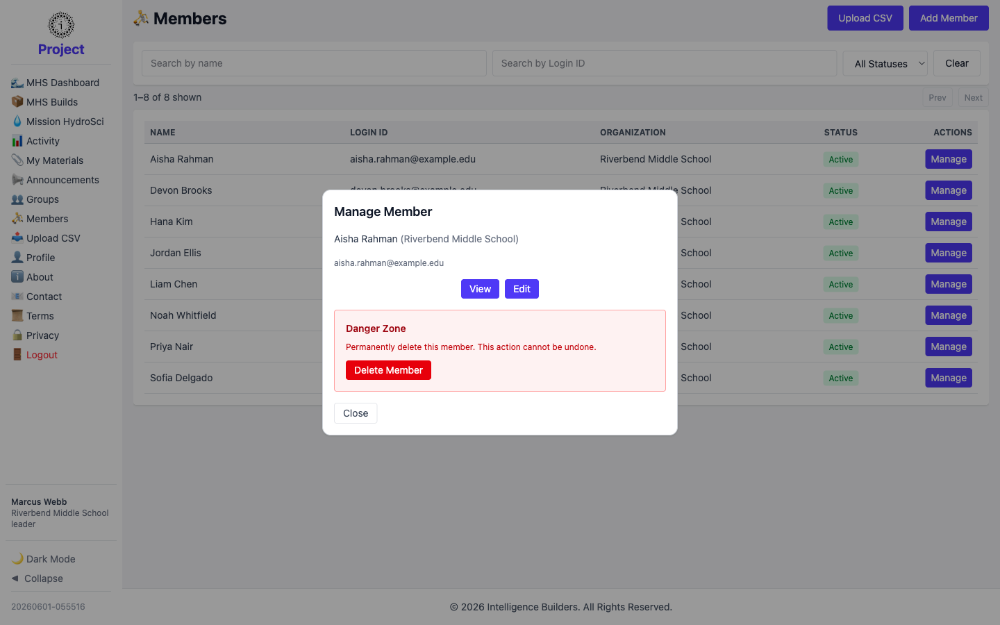

# Members

The **Members** screen lists the members in your organization. As a leader you can
add new members, edit their details, and place them in your group.

<picture>
  <source media="(prefers-color-scheme: dark)" srcset="images/members-list-dark.png">
  
</picture>

## Adding a member

Select **Add Member**, enter the member's **Full Name**, set the **Auth Method**
(for example **Password**, which gives them a temporary password to change on first
login), enter a **Login ID** and optional **Email**, and select **Add Member**.

<picture>
  <source media="(prefers-color-scheme: dark)" srcset="images/member-new-dark.png">
  
</picture>

> **Placing a member in your group** is done from the group — open
> **Groups → Manage → Users**. See [Groups](groups.md).

## Managing a member

Selecting **Manage** opens a panel with **View**, **Edit**, and a **Danger Zone**
for deleting the member. Editing lets you update their details and status, or reset
their password.

<picture>
  <source media="(prefers-color-scheme: dark)" srcset="images/member-manage-dark.png">
  
</picture>
