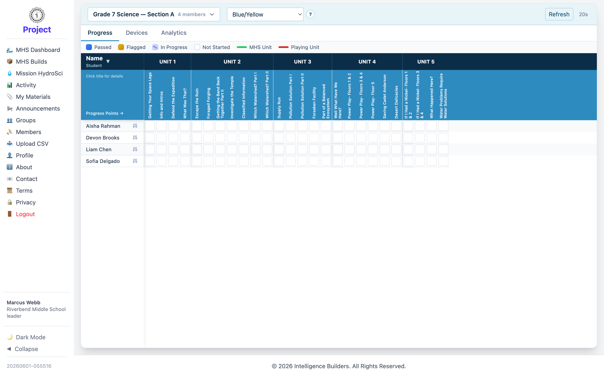

# MHS Dashboard

The **MHS Dashboard** is a leader's landing screen. It shows how the members of your
group are progressing through **Mission HydroSci**, the learning app they play.
(This feature appears in workspaces that include the Mission HydroSci app.)

<picture>
  <source media="(prefers-color-scheme: dark)" srcset="images/mhs-dashboard-dark.png">
  
</picture>

## Your group

The dashboard is focused on your own group and its members — the group name and
member count are shown at the top. Select **Refresh** to pull the latest data.

## Views

Tabs switch between ways of looking at the group:

- **Progress** — each member's progress through the units (shown above).
- **Devices** — the devices members are playing on.
- **Analytics** — summarized activity and performance.

## Reading the progress grid

In the **Progress** view, each row is a member and the columns are the units
(**Unit 1** through **Unit 5**), broken into progress points. The legend explains
each state — **Passed**, **Flagged**, **In Progress**, and **Not Started** — and
markers show each member's currently playing unit. Select a member to review their
progress in detail.
